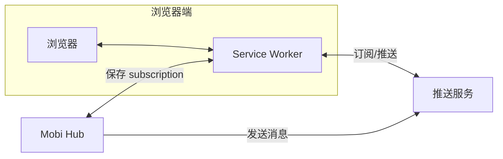
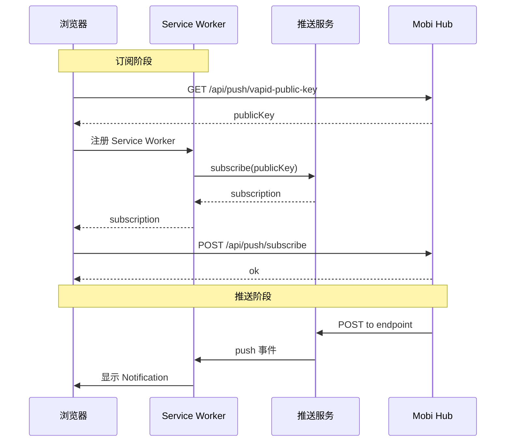
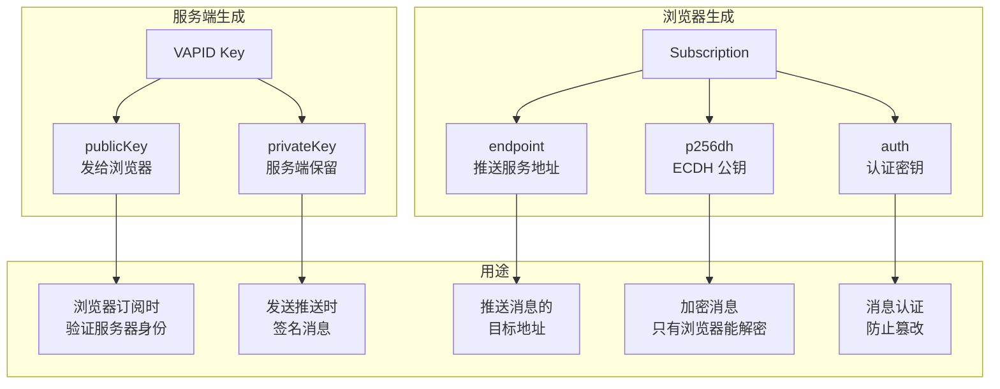
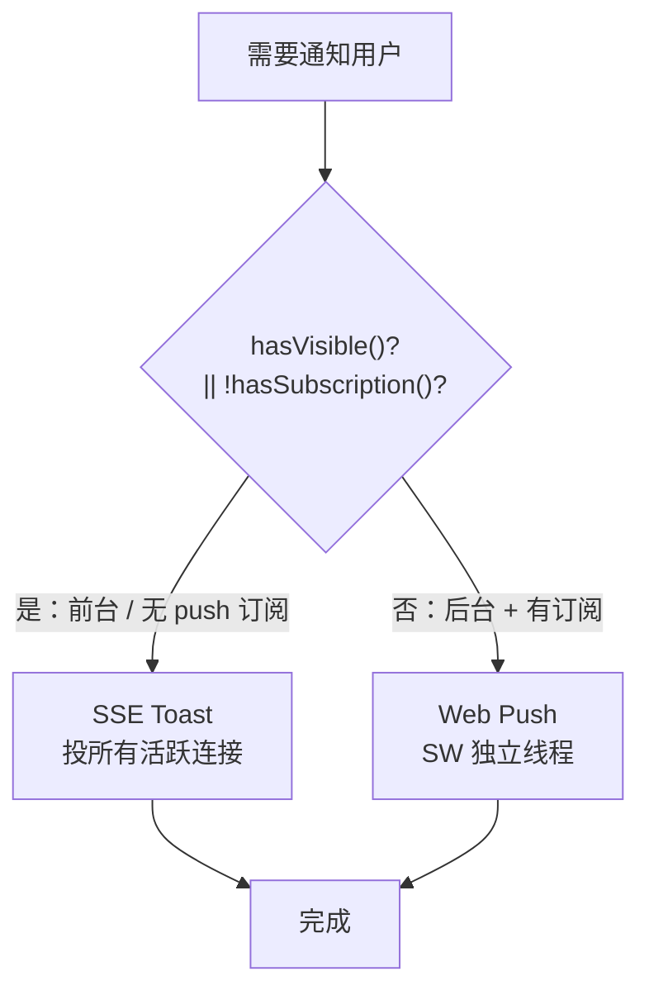
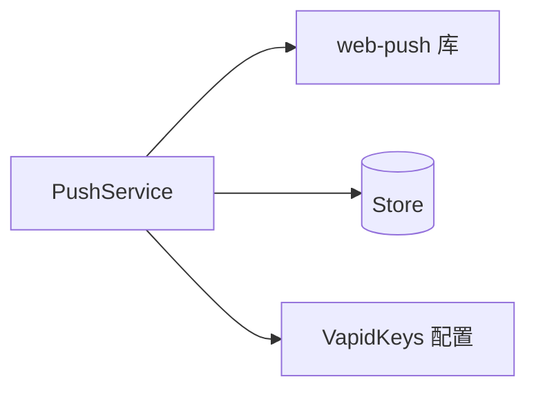
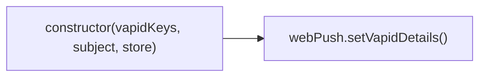
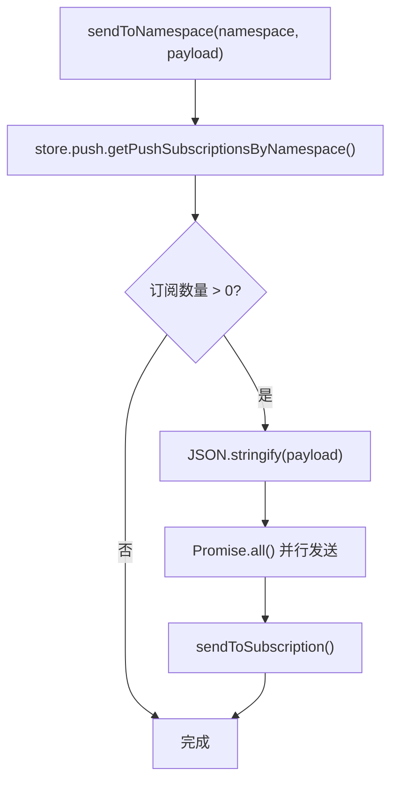
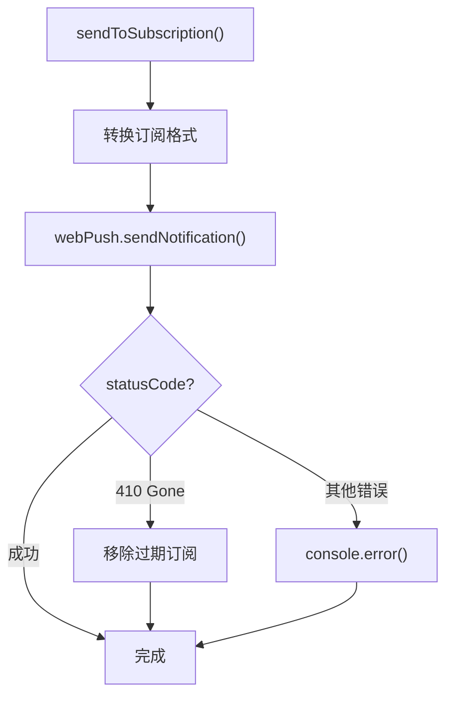

# PushService 架构

**文件**: [`packages/hub/src/push/pushService.ts`](/packages/hub/src/push/pushService.ts)

Web Push 通知服务，基于 [web-push](https://github.com/web-push-libs/web-push) 库实现。

## Web Push 原理

### 整体架构



### 推送服务由浏览器决定

Mobi 不选择推送服务，而是由浏览器自动选择：

| 浏览器 | 推送服务 | subscription.endpoint 示例 |
|--------|---------|---------------------------|
| Chrome/Edge | FCM | `https://fcm.googleapis.com/fcm/send/...` |
| Firefox | Mozilla Push | `https://push.services.mozilla.com/...` |
| Safari | APNs | `https://api.push.apple.com/...` |

### 工作流程



### 密钥与身份

Web Push 涉及两套独立的密钥体系：



#### 对比

| | VAPID Key | p256dh / auth |
|--|-----------|---------------|
| **生成方** | 服务端 | 浏览器 |
| **用途** | 服务器身份认证 | 消息加密 |
| **证明** | "我是合法服务器" | "只有这个浏览器能解密" |
| **交互对象** | 服务器 ↔ 推送服务 | 服务器 → 浏览器 |

#### 各字段说明

| 字段 | 来源 | 说明 |
|------|------|------|
| **VAPID publicKey** | 服务端 | 浏览器订阅时需要，告诉推送服务"我信任这个服务器" |
| **VAPID privateKey** | 服务端 | 发送推送时签名，证明消息来自合法服务器 |
| **endpoint** | 推送服务 | 唯一的推送地址，服务器向此 URL 发送消息 |
| **p256dh** | 浏览器 | ECDH 公钥（P-256 曲线），用于加密消息内容 |
| **auth** | 浏览器 | 16 字节随机数，用于消息认证 |

#### 推送时的加密流程

```
Hub 发送推送：
┌─────────────────────────────────────────────┐
│  1. 用 VAPID privateKey 签名（身份认证）     │
│  2. 用 p256dh 加密消息（端到端加密）         │
│  3. 用 auth 生成认证标签（防篡改）           │
└─────────────────────────────────────────────┘
                    │
                    ▼
            ┌─────────────┐
            │  推送服务    │  ← 只能转发，无法解密
            └─────────────┘
                    │
                    ▼
            ┌─────────────┐
            │   浏览器    │  ← 用私钥解密
            └─────────────┘
```

### Web API

**文件**: [`packages/hub/src/web/routes/push.ts`](/packages/hub/src/web/routes/push.ts)

| 方法 | 路径 | 功能 | 说明 |
|------|------|------|------|
| GET | `/api/push/vapid-public-key` | 获取公钥 | 浏览器订阅时需要 |
| POST | `/api/push/subscribe` | 保存订阅 | 将 subscription 存储到 Store |
| DELETE | `/api/push/subscribe` | 移除订阅 | 取消推送通知 |

#### 订阅请求格式

```typescript
// POST /api/push/subscribe
{
    endpoint: string,       // 推送服务端点
    keys: {
        p256dh: string,     // 公钥
        auth: string        // 认证密钥
    }
}
```

#### 取消订阅请求格式

```typescript
// DELETE /api/push/subscribe
{
    endpoint: string        // 要移除的订阅端点
}
```

### Mobi 投递策略（按可见性 + push 订阅分级）



`PushNotificationChannel` 按 `shouldUseToast = hasVisibleConnection(ns) || !hasSubscription(ns)` 分级选择投递路径：

- **有可见连接**（用户在前台）→ SSE toast，不打扰正在使用的用户
- **无 push 订阅**（无法走 Web Push，如未装推送服务的环境）→ SSE toast 兜底，由前端收到后转系统通知
- **后台 + 已订阅 push** → Web Push，经 Service Worker 独立线程投递，不依赖页面 JS 存活，长时后台仍可靠

通道选择**依赖** `sseManager.hasVisibleConnection(namespace)`（可见性，转发 VisibilityTracker）与 `pushService.hasSubscription(namespace)`（push 订阅）。`sendToast` 投递该 namespace 所有活跃连接（含后台 hidden），「要不要打扰」由前端本地三分支判定：

| 连接状态 + 当前路由 | 处理方式 |
|------|---------|
| visible 且当前路由在该 session | 忽略（用户已看到） |
| visible 但不在该 session | 页面 Toast + 角标 |
| hidden | 系统通知（Web Notification） |

## 依赖关系



## 核心类型

### PushPayload

推送消息内容：

```typescript
type PushPayload = {
    title: string           // 通知标题
    body: string            // 通知正文
    tag?: string            // 通知标签（用于替换/合并）
    data?: {
        type: string        // 消息类型
        sessionId: string   // 会话 ID
        url: string         // 跳转链接
    }
}
```

### StoredSubscription

存储层保存的订阅格式：

```typescript
type StoredSubscription = {
    endpoint: string    // 推送端点 URL
    p256dh: string      // 公钥
    auth: string        // 认证密钥
}
```

## 核心流程

### 初始化



构造时调用 `webPush.setVapidDetails()` 配置 VAPID 身份信息。

### 发送推送



### 单订阅发送



## 错误处理

| 状态码 | 含义 | 处理 |
|--------|------|------|
| 410 | 订阅已失效 | 自动移除存储的订阅 |
| 其他 | 发送失败 | 记录错误日志 |

## 与其他模块交互

| 模块 | 交互方式 |
|------|---------|
| Store | 读取订阅、移除过期订阅 |
| SyncEngine | 调用 `sendToNamespace()` 发送通知 |
| WebServer | 通过 `/api/push` 管理订阅（见 [push.md](../web/api/push.md)） |

## VAPID 配置

VAPID (Voluntary Application Server Identification) 用于标识推送服务器身份：

- **subject**: 联系方式（mailto: 或 https:// URL）
- **publicKey**: 公钥（客户端用于订阅）
- **privateKey**: 私钥（服务端用于签名）
