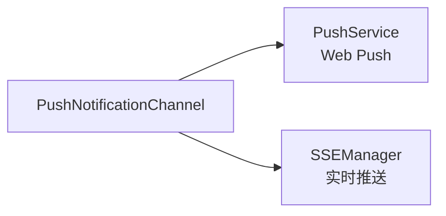
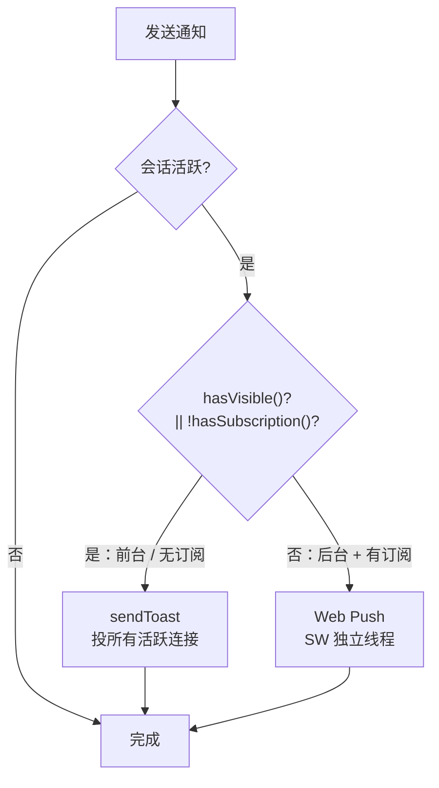
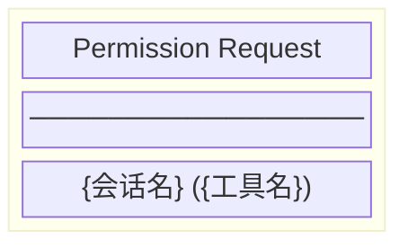
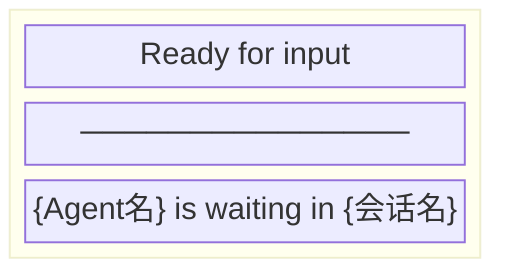

# PushNotificationChannel 架构

**文件**: [`packages/hub/src/push/pushNotificationChannel.ts`](/packages/hub/src/push/pushNotificationChannel.ts)

推送通知通道，实现 `NotificationChannel` 接口，结合 SSE 和 Web Push 实现智能降级通知。

## 依赖关系



> 注：`PushNotificationChannel` 通过 `sseManager.hasVisibleConnection()`（间接消费 VisibilityTracker）与 `pushService.hasSubscription()` 分级判定通道选择。

## 核心职责

实现 `NotificationChannel` 接口，处理两种通知场景：

| 方法 | 触发场景 |
|------|---------|
| `sendPermissionRequest()` | CLI 请求权限时 |
| `sendReady()` | Agent 等待用户输入时 |

## 降级策略



**通道选择**（Hub 端）：`shouldUseToast = hasVisibleConnection(ns) || !hasSubscription(ns)`（依赖 `sseManager.hasVisibleConnection` 间接消费 VisibilityTracker，与 `pushService.hasSubscription`）。

| 条件 | 通知方式 |
|------|---------|
| 有可见连接（用户在前台） | `sendToast` 投所有活跃连接，不打扰 |
| 无 push 订阅（无法 Web Push） | `sendToast` 投所有活跃连接（兜底，前端转系统通知） |
| 后台 + 已订阅 push | Web Push（SW 独立线程，长时后台可靠） |

**「要不要打扰」由前端本地判定**：`decideToastAction(sessionId, { activeSessionId, isHidden })` 三分支：

| 连接状态 + 当前路由 | 处理方式 |
|------|---------|
| visible 且当前路由在该 session | 忽略（用户已看到） |
| visible 但不在该 session | 页面 Toast + 角标 |
| hidden | 系统通知（Web Notification） |

多设备天然支持：每个活跃 SSE 连接独立在前端判定展示方式。

## 通知类型

### Permission Request

触发时机：CLI 需要用户授权工具调用时。



| 属性 | 值 |
|------|-----|
| title | `Permission Request` |
| body | `{会话名} ({工具名})` |
| tag | `permission-{sessionId}` |
| type | `permission-request` |

### Ready for Input

触发时机：Agent 完成任务，等待用户输入时。



| 属性 | 值 |
|------|-----|
| title | `Ready for input` |
| body | `{Agent名} is waiting in {会话名}` |
| tag | `ready-{sessionId}` |
| type | `ready` |

## 数据结构

### SSE Toast 格式

```typescript
{
    type: 'toast',
    data: {
        title: string,      // 通知标题
        body: string,       // 通知正文
        sessionId: string,  // 会话 ID
        url: string,        // 跳转路径
        kind: 'ready' | 'permission'  // 通知类型（ready=等待输入, permission=权限请求）
    }
}
```

### Web Push Payload 格式

```typescript
{
    title: string,
    body: string,
    tag?: string,           // 用于合并/替换通知
    data?: {
        type: string,       // 通知类型
        sessionId: string,  // 会话 ID
        url: string         // 跳转路径
    }
}
```

## 与其他模块交互

| 模块 | 交互方式 |
|------|---------|
| PushService | 调用 `hasSubscription()` 判定订阅、`sendToNamespace()` 发送 Web Push |
| SSEManager | 调用 `hasVisibleConnection()` 判定通道、`sendToast()` 发送实时 Toast |
| SyncEngine | 作为 NotificationChannel 被调用 |
