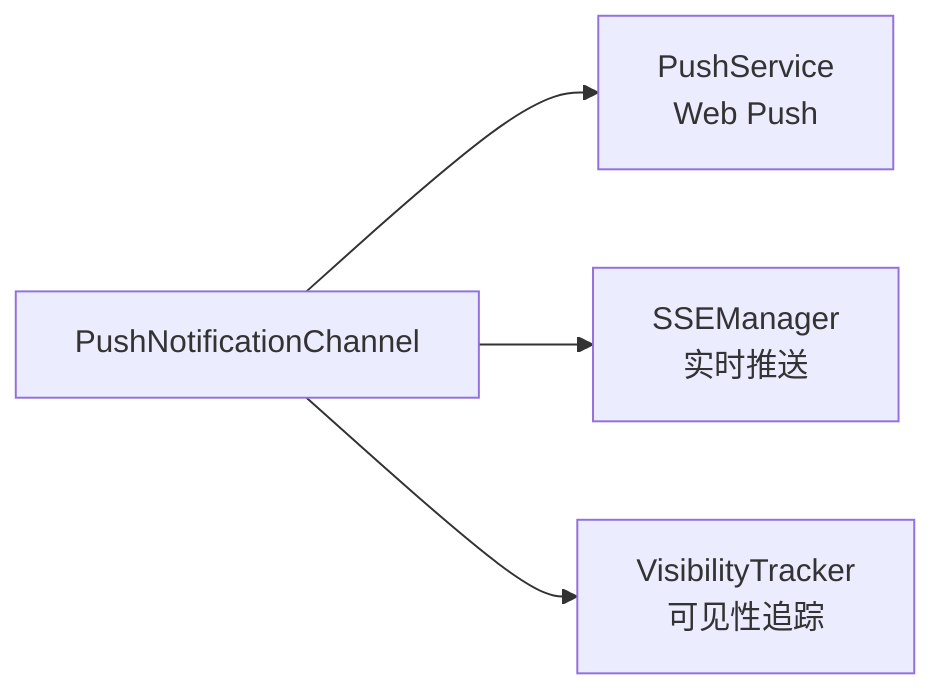
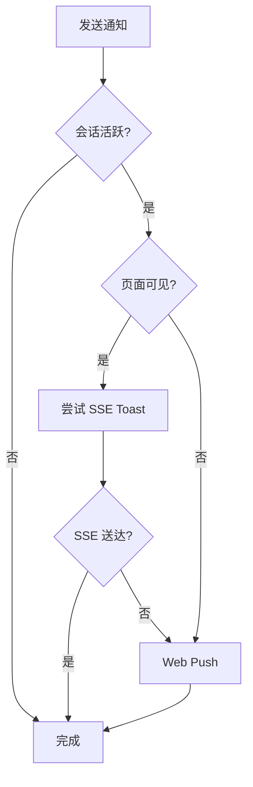
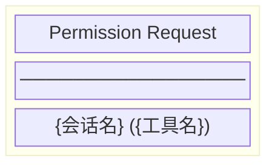
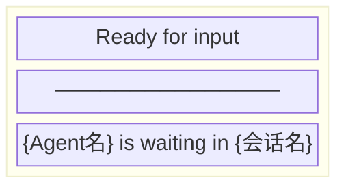

# PushNotificationChannel 架构

**文件**: [`packages/hub/src/push/pushNotificationChannel.ts`](/packages/hub/src/push/pushNotificationChannel.ts)

推送通知通道，实现 `NotificationChannel` 接口，结合 SSE 和 Web Push 实现智能降级通知。

## 依赖关系



## 核心职责

实现 `NotificationChannel` 接口，处理两种通知场景：

| 方法 | 触发场景 |
|------|---------|
| `sendPermissionRequest()` | CLI 请求权限时 |
| `sendReady()` | Agent 等待用户输入时 |

## 降级策略



**优先级**：SSE Toast > Web Push

| 条件 | 通知方式 |
|------|---------|
| 页面可见 + SSE 送达 | SSE Toast（实时） |
| 页面可见 + SSE 未送达 | Web Push |
| 页面不可见 | Web Push |

## 通知类型

### Permission Request

触发时机：CLI 需要用户授权工具调用时。



| 属性 | 值 |
|------|-----|
| title | `Permission Request` |
| body | `{会话名} ({工具名})` |
| tag | `permission-{sessionId}` |
| type | `permission-request` |

### Ready for Input

触发时机：Agent 完成任务，等待用户输入时。



| 属性 | 值 |
|------|-----|
| title | `Ready for input` |
| body | `{Agent名} is waiting in {会话名}` |
| tag | `ready-{sessionId}` |
| type | `ready` |

## 数据结构

### SSE Toast 格式

```typescript
{
    type: 'toast',
    data: {
        title: string,      // 通知标题
        body: string,       // 通知正文
        sessionId: string,  // 会话 ID
        url: string         // 跳转路径
    }
}
```

### Web Push Payload 格式

```typescript
{
    title: string,
    body: string,
    tag?: string,           // 用于合并/替换通知
    data?: {
        type: string,       // 通知类型
        sessionId: string,  // 会话 ID
        url: string         // 跳转路径
    }
}
```

## 与其他模块交互

| 模块 | 交互方式 |
|------|---------|
| PushService | 调用 `sendToNamespace()` 发送 Web Push |
| SSEManager | 调用 `sendToast()` 发送实时 Toast |
| VisibilityTracker | 调用 `hasVisibleConnection()` 检查可见性 |
| SyncEngine | 作为 NotificationChannel 被调用 |
