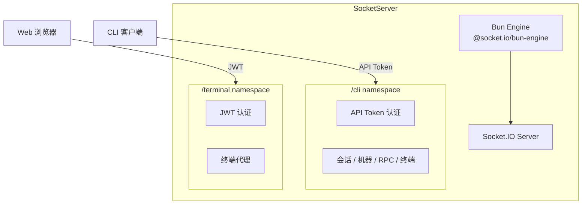
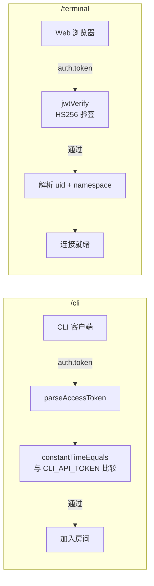
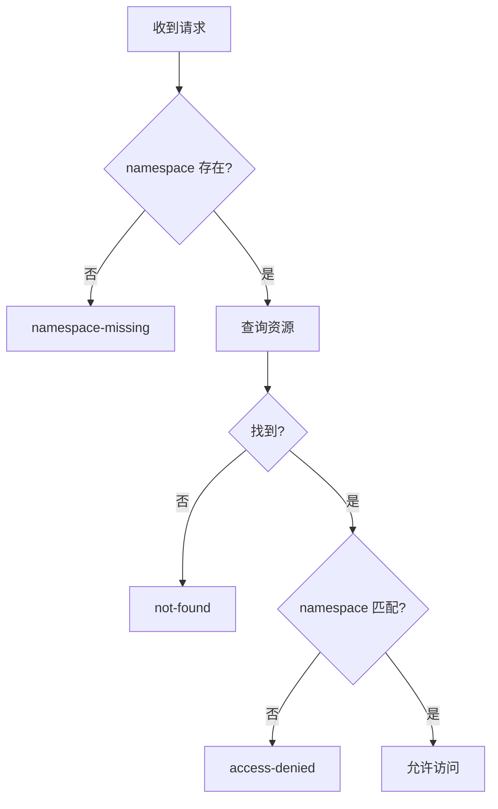
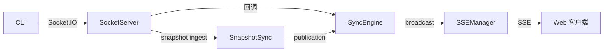

# SocketServer

**文件**: [`packages/hub/src/socket/server.ts`](/packages/hub/src/socket/server.ts)

SocketServer 是 Hub 的实时通信层，基于 Socket.IO，负责 CLI 客户端和 Web 前端之间的双向实时通信。

## 整体架构



两个 namespace 隔离了不同客户端类型的连接和认证逻辑：

| Namespace | 客户端 | 认证方式 | 用途 |
|-----------|--------|----------|------|
| `/cli` | CLI 客户端 | API Token | 会话心跳、消息同步、状态更新、RPC、终端控制 |
| `/terminal` | Web 浏览器 | JWT | 终端输入/输出代理 |

## 事件总览

### /cli namespace

CLI 连接后，通过事件与 Hub 交互。事件按职责分为六组：

**会话事件**（`sessionHandlers.ts`）

| 事件 | 方向 | 说明 |
|------|------|------|
| `message` | CLI → Hub | 发送消息，存入数据库并广播给同房间客户端 |
| `session-message`（snapshot / snapshotDelta） | CLI → Hub | 校验会话后交给 `SnapshotSync.ingest()`，不落库；接受的 publication 转交 SyncEngine |
| `snapshot-stream-end` | CLI → Hub | 通知 `SnapshotSync` 精确结束指定流，清完整基线和订阅游标 |
| `session-alive` | CLI → Hub | 会话心跳，保活状态，携带运行时字段（`running`、`mode`、`permissionMode`、`model`、`effort`） |
| `session-end` | CLI → Hub | 会话结束，触发清理 |
| `context-usage` | CLI → Hub | 上下文用量事件驱动上报（启动采样/result 采样走 SDK `getContextUsage({detail:'summary'})` 零 LLM + assistant usage 派生），落库到 `runtimeState.contextUsage` 并广播给 Web |
| `goal-status` | CLI → Hub | 上报 `/goal` 状态（scanner 从 transcript `attachment.goal_status` 提取后双发：RPC 落库 `runtimeState.goalStatus` + `goal_progress` 消息进聊天流），`goalStatus:null` 表示清空（达成 10s 后 / 手动清理） |
| `run-started` | CLI → Hub | 轮次起点上报（`running` 翻转 false→true 时），落库 `runtimeState.runStartedAt` 并广播给 Web；StatusBar 计时的权威来源（不随 Web 消息窗口化丢失） |
| `cache-status` | CLI → Hub | 会话恢复（resume/fork）时 prompt cache 过期状态（SessionStart hook 信号），落库 `runtimeState.cacheStatus` 并广播给 Web；`cacheStatus:null` 表示清空（首 turn result 到达后 CLI 清除） |
| `receive-readiness` | CLI → Hub | 「本会话此刻能不能收消息」的翻转上报（sink 接通 `true` / 轮次收尾断开 `false`）。**不落库、不广播**——只在 Hub 进程内喂 `SessionReceiveReadiness`（供「建完即可用」等待与投递失败成因解释），随会话进程生灭且会反复翻转 |
| `update-metadata` | CLI ⇄ Hub | 更新会话元数据（名称等），带乐观锁 |
| `update-state` | CLI ⇄ Hub | 更新 Agent 状态（requests 等），带乐观锁 |
| `idle-timeout-warning` | CLI → Hub | 空闲超时预警，广播到 Web 端 |

**机器事件**（`machineHandlers.ts`）

| 事件 | 方向 | 说明 |
|------|------|------|
| `machine-alive` | CLI → Hub | 机器心跳，保活在线状态 |
| `machine-update-metadata` | CLI ⇄ Hub | 更新机器元数据 |
| `machine-update-state` | CLI ⇄ Hub | 更新 Runner 状态 |

**RPC 事件**（`rpcHandlers.ts`）

| 事件 | 方向 | 说明 |
|------|------|------|
| `rpc-register` | CLI → Hub | 注册 RPC 方法 |
| `rpc-unregister` | CLI → Hub | 注销 RPC 方法 |

Hub 通过 `rpc-request` 事件调用 CLI 的 RPC 方法，用于 Web 端发起的权限操作、文件操作等。详见 [RPC 框架](./rpc.md)。

**终端事件（CLI 端）**（`terminalHandlers.ts`）

| 事件 | 方向 | 说明 |
|------|------|------|
| `terminal:ready` | CLI → Hub | 终端就绪 |
| `terminal:output` | CLI → Hub | 终端输出 |
| `terminal:exit` | CLI → Hub | 终端退出 |
| `terminal:error` | CLI → Hub | 终端错误 |

**UI 命令事件**（`uiCommandHandlers.ts`，agent 触达 mobi 界面，A 类）

| 事件 | 方向 | 说明 |
|------|------|------|
| `sendUiCommand` | CLI → Hub | agent 发起的 UI 命令（如打开文件），广播给活跃 Web 连接。ack 的 `delivered=true` 是「已广播给活跃连接」而非「用户已看到」；无 Web 在线时 `false`（调用成功、非错误），连接故障才 reject |

**Agent 会话操作事件**（`agentSessionHandlers.ts`，agent 触达其他会话，B 类；见 ADR 0005）

namespace 由 Hub 从鉴权过的 `sid` 解析，CLI 不填也不可信；四个都是 `emitWithAck` 的请求/响应事件。

| 事件 | 方向 | 说明 |
|------|------|------|
| `listMachinesForAgent` | CLI → Hub | 列可派活的**在线**机器（离线机器不出现，列出来只会让 agent 选中注定失败的目标） |
| `listSessionsForAgent` | CLI → Hub | 列可派活的会话（keyword / status / limit / projectId 过滤；默认 `ACTIVE`、上限 50） |
| `createSessionForAgent` | CLI → Hub | 在某台机器上起新会话进程。默认 `waitForReady`：返回前**保证新会话能收消息**（服务端固定 3s 预算），ack 带 `readiness: 'ready' \| 'not-ready' \| 'not-checked'`；等不到仍算成功（会话确实建好了）。失败文案由 Hub 译成人话 |
| `sendMessageToSessionForAgent` | CLI → Hub | 把一条消息投给若干会话。**不经投递队列**（`sentFrom:'cli'` ⇒ `lifecycle=null`）、不可取消/编辑；逐目标独立返回 `{sessionId, ok, error?}`，失败文案里「还没连上」与「连接没了」靠 `receive-readiness` 的事实分开说 |

各事件的详细处理流程见 [事件处理器架构](./handlers.md)。

### /terminal namespace

Web 端通过此 namespace 代理终端 I/O：

| 事件 | 方向 | 说明 |
|------|------|------|
| `terminal:create` | Web → Hub | 创建终端，转发给 CLI |
| `terminal:write` | Web → Hub | 终端输入，转发给 CLI |
| `terminal:resize` | Web → Hub | 终端大小变更，转发给 CLI |
| `terminal:close` | Web → Hub | 关闭终端 |

终端数据流：Web ↔ `/terminal` ↔ Hub ↔ `/cli` ↔ CLI，不经过 SyncEngine。详见 [事件处理器架构](./handlers.md) 和 [终端代理](./terminal.md)。

## 核心机制

### 认证

两个 namespace 使用不同的认证策略：



- `/cli`：使用 `CLI_API_TOKEN` 做固定令牌认证，通过时间恒定比较防止时序攻击
- `/terminal`：使用 JWT 认证，验证 HS256 签名，提取 `uid` 和 `ns`（namespace）

认证通过后，客户端信息存入 `socket.data`：

```typescript
// /cli namespace
socket.data.namespace = parsedToken.namespace

// /terminal namespace
socket.data.userId = parsed.data.uid
socket.data.namespace = parsed.data.ns
```

### 权限控制

每个事件处理前都会通过 `resolveSessionAccess` 或 `resolveMachineAccess` 检查：

1. namespace 是否匹配（多租户隔离）
2. 资源是否存在
3. 客户端是否有权访问



### 房间机制

CLI 连接后自动加入房间，用于 Socket.IO 的广播定向：

| 房间 | 加入条件 | 用途 |
|------|----------|------|
| `session:{sessionId}` | auth 中携带 sessionId 且有权限 | 同会话的 CLI 客户端接收 `update` 事件 |
| `machine:{machineId}` | auth 中携带 machineId 且有权限 | 同机器的 CLI 客户端接收 `update` 事件 |

hub→CLI 推送按域分事件名：session room 走 `session-update`，machine room 走 `machine-update`（body.t 判别不变）。

### 快照连接 lease

合法的 session CLI 连接会从 `SnapshotSync.attachCli()` 取得 lease。断连时只关闭自己的 lease；若同一会话已被新 socket 接管，旧 socket 的迟到 `disconnect` 不会清理新连接重建的快照基线。这个连接所有权与快照缓存由同一 module 维护，Socket 层不再保存独立 epoch 表。

### 乐观锁

`update-metadata`、`update-state`、`machine-update-metadata`、`machine-update-state` 四个事件使用乐观锁机制：

- 请求中携带 `expectedVersion`
- 数据库更新时比对版本号
- 成功则递增版本，失败返回 `version-mismatch` 和当前版本

这保证了 CLI 和 Web 并发更新时不会丢失数据。

## RPC 框架

CLI 通过 `rpc-register` 注册 RPC 方法（如权限操作、文件操作），Web 端通过 Hub 调用。

详见 [RpcRegistry](./rpc.md)。

## 终端代理

终端通道在 Web 和 CLI 之间实时双向转发终端 I/O，通过 `TerminalRegistry` 管理终端生命周期。

详见 [终端代理](./terminal.md)。

## 与 SyncEngine 的关系

SocketServer 与 SyncEngine 存在循环引用：

```
SocketServer ←(lazy getter)→ SyncEngine
```

- SocketServer 创建时传入 `getSession`、`onSessionAlive` 等回调，这些回调由 SyncEngine 实现
- SyncEngine 创建时使用 SocketServer 的 `io` 和 `rpcRegistry`

在 `index.ts` 中的解决方式：

```typescript
// SocketServer 先创建，回调中引用 SyncEngine（此时为 null）
const socketServer = createSocketServer({
    getSession: (sessionId) => syncEngine?.getSession(sessionId) ?? null,
    onSessionAlive: (payload) => syncEngine?.handleSessionAlive(payload),
    ...
})

// SyncEngine 后创建，使用 SocketServer 的 io 和 rpcRegistry
syncEngine = new SyncEngine(store, socketServer.io, socketServer.rpcRegistry, sseManager)
```

### 事件转发链路



CLI → SocketServer（通过回调）→ SyncEngine → SSEManager → Web

## 代码结构

```
packages/hub/src/socket/
├── server.ts                  # 入口：创建 Socket.IO Server，配置 namespace
├── socketTypes.ts             # 类型定义：SocketData、SocketServer 等
├── rpcRegistry.ts             # RPC 方法注册表
├── terminalRegistry.ts        # 终端注册表，管理终端生命周期
└── handlers/
    ├── terminal.ts            # /terminal namespace 处理器
    └── cli/
        ├── index.ts           # /cli 入口：注册所有 CLI 处理器
        ├── types.ts           # 访问控制类型：AccessResult
        ├── sessionHandlers.ts # 会话事件处理器
        ├── machineHandlers.ts # 机器事件处理器
        ├── rpcHandlers.ts     # RPC 注册/注销处理器
        ├── terminalHandlers.ts # 终端事件处理器（CLI 端）
        ├── uiCommandHandlers.ts # UI 命令处理器（A 类：agent 触达 mobi 界面）
        └── agentSessionHandlers.ts # Agent 会话操作处理器（B 类：agent 触达其他会话）
```

## 配置项

| 环境变量 | 默认值 | 说明 |
|----------|--------|------|
| `MOBI_TERMINAL_IDLE_TIMEOUT_MS` | 900000 (15min) | 终端空闲超时时间 |
| `MOBI_TERMINAL_MAX_TERMINALS` | 4 | 每个 socket/session 最大终端数 |

### 传输上限（bun-engine）

bun-engine 的 `maxHttpBufferSize` 设为 **4MB**（`packages/hub/src/socket/server.ts`）。注意此选项必须**直接设在 bun-engine 构造参数**上——`io.bind(外部 engine)` 不会把 `new Server({ maxHttpBufferSize })` 透传给外部 engine。

允许 `readFileRange` / `uploadFileRange` 等 RPC 的单个二进制 chunk（当前 2MB）往返；bun-engine 默认仅 1MB，超过会触发 `payload too large` 断连（CLI 大文件预览/上传失败的常见根因）。调整 shared `RPC_BINARY_CHUNK_SIZE` 时需同步评估此上限。
