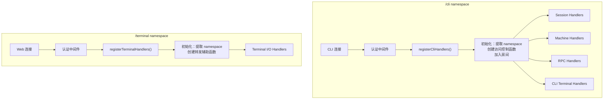
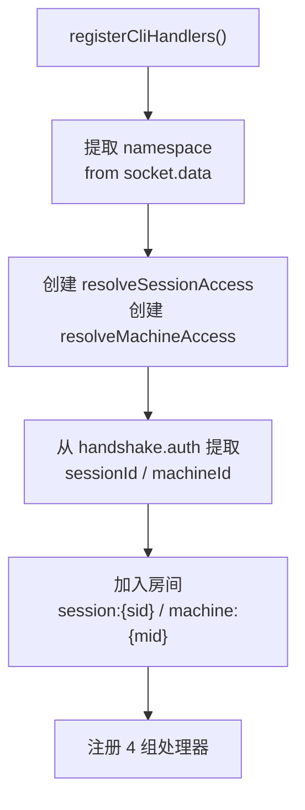
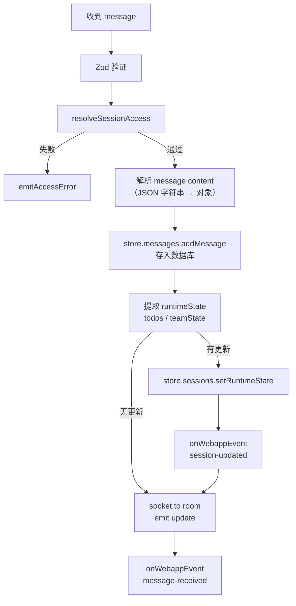
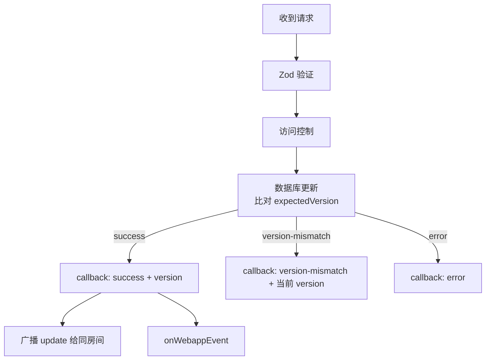
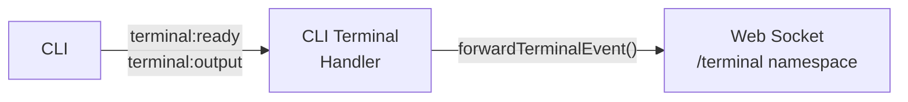
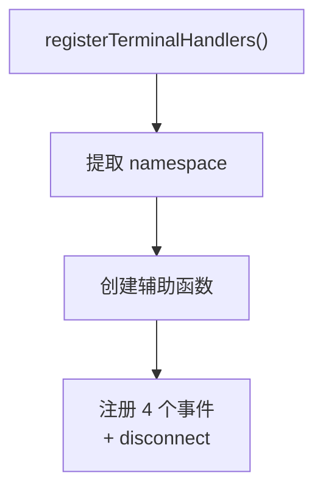
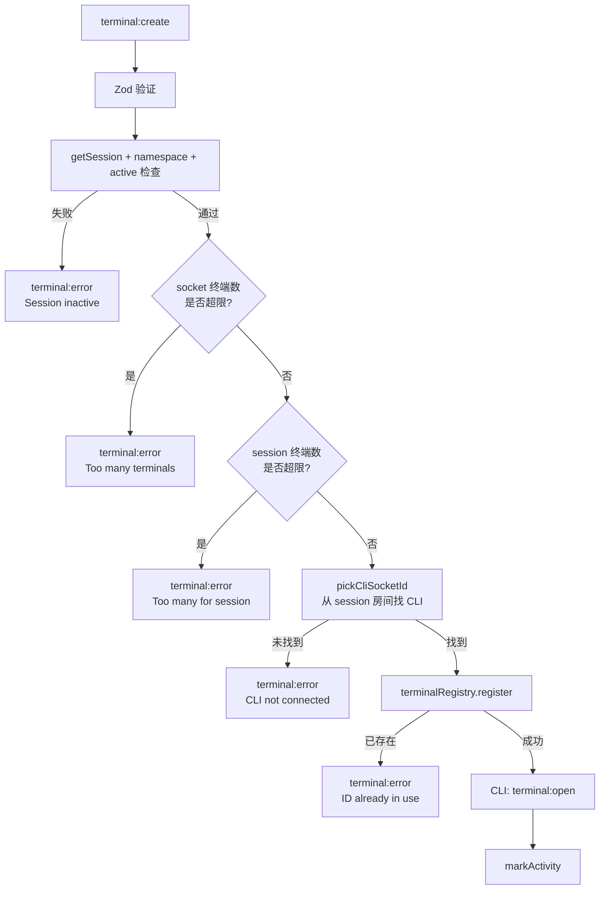
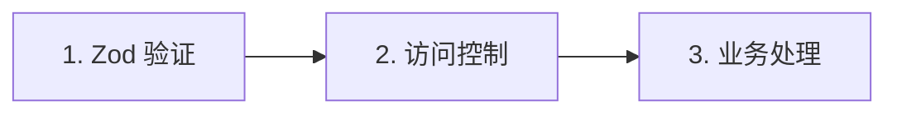
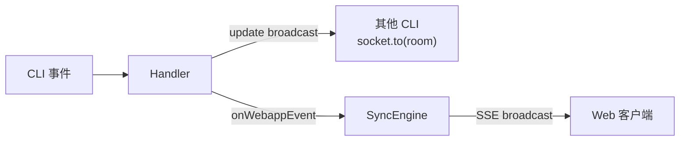

# 事件处理器架构

> **目录**
>
> - [整体流程](#整体流程)
> - [/cli namespace：connection 流程](#/cli-namespaceconnection-流程)
>   - [初始化阶段](#1-初始化阶段)
>   - [处理器注册](#2-处理器注册)
>   - [断线清理](#3-断线清理)
> - [/cli 会话处理器](#/cli-会话处理器)
> - [/cli 机器处理器](#/cli-机器处理器)
> - [/cli RPC 处理器](#/cli-rpc-处理器)
> - [/cli 终端处理器（CLI 端）](#/cli-终端处理器cli-端)
> - [/terminal namespace：connection 流程](#/terminal-namespaceconnection-流程)
> - [共同模式](#共同模式)

**文件**:
- [`hub/src/socket/handlers/cli/index.ts`](/hub/src/socket/handlers/cli/index.ts) — /cli 入口
- [`hub/src/socket/handlers/terminal.ts`](/hub/src/socket/handlers/terminal.ts) — /terminal 入口

两个 namespace 在客户端连接后，分别注册各自的处理器组。本文梳理 connection 之后的完整流程。

## 整体流程



两个入口对比：

| | /cli `registerCliHandlers` | /terminal `registerTerminalHandlers` |
|---|---|---|
| 客户端 | CLI 客户端 | Web 浏览器 |
| 处理器数 | 4 组子处理器 | 1 组 |
| 访问控制 | resolveSessionAccess / resolveMachineAccess | getSession + namespace 检查 |
| 房间加入 | session + machine 房间 | 无 |
| 跨 namespace | 需要访问 /terminal socket | 需要访问 /cli socket |

---

## /cli namespace：connection 流程

CLI 客户端通过认证后，进入 `registerCliHandlers(socket, deps)`。

### 1. 初始化阶段



**访问控制函数**在初始化时创建，被所有子处理器共享：

| 函数 | 逻辑 |
|------|------|
| `resolveSessionAccess(sid)` | namespace 检查 → 按 namespace 查询 session → 返回 ok / access-denied / not-found |
| `resolveMachineAccess(mid)` | namespace 检查 → 按 namespace 查询 machine → 返回 ok / access-denied / not-found |

这两个函数实现了多租户隔离：同一个 sessionId，只有匹配 namespace 的客户端才能访问。

**房间加入**：从 `handshake.auth` 中提取 `sessionId` 和 `machineId`，权限校验通过后加入。后续 `socket.to(room).emit(...)` 实现同房间广播。

### 2. 处理器注册

初始化后，依次注册 4 组处理器：

```
registerRpcHandlers(socket, rpcRegistry)
registerSessionHandlers(socket, { store, resolveSessionAccess, emitAccessError, ... })
registerMachineHandlers(socket, { store, resolveMachineAccess, emitAccessError, ... })
registerTerminalHandlers(socket, { terminalRegistry, terminalNamespace, resolveSessionAccess, ... })
```

另外注册 `ping`（心跳）和 `disconnect`（断线清理）。

### 3. 断线清理

```typescript
socket.on('disconnect', () => {
    rpcRegistry.unregisterAll(socket)                          // 清理 RPC 注册
    cleanupTerminalHandlers(socket, { terminalRegistry, terminalNamespace }) // 清理终端
})
```

---

## /cli 会话处理器

**文件**: [`hub/src/socket/handlers/cli/sessionHandlers.ts`](/hub/src/socket/handlers/cli/sessionHandlers.ts)

处理会话相关的所有事件。

### 事件一览

| 事件 | 模式 | 数据库 | 广播 | 回调 |
|------|------|--------|------|------|
| `message` | 单向 | 写入消息 + 更新 runtimeState | `update` → 同房间 | onWebappEvent |
| `update-metadata` | 请求/响应 | 乐观锁更新 metadata | `update` → 同房间 | onWebappEvent |
| `update-state` | 请求/响应 | 乐观锁更新 agentState | `update` → 同房间 | onWebappEvent |
| `session-alive` | 单向 | — | — | onSessionAlive |
| `session-end` | 单向 | — | — | onSessionEnd |

### message：消息接收

最复杂的事件，涉及消息存储、runtimeState 提取和双重通知。



**双重通知机制**：每次事件处理后同时做两件事：
1. `socket.to(room).emit('update', ...)` — 广播给同房间的其他 CLI 客户端
2. `onWebappEvent(...)` — 转发给 SyncEngine，由 SyncEngine 通过 SSE 推送给 Web 端

**runtimeState 提取**：从消息内容中自动提取 todos 和 teamState，合并到 session 的 runtimeState 中。

### update-metadata / update-state：状态更新

两个事件使用相同的乐观锁模式：



CLI 通过 `expectedVersion` 实现乐观锁，如果版本不匹配，返回当前版本让 CLI 决定如何处理。

### session-alive / session-end：心跳与结束

简单转发事件给 SyncEngine：

- `session-alive` → `onSessionAlive` → SyncEngine 更新会话活跃状态
- `session-end` → `onSessionEnd` → SyncEngine 清理会话资源

两者都先做访问控制，不合法则返回错误。

---

## /cli 机器处理器

**文件**: [`hub/src/socket/handlers/cli/machineHandlers.ts`](/hub/src/socket/handlers/cli/machineHandlers.ts)

与会话处理器结构对称，处理机器相关事件。

### 事件一览

| 事件 | 模式 | 数据库 | 广播 | 回调 |
|------|------|--------|------|------|
| `machine-alive` | 单向 | — | — | onMachineAlive |
| `machine-update-metadata` | 请求/响应 | 乐观锁更新 | `update` → machine 房间 | onWebappEvent |
| `machine-update-state` | 请求/响应 | 乐观锁更新 | `update` → machine 房间 | onWebappEvent |

模式与会话处理器完全一致：访问控制 → 乐观锁更新 → 广播 + onWebappEvent。唯一区别是房间名为 `machine:{id}` 而非 `session:{id}`。

---

## /cli RPC 处理器

**文件**: [`hub/src/socket/handlers/cli/rpcHandlers.ts`](/hub/src/socket/handlers/cli/rpcHandlers.ts)

最简单的处理器组，只做注册/注销。

```
rpc-register   →  rpcRegistry.register(socket, method)
rpc-unregister →  rpcRegistry.unregister(socket, method)
```

详细文档见 [RPC 框架](./rpc.md)。

---

## /cli 终端处理器（CLI 端）

**文件**: [`hub/src/socket/handlers/cli/terminalHandlers.ts`](/hub/src/socket/handlers/cli/terminalHandlers.ts)

CLI 端的终端事件处理器，负责将 CLI 的终端输出转发给 Web 端。

### 转发流程



**核心函数 `forwardTerminalEvent()`**，统一处理 `terminal:ready` 和 `terminal:output`：

1. 从 TerminalRegistry 查找 entry
2. 验证 `cliSocketId === socket.id`（确保是归属的 CLI）
3. 验证 `sessionId` 匹配
4. 访问控制 `resolveSessionAccess`
5. 查找 Web 端 socket 并 emit

### 各事件处理

| 事件 | 处理 |
|------|------|
| `terminal:ready` | markActivity + forwardTerminalEvent |
| `terminal:output` | markActivity + forwardTerminalEvent |
| `terminal:exit` | 移除 registry entry + 转发给 Web socket |
| `terminal:error` | 验证归属 + 访问控制 + 转发给 Web socket + 移除 entry |

`terminal:exit` 和 `terminal:error` 的区别：
- `exit`：正常退出，先移除 entry 再转发
- `error`：CLI 报告错误，先移除 entry 再转发，防止无限重连循环

---

## /terminal namespace：connection 流程

Web 浏览器通过 JWT 认证后，进入 `registerTerminalHandlers(socket, deps)`。

### 1. 初始化阶段



**辅助函数**：

| 函数 | 用途 |
|------|------|
| `emitTerminalError(terminalId, message)` | 向当前 Web socket 发送错误 |
| `resolveEntryForSocket(terminalId)` | 查找 entry 并验证属于当前 socket |
| `resolveCliSocket(entry, reportError)` | 查找 CLI socket，不存在则清理 entry |
| `emitCloseToCli(entry)` | 向 CLI 发送 terminal:close |
| `pickCliSocketId(sessionId)` | 从 session 房间中找到匹配 namespace 的 CLI socket |

### 2. 事件处理

| 事件 | 方向 | 处理 |
|------|------|------|
| `terminal:create` | Web → CLI | 验证 → 限额检查 → 注册 → 转发 |
| `terminal:write` | Web → CLI | 验证 entry → 转发给 CLI |
| `terminal:resize` | Web → CLI | 验证 entry → 转发给 CLI |
| `terminal:close` | Web → CLI | 移除 entry → 通知 CLI |

### terminal:create 详细流程

最复杂的 /terminal 事件：



五层检查，任一失败都返回 `terminal:error` 给 Web 端。

### 3. 断线处理

Web 断开时，清理所有关联终端并通知 CLI：

```typescript
socket.on('disconnect', () => {
    const removed = terminalRegistry.removeBySocket(socket.id)
    for (const entry of removed) {
        emitCloseToCli(entry)  // CLI: terminal:close
    }
})
```

---

## 共同模式

### 事件处理三步骤

几乎所有事件都遵循相同的模式：



1. **Zod 验证**：所有 payload 都用 Zod schema 验证，不合法直接忽略（静默丢弃，不报错）
2. **访问控制**：通过 `resolveSessionAccess` 或 `resolveMachineAccess` 检查 namespace 隔离
3. **业务处理**：数据库操作、转发、广播等

### 双重通知

CLI → Hub 的事件处理后，数据通过两条路径到达 Web 端：



- `socket.to(room).emit('update', ...)` — 实时通知同房间的其他 CLI 客户端
- `onWebappEvent(...)` — 转发给 SyncEngine → SSEManager → Web 端

### 跨 namespace 通信

两个 namespace 之间通过 socket ID 直接访问：

| 场景 | 方向 | 方式 |
|------|------|------|
| /terminal → /cli | Web 终端输入 | `cliNamespace.sockets.get(cliSocketId)` |
| /cli → /terminal | CLI 终端输出 | `terminalNamespace.sockets.get(entry.socketId)` |

这是通过 `io.of('/cli')` 和 `io.of('/terminal')` 获取对端 namespace 引用来实现的。
