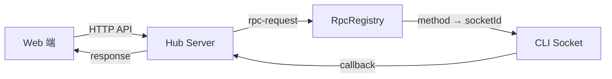
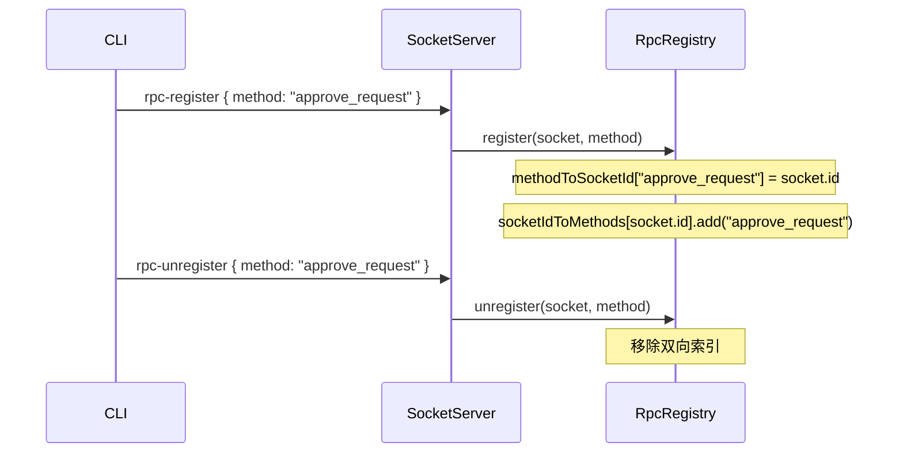
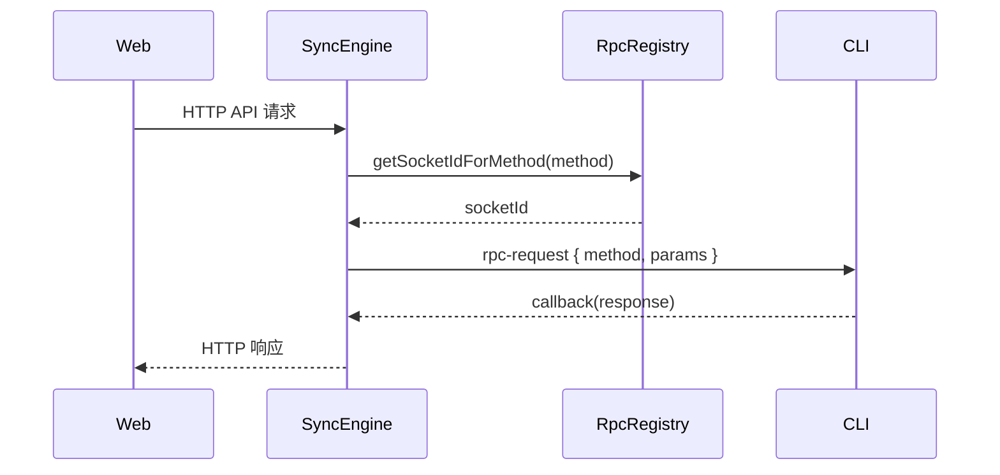

# RPC 框架

**文件**: [`packages/hub/src/socket/rpcRegistry.ts`](/packages/hub/src/socket/rpcRegistry.ts)

RpcRegistry 管理 CLI 注册的 RPC 方法，使 Web 端可以通过 Hub 远程调用 CLI 的方法。

## 架构



## 数据结构

RpcRegistry 维护两个双向索引：

```
methodToSocketId:   Map<method, socketId>     // 方法名 → CLI socket ID
socketIdToMethods:  Map<socketId, Set<method>> // CLI socket ID → 方法集合
```

通过双向索引可以：
- `getSocketIdForMethod(method)` — 快速查找提供某方法的 CLI socket
- `unregisterAll(socket)` — CLI 断开时批量清理所有注册的方法

## RPC 方法注册流程



## RPC 调用流程

当 Web 端需要调用 CLI 的 RPC 方法时：



## 断线清理

CLI 断开连接时，`unregisterAll` 批量清理：

```typescript
// 在 CLI handlers 的 disconnect 事件中
socket.on('disconnect', () => {
    rpcRegistry.unregisterAll(socket)
})
```

这确保了断线的 CLI 不会残留无效的 RPC 方法注册。
