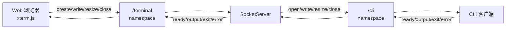
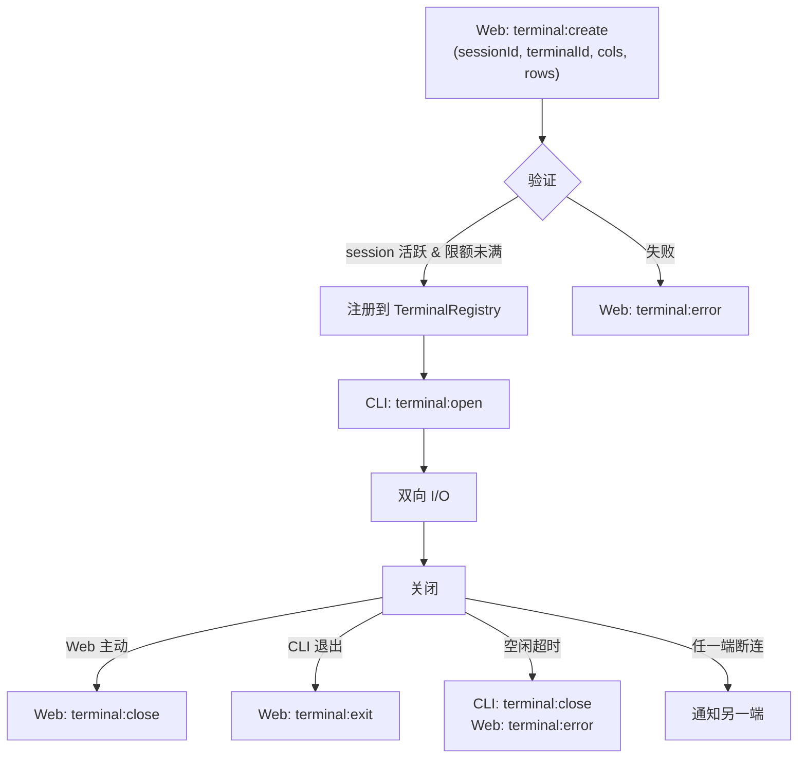
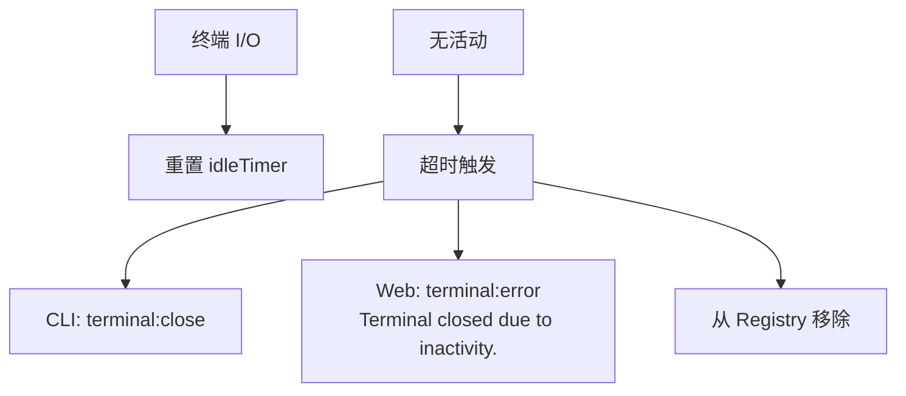

# 终端代理

**文件**:
- [`hub/src/socket/terminalRegistry.ts`](/hub/src/socket/terminalRegistry.ts)
- [`hub/src/socket/handlers/terminal.ts`](/hub/src/socket/handlers/terminal.ts)（/terminal namespace）
- [`hub/src/socket/handlers/cli/terminalHandlers.ts`](/hub/src/socket/handlers/cli/terminalHandlers.ts)（/cli namespace）

终端代理在 Web 浏览器和 CLI 之间实时转发终端 I/O，让用户可以在浏览器中操作远程终端。

## 架构



终端数据不经 SyncEngine，直接在两个 namespace 之间转发。

## 终端生命周期



## TerminalRegistry

管理所有活跃终端的注册表，提供四维索引：

```
terminals:          Map<terminalId, Entry>        // 主存储
terminalsBySocket:  Map<socketId, Set<terminalId>> // 按 Web socket 索引
terminalsBySession: Map<sessionId, Set<terminalId>> // 按会话索引
terminalsByCliSocket: Map<cliSocketId, Set<terminalId>> // 按 CLI socket 索引
```

每个 `TerminalRegistryEntry` 记录：

| 字段 | 说明 |
|------|------|
| `terminalId` | 终端唯一标识 |
| `sessionId` | 所属会话 |
| `socketId` | Web 端 socket ID |
| `cliSocketId` | CLI 端 socket ID |
| `idleTimer` | 空闲超时定时器 |

### 多维索引的用途

| 操作 | 使用的索引 |
|------|-----------|
| 创建终端时检查限额 | `countForSocket`、`countForSession` |
| Web 断开时清理 | `removeBySocket` |
| CLI 断开时清理 | `removeByCliSocket` |
| 转发事件时查找对端 | `get(terminalId)` |

## 空闲超时

每个终端有独立的空闲计时器：

- 默认 15 分钟（`MOBI_TERMINAL_IDLE_TIMEOUT_MS`）
- 每次有 I/O 活动时重置计时器
- 超时后通知两端并移除注册



## 限额控制

通过环境变量 `MOBI_TERMINAL_MAX_TERMINALS`（默认 4）控制：

| 限制维度 | 检查时机 |
|----------|----------|
| 每个 Web socket | `terminal:create` 时 |
| 每个 session | `terminal:create` 时 |

超过限额时返回 `terminal:error`，提示 "Too many terminals open"。

## 断线处理

任一端断开连接时，自动清理所有相关终端并通知对端：

| 断开端 | 清理方式 | 通知 |
|--------|----------|------|
| Web 断开 | `removeBySocket` | CLI 收到 `terminal:close` |
| CLI 断开 | `removeByCliSocket` | Web 收到 `terminal:error`（"CLI disconnected."） |
