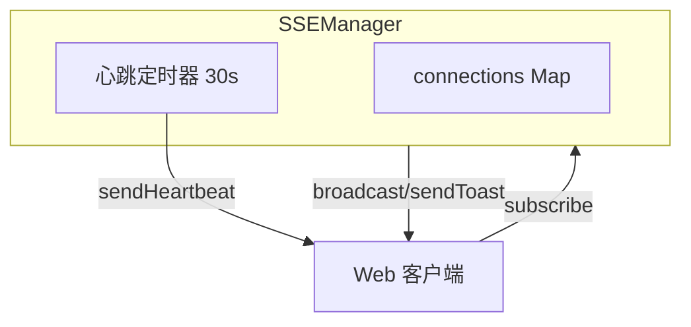
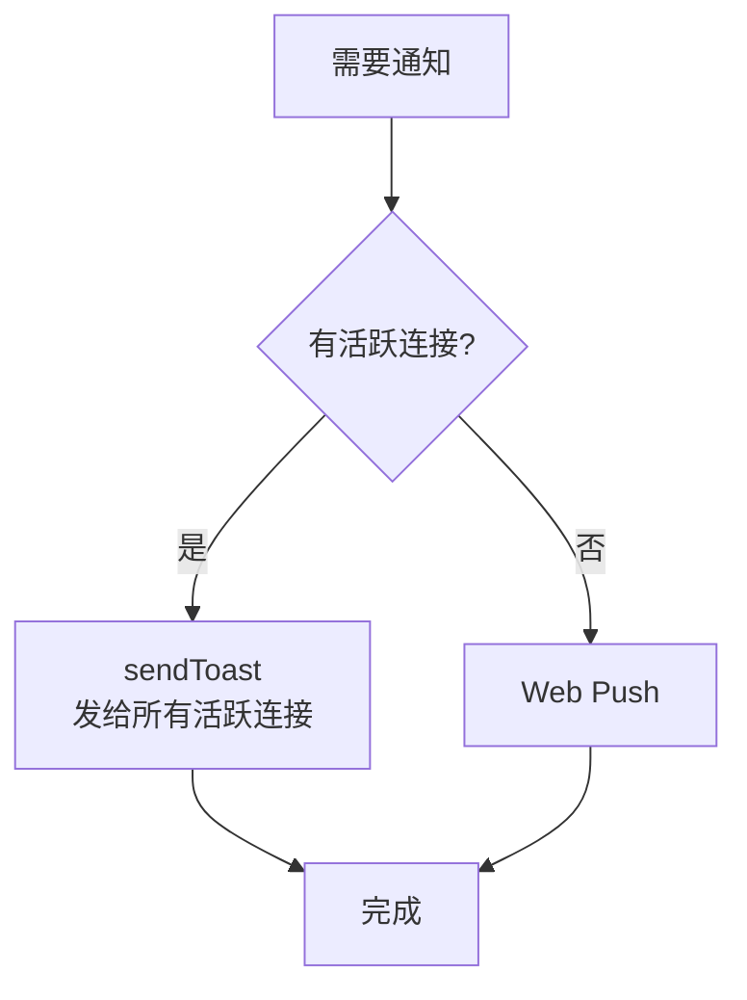
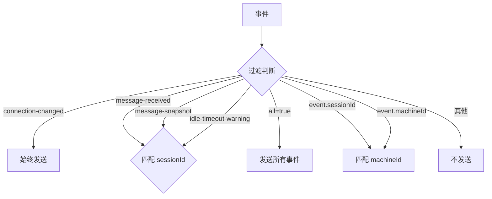
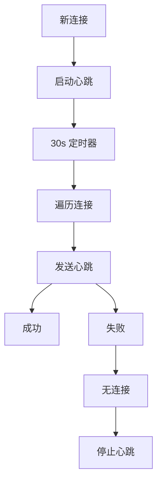

# SSEManager

**文件**: [`packages/hub/src/sse/sseManager.ts`](/packages/hub/src/sse/sseManager.ts)

管理 SSE（Server-Sent Events）连接，负责事件推送。

## 架构



## 核心方法

| 方法 | 作用 |
|------|------|
| `subscribe()` | 注册 SSE 连接 |
| `unsubscribe()` | 移除 SSE 连接 |
| `broadcast()` | 广播事件给所有匹配的连接 |
| `sendToast()` | 发送 toast 事件给该 namespace 所有活跃连接（含后台 hidden） |
| `hasActiveConnection()` | 查询某 namespace 是否有活跃连接（通知通道选择依据） |
| `stop()` | 停止所有连接和心跳 |

## sendToast vs broadcast

| | sendToast | broadcast |
|--|-----------|-----------|
| **投递范围** | 该 namespace 所有活跃连接（含后台 hidden） | 所有匹配连接 |
| **namespace** | 指定 namespace | 从 event 中提取 |
| **返回值** | 返回成功送达数量 | 无返回值 |
| **用途** | Toast 通知 | 广播事件 |

### sendToast

```typescript
async sendToast(namespace: string, event): Promise<number>
```

**发送条件**：
1. namespace 匹配
2. 匹配该 namespace 的**所有活跃连接**（含后台 hidden，不再过滤可见性）

**使用场景**：有活跃 SSE 连接时发送 Toast（通道选择由 `PushNotificationChannel` 调用 `hasActiveConnection()` 判定），前端据 `hidden` 标志决定页面 Toast 或系统通知。



### broadcast

```typescript
broadcast(event: SyncEvent): void
```

**发送条件**（`shouldSend` 逻辑）：

| 事件类型 | 发送对象 |
|---------|---------|
| `connection-changed` | 所有连接 |
| `message-received` | all=true 或对应 session 的订阅者 |
| `message-snapshot` | all=true 或对应 session 的订阅者 |
| `idle-timeout-warning` | all=true 或对应 session 的订阅者 |
| `session-updated` | all=true 或 session 匹配 |
| `machine-updated` | all=true 或 machine 匹配 |

**使用场景**：SyncEngine 广播事件给所有订阅者

## 订阅过滤逻辑

`shouldSend()` 方法决定事件是否发送给某个连接：



## 心跳机制



## 与 VisibilityTracker 的关系

`sendToast()` 现投递该 namespace **所有活跃连接**（含后台 hidden），不再按可见性过滤。通知链路通过 `hasActiveConnection()` 判定有无活跃连接来选择通道（有 → sendToast；无 → Web Push），「要不要打扰」由前端本地三分支判定（visible+当前 session→忽略 / visible+其他→页面 Toast+角标 / hidden→系统通知）。

VisibilityTracker 类一期保留不删（降风险），但 SSEManager 的通知投递逻辑不再消费它。后续清理项见 [docs/pending.md](../../../../pending.md) #17。
