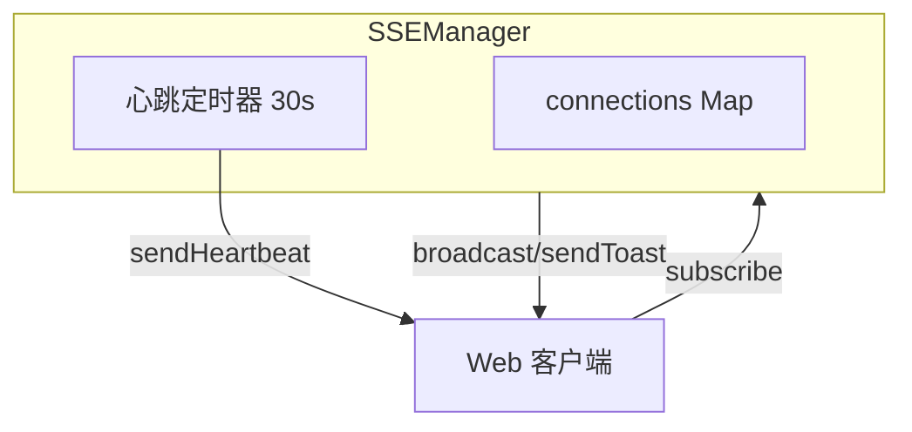
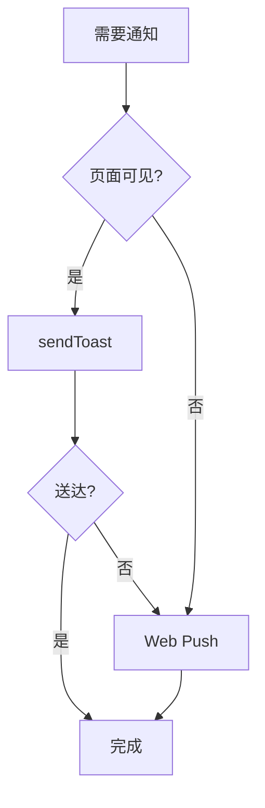
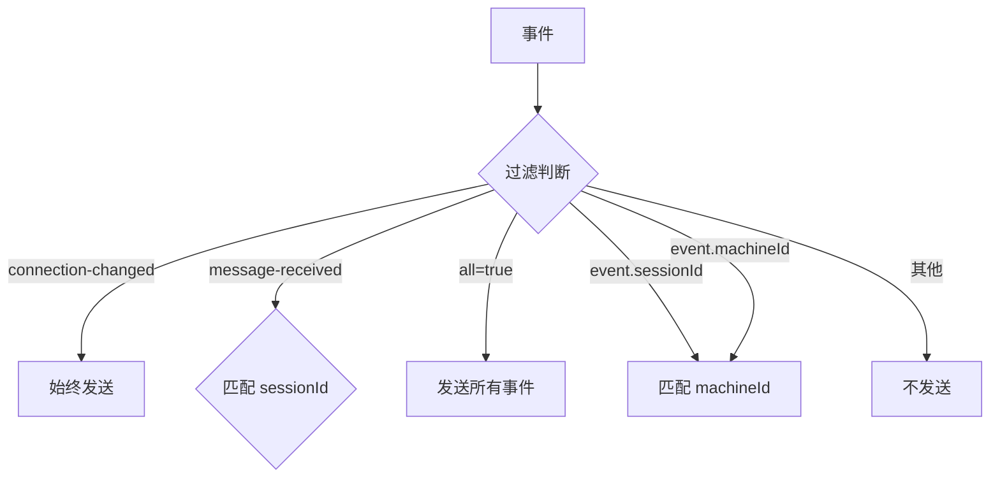
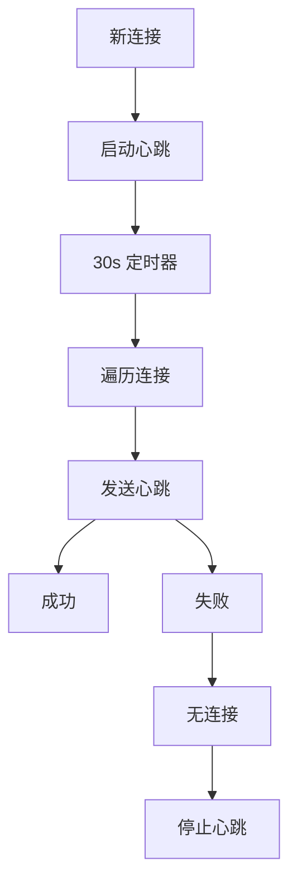

# SSEManager

**文件**: [`hub/src/sse/sseManager.ts`](/hub/src/sse/sseManager.ts)

管理 SSE（Server-Sent Events）连接，负责事件推送。

## 架构



## 核心方法

| 方法 | 作用 |
|------|------|
| `subscribe()` | 注册 SSE 连接 |
| `unsubscribe()` | 移除 SSE 连接 |
| `broadcast()` | 广播事件给所有匹配的连接 |
| `sendToast()` | 发送 toast 事件给可见连接 |
| `stop()` | 停止所有连接和心跳 |

## sendToast vs broadcast

| | sendToast | broadcast |
|--|-----------|-----------|
| **可见性** | 只发给**可见**连接 | 发给**所有**匹配连接 |
| **namespace** | 指定 namespace | 从 event 中提取 |
| **返回值** | 返回成功送达数量 | 无返回值 |
| **用途** | Toast 通知 | 广播事件 |

### sendToast

```typescript
async sendToast(namespace: string, event): Promise<number>
```

**发送条件**：
1. namespace 匹配
2. 连接**可见**（`isVisibleConnection`）

**使用场景**：页面可见时发送 Toast，与 Web Push 配合实现降级



### broadcast

```typescript
broadcast(event: SyncEvent): void
```

**发送条件**（`shouldSend` 逻辑）：

| 事件类型 | 发送对象 |
|---------|---------|
| `connection-changed` | 所有连接 |
| `message-received` | 对应 session 的订阅者 |
| `session-updated` | all=true 或 session 匹配 |
| `machine-updated` | all=true 或 machine 匹配 |

**使用场景**：SyncEngine 广播事件给所有订阅者

## 订阅过滤逻辑

`shouldSend()` 方法决定事件是否发送给某个连接：



## 心跳机制



## 与 VisibilityTracker 配合

`sendToast()` 只推送给**可见**的连接，其他事件则推送给所有匹配的连接。

```typescript
// sendToast 只推送给可见连接
if (!this.visibilityTracker.isVisibleConnection(connection.id)) {
    continue  // 跳过不可见连接
}
```

这样当用户离开页面时，可以改用 Web Push 通知。
