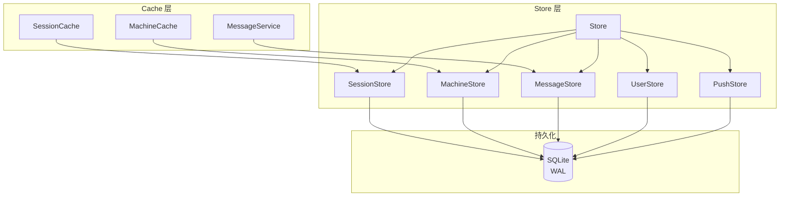

# Store 数据层

**文件**: [`hub/src/store/index.ts`](/hub/src/store/index.ts)

SQLite 数据库封装，使用 Bun 原生 SQLite，WAL 模式。

## 整体架构



## Store 子模块

| 子 Store | 职责 |
|----------|------|
| **SessionStore** | 会话持久化 |
| **MachineStore** | 机器持久化 |
| **MessageStore** | 消息持久化 |
| **UserStore** | 用户持久化 |
| **PushStore** | Web Push 订阅持久化 |

## 数据库配置

```typescript
PRAGMA journal_mode = WAL     // 写前日志，提升并发
PRAGMA synchronous = NORMAL   // 平衡性能和安全
PRAGMA foreign_keys = ON      // 启用外键约束
PRAGMA busy_timeout = 5000    // 5 秒超时
```

## 表结构

### sessions

| 字段 | 类型 | 说明 |
|------|------|------|
| id | TEXT PRIMARY KEY | 会话 ID |
| tag | TEXT | 会话标签 |
| namespace | TEXT | 命名空间 |
| machine_id | TEXT | 机器 ID |
| created_at | INTEGER | 创建时间 |
| updated_at | INTEGER | 更新时间 |
| metadata | TEXT | 元数据（JSON） |
| agent_state | TEXT | Agent 状态（JSON） |
| runtime_state | TEXT | 运行时状态（JSON） |
| group_key | TEXT | 分组标识 |

### machines

| 字段 | 类型 | 说明 |
|------|------|------|
| id | TEXT PRIMARY KEY | 机器 ID |
| namespace | TEXT | 命名空间 |
| created_at | INTEGER | 创建时间 |
| updated_at | INTEGER | 更新时间 |
| metadata | TEXT | 元数据（JSON） |
| runner_state | TEXT | 运行状态（JSON） |
| active | INTEGER | 是否在线 |
| active_at | INTEGER | 最后活跃时间 |

### messages

| 字段 | 类型 | 说明 |
|------|------|------|
| id | TEXT PRIMARY KEY | 消息 ID |
| session_id | TEXT | 会话 ID（外键） |
| content | TEXT | 消息内容（加密） |
| created_at | INTEGER | 创建时间 |
| seq | INTEGER | 序号 |
| local_id | TEXT | 本地 ID |

## 代码入口

```
hub/src/store/
├── index.ts           # Store 主入口
├── sessionStore.ts    # 会话存储
├── machineStore.ts    # 机器存储
├── messageStore.ts    # 消息存储
├── userStore.ts       # 用户存储
├── pushStore.ts       # Push 订阅存储
└── types.ts           # 类型定义
```
