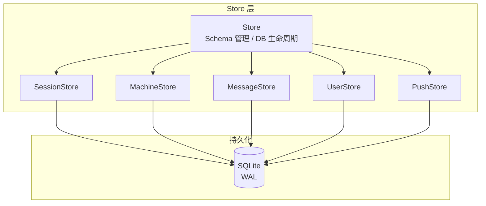

# Store 数据层

**文件**: [`packages/hub/src/store/index.ts`](/packages/hub/src/store/index.ts)

SQLite 数据库封装，使用 Bun 原生 SQLite，WAL 模式。

## 整体架构



## Store 子模块

| 子 Store | 职责 |
|----------|------|
| **SessionStore** | 会话 CRUD、分组查询、metadata / agentState / runtimeState 乐观锁更新 |
| **MachineStore** | 机器 CRUD、metadata / runnerState 乐观锁更新 |
| **MessageStore** | 消息追加、按序号分页查询、sidechain 查询、会话消息合并 |
| **UserStore** | 用户绑定（平台 + 平台 ID）、按平台/命名空间查询 |
| **PushStore** | Web Push 订阅管理（按命名空间） |

## 数据库配置

```typescript
PRAGMA journal_mode = WAL     // 写前日志，提升并发
PRAGMA synchronous = NORMAL   // 平衡性能和安全
PRAGMA foreign_keys = ON      // 启用外键约束
PRAGMA busy_timeout = 5000    // 5 秒超时
```

## Schema 版本管理

使用 `PRAGMA user_version` 跟踪 schema 版本，由 `/db-schema` skill 管理变更流程：

| `SCHEMA_RELEASE_BASELINE` | 状态 | 变更方式 |
|---|---|---|
| `0` | 未发布 | 直接修改 `createSchema()` |
| `> 0` | 已发布 | 递增 `SCHEMA_VERSION`，编写迁移方法 |

## 表结构

### sessions

| 字段 | 类型 | 约束 | 说明 |
|------|------|------|------|
| id | TEXT | PRIMARY KEY | 会话 ID |
| tag | TEXT | | 会话标签 |
| namespace | TEXT | NOT NULL DEFAULT 'default' | 命名空间 |
| machine_id | TEXT | | 机器 ID |
| created_at | INTEGER | NOT NULL | 创建时间 |
| updated_at | INTEGER | NOT NULL | 更新时间 |
| metadata | TEXT | | 元数据（JSON） |
| metadata_version | INTEGER | DEFAULT 1 | metadata 乐观锁版本号 |
| agent_state | TEXT | | Agent 状态（JSON） |
| agent_state_version | INTEGER | DEFAULT 1 | agentState 乐观锁版本号 |
| runtime_state | TEXT | | 运行时状态（JSON） |
| runtime_state_updated_at | INTEGER | | 运行时状态最后更新时间 |
| group_key | TEXT | | 分组标识 |
| seq | INTEGER | DEFAULT 0 | 序号 |

**索引**:
- `idx_sessions_tag` → `(tag)`
- `idx_sessions_tag_namespace` → `(tag, namespace)`
- `idx_sessions_group_key` → `(group_key)`

### machines

| 字段 | 类型 | 约束 | 说明 |
|------|------|------|------|
| id | TEXT | PRIMARY KEY | 机器 ID |
| namespace | TEXT | NOT NULL DEFAULT 'default' | 命名空间 |
| created_at | INTEGER | NOT NULL | 创建时间 |
| updated_at | INTEGER | NOT NULL | 更新时间 |
| metadata | TEXT | | 元数据（JSON） |
| metadata_version | INTEGER | DEFAULT 1 | metadata 乐观锁版本号 |
| runner_state | TEXT | | 运行状态（JSON） |
| runner_state_version | INTEGER | DEFAULT 1 | runnerState 乐观锁版本号 |
| active | INTEGER | DEFAULT 0 | 是否在线 |
| active_at | INTEGER | | 最后活跃时间 |
| seq | INTEGER | DEFAULT 0 | 序号 |

**索引**:
- `idx_machines_namespace` → `(namespace)`

### messages

| 字段 | 类型 | 约束 | 说明 |
|------|------|------|------|
| id | TEXT | PRIMARY KEY | 消息 ID |
| session_id | TEXT | NOT NULL, FK → sessions(id) ON DELETE CASCADE | 会话 ID |
| content | TEXT | NOT NULL | 消息内容（JSON） |
| created_at | INTEGER | NOT NULL | 创建时间 |
| seq | INTEGER | NOT NULL | 序号 |
| local_id | TEXT | | 客户端本地 ID |
| is_sidechain | INTEGER | NOT NULL DEFAULT 0 | 是否为 sidechain 消息 |
| parent_tool_use_id | TEXT | | 所属 tool_use 的消息 ID |

**索引**:
- `idx_messages_session` → `(session_id, seq)`
- `idx_messages_session_main` → `(session_id, seq, is_sidechain)`
- `idx_messages_parent_tool` → `(parent_tool_use_id)`
- `idx_messages_local_id` → `UNIQUE (session_id, local_id) WHERE local_id IS NOT NULL`

### users

| 字段 | 类型 | 约束 | 说明 |
|------|------|------|------|
| id | INTEGER | PRIMARY KEY AUTOINCREMENT | 用户 ID |
| platform | TEXT | NOT NULL | 平台标识 |
| platform_user_id | TEXT | NOT NULL | 平台用户 ID |
| namespace | TEXT | NOT NULL DEFAULT 'default' | 命名空间 |
| created_at | INTEGER | NOT NULL | 创建时间 |

**约束**:
- `UNIQUE(platform, platform_user_id)`

**索引**:
- `idx_users_platform` → `(platform)`
- `idx_users_platform_namespace` → `(platform, namespace)`

### push_subscriptions

| 字段 | 类型 | 约束 | 说明 |
|------|------|------|------|
| id | INTEGER | PRIMARY KEY AUTOINCREMENT | 订阅 ID |
| namespace | TEXT | NOT NULL | 命名空间 |
| endpoint | TEXT | NOT NULL | Push 端点 URL |
| p256dh | TEXT | NOT NULL | 公钥 |
| auth | TEXT | NOT NULL | 认证密钥 |
| created_at | INTEGER | NOT NULL | 创建时间 |

**约束**:
- `UNIQUE(namespace, endpoint)`

**索引**:
- `idx_push_subscriptions_namespace` → `(namespace)`

## 代码入口

```
packages/hub/src/store/
├── index.ts              # Store 主入口（DB 生命周期、Schema 管理）
├── types.ts              # Stored* 类型定义、VersionedUpdateResult
├── json.ts               # safeJsonParse 工具函数
├── versionedUpdates.ts   # 乐观锁通用更新 updateVersionedField()
├── sessions.ts           # 会话 SQL 操作（底层函数）
├── sessionStore.ts       # SessionStore 类（委托 sessions.ts）
├── machines.ts           # 机器 SQL 操作（底层函数）
├── machineStore.ts       # MachineStore 类（委托 machines.ts）
├── messages.ts           # 消息 SQL 操作（底层函数）
├── messageStore.ts       # MessageStore 类（委托 messages.ts）
├── users.ts              # 用户 SQL 操作（底层函数）
├── userStore.ts          # UserStore 类（委托 users.ts）
├── pushSubscriptions.ts  # Push 订阅 SQL 操作（底层函数）
└── pushStore.ts          # PushStore 类（委托 pushSubscriptions.ts）
```

每个子模块采用 **Store 类 + SQL 函数文件** 的分层模式：Store 类封装业务接口，同名（小写）文件包含纯 SQL 操作函数，两者通过 `Database` 实例连接。
