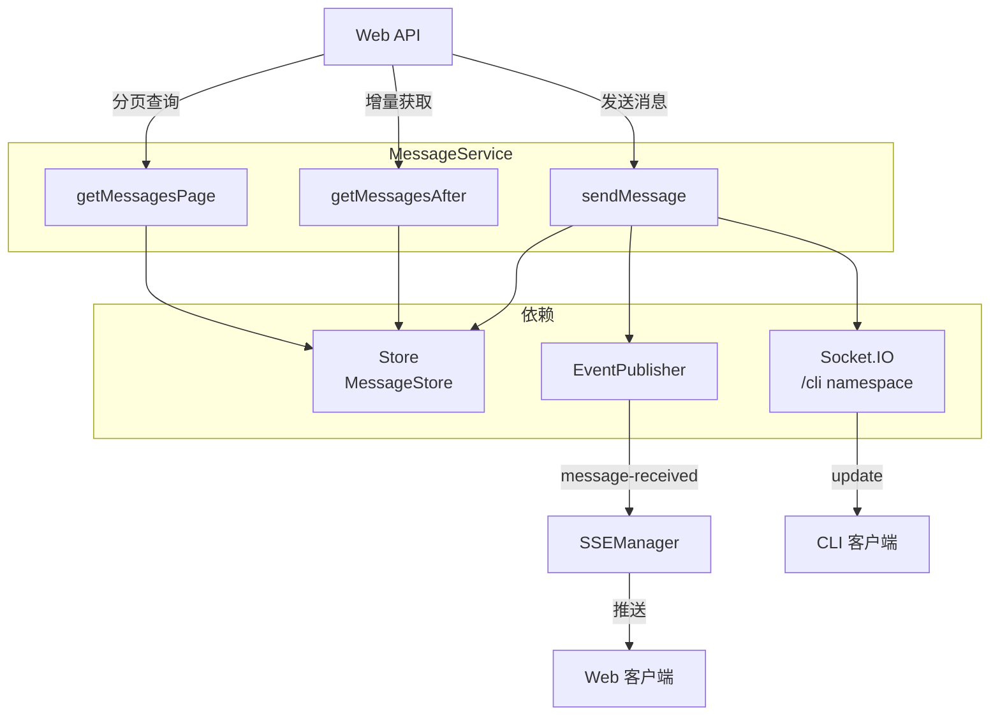
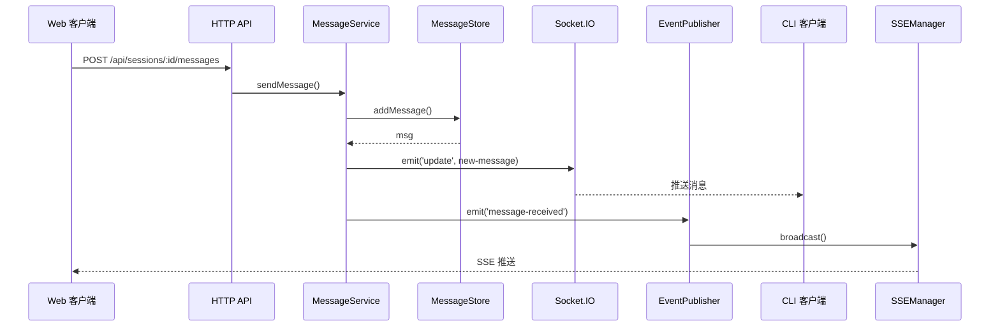
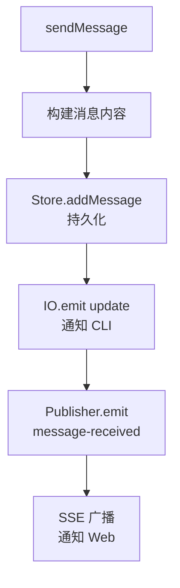

# MessageService

**文件**: [`hub/src/sync/messageService.ts`](/hub/src/sync/messageService.ts)

消息服务，处理消息的分页查询和发送。

## 架构



## 核心方法

| 方法 | 作用 |
|------|------|
| `getMessagesPage()` | 分页获取消息（支持向上翻页） |
| `getMessagesAfter()` | 获取指定序号后的消息（增量同步） |
| `sendMessage()` | 发送消息 |

## 消息发送流程



### sendMessage 详细流程



**消息内容格式**：

```typescript
{
    role: 'user',
    content: {
        type: 'text',
        text: string,
        attachments?: AttachmentMetadata[]
    },
    meta: {
        sentFrom: 'webapp' | 'cli'
    }
}
```

## 分页查询

### getMessagesPage

```
GET /api/sessions/:id/messages?limit=50&beforeSeq=100
```

**返回结构**：

```typescript
{
    messages: DecryptedMessage[],
    page: {
        limit: number,
        beforeSeq: number | null,
        nextBeforeSeq: number | null,
        hasMore: boolean
    }
}
```

### getMessagesAfter

```
GET /api/sessions/:id/messages/after?afterSeq=100&limit=50
```

用于增量同步，获取指定序号之后的新消息。

## 事件发布

| 方法入口 | 触发点 | 事件类型 | 说明 |
|----------|--------|----------|------|
| `sendMessage` | 用户发送消息 | `message-received` | 包含完整消息内容 |
