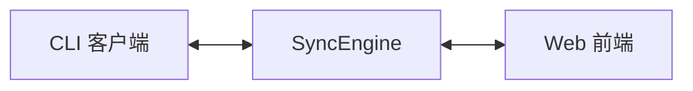
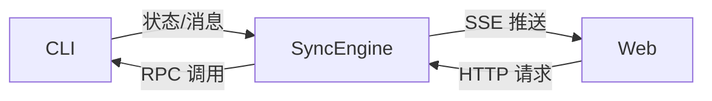
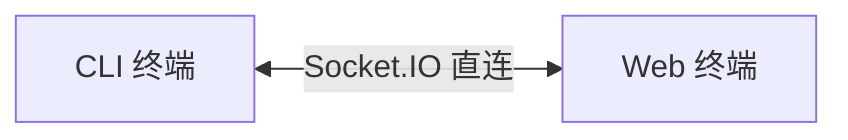
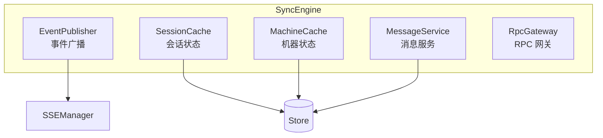
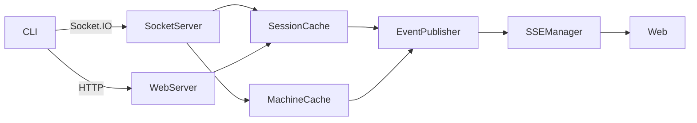
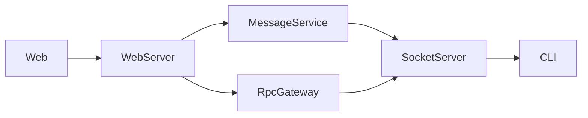
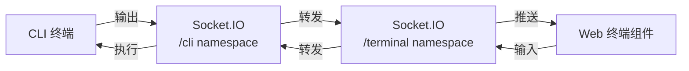
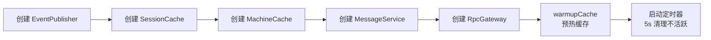

# SyncEngine 架构

**文件**: [`packages/hub/src/sync/syncEngine.ts`](/packages/hub/src/sync/syncEngine.ts)

SyncEngine 是 Hub 的核心协调层，统一管理会话、机器、消息和事件。

## 1. 顶层视图

SyncEngine 是 **CLI ↔ Web 的中枢**。



## 2. 数据通道

### 2.1 消息/状态通道

CLI 状态变化通过 SSE 推送到 Web，Web 请求通过 RPC 调用 CLI。



### 2.2 终端通道

终端流直接通过 Socket.IO 转发，不经过 SyncEngine。



**特点**：实时双向通信，不经过 SyncEngine、EventPublisher、SSE。

## 3. 组件架构

### 3.1 SyncEngine 内部组件



### 3.2 组件与传输层关系

**上行流**（CLI → Web）：



**HTTP 路径场景**：
- 会话初始化：`POST /cli/sessions`、`GET /cli/sessions/by-claude-session/:id`
- 机器初始化：`POST /cli/machines`
- 消息回填：`GET /cli/sessions/:id/messages`（断线重连后获取缺失消息）

**Socket.IO 路径场景**：
- 心跳：`session-alive`、`machine-alive`
- 消息发送：`message`
- 状态更新：`update-metadata`、`update-state`
- 终端事件：`terminal:*`
- 会话结束：`session-end`

**下行流**（Web → CLI）：



**MessageService 场景**：
- 发送消息：`sendMessage`

**RpcGateway 场景**：
- 权限操作：`approvePermission`、`denyPermission`
- 会话控制：`abortSession`、`switchSession`、`requestSessionConfig`
- 会话创建：`spawnSession`、`resumeSession`
- 文件操作：`uploadFile`、`readSessionFile`、`listDirectory`
- Git 操作：`getGitStatus`、`getGitDiffFile`
- 搜索：`runRipgrep`

## 4. 数据流详解

| 方向 | 路径 | 说明 |
|------|------|------|
| CLI → Web | `Socket.IO → EventPublisher → SSE` | 状态/消息推送 |
| Web → CLI | `HTTP → RpcGateway → Socket.IO` | 远程调用 CLI |
| Web 发消息 | `HTTP → MessageService → Socket.IO` | 发送给 CLI |
| 持久化 | `Cache/Service → Store` | 存入 SQLite |

## 5. 终端流



## 6. 五个子组件分工

| 组件 | 方向 | 作用 |
|------|------|------|
| EventPublisher | CLI → Web | 事件广播（通过 SSE） |
| SessionCache | 双向 | 会话状态管理 |
| MachineCache | 双向 | 机器状态管理 |
| MessageService | Web → CLI | Web 发送消息给 CLI |
| RpcGateway | Web → CLI | 远程调用 CLI 功能 |

## 核心组件

| 组件 | 职责 |
|------|------|
| **[EventPublisher](./event-publisher)** | 事件发布器，向 SSE 推送实时事件 |
| **[SessionCache](./session-cache)** | 会话缓存，管理会话生命周期和活跃状态 |
| **[MachineCache](./machine-cache)** | 机器缓存，管理 CLI 客户端在线状态 |
| **[MessageService](./message-service)** | 消息服务，处理消息分页和发送 |
| **[RpcGateway](./rpc-gateway)** | RPC 网关，通过 Socket.IO 调用 CLI 功能 |

## 初始化流程



## API 分类

### 会话查询

| 方法 | 作用 |
|------|------|
| `getSessions()` | 获取所有会话 |
| `getSessionsByNamespace()` | 按命名空间获取 |
| `getSession()` | 获取单个会话 |
| `getActiveSessions()` | 获取活跃会话 |

### 机器查询

| 方法 | 作用 |
|------|------|
| `getMachines()` | 获取所有机器 |
| `getOnlineMachines()` | 获取在线机器 |
| `getMachine()` | 获取单个机器 |

### 消息操作

| 方法 | 作用 |
|------|------|
| `getMessagesPage()` | 分页获取消息 |
| `getMessagesAfter()` | 获取指定序号后的消息 |
| `sendMessage()` | 发送消息 |

### 会话控制

| 方法 | 作用 |
|------|------|
| `spawnSession()` | 创建新会话 |
| `resumeSession()` | 恢复会话 |
| `abortSession()` | 中止会话 |
| `archiveSession()` | 归档会话 |
| `switchSession()` | 切换本地/远程模式 |
| `renameSession()` | 重命名会话 |
| `deleteSession()` | 删除会话 |

### 权限操作

| 方法 | 作用 |
|------|------|
| `approvePermission()` | 批准权限请求 |
| `denyPermission()` | 拒绝权限请求 |

### 文件操作

| 方法 | 作用 |
|------|------|
| `uploadFile()` | 上传文件 |
| `deleteUploadFile()` | 删除上传文件 |
| `readSessionFile()` | 读取会话文件 |
| `listDirectory()` | 列出目录 |

### Git 操作

| 方法 | 作用 |
|------|------|
| `getGitStatus()` | 获取 Git 状态 |
| `getGitDiffNumstat()` | 获取变更统计 |
| `getGitDiffFile()` | 获取文件 diff |

## 代码入口

```
packages/hub/src/sync/
├── syncEngine.ts       # 主入口
├── eventPublisher.ts   # 事件发布
├── sessionCache.ts     # 会话缓存
├── machineCache.ts     # 机器缓存
├── messageService.ts   # 消息服务
├── rpcGateway.ts       # RPC 网关
├── aliveTime.ts        # 活跃时间计算
├── teams.ts            # 团队相关
└── todos.ts            # Todo 处理
```
