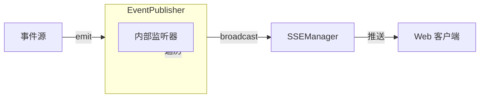
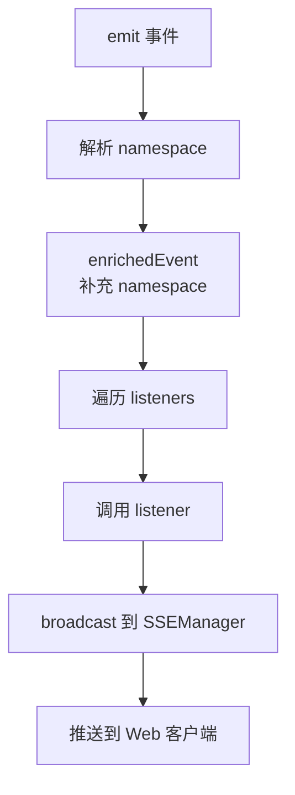
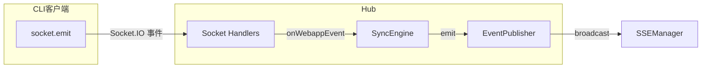

# EventPublisher

**文件**: [`packages/hub/src/sync/eventPublisher.ts`](/packages/hub/src/sync/eventPublisher.ts)

事件发布器，负责将事件分发给内部监听器和 Web 客户端。

## 架构



## 核心方法

| 方法 | 作用 |
|------|------|
| `subscribe(listener)` | 添加监听器，返回取消订阅函数 |
| `emit(event)` | 分发事件 |

## 事件分发流程



**说明**：
1. 事件可能没有 `namespace` 字段，需要从 `sessionId` 或 `machineId` 反查
2. `resolveNamespace` 由 SyncEngine 提供，用于补充事件的 namespace
3. 内部监听器出错不影响其他监听器和 SSE 广播

## 内部监听器

目前只有一个外部订阅者：

| 订阅者 | 用途 |
|------|------|
| **NotificationHub** | 监听会话事件，在用户离开页面时发送 Web Push 通知 |

> 注：SessionCache、MachineCache 等组件不通过 subscribe 监听，而是由 SyncEngine 直接调用其方法更新状态。

## emit 触发场景



> **Socket 事件**：CLI 通过 Socket.IO 发送给 Hub 的事件，如 `socket.emit('message', data)`

### SessionHandlers

| CLI 触发 | Socket 事件名 | 产生的 SyncEvent |
|----------|--------------|------------------|
| CLI 发送消息 | `message` | `message-received` |
| CLI 更新会话元数据 | `update-metadata` | `session-updated` |
| CLI 更新会话状态 | `update-state` | `session-updated` |

### MachineHandlers

| CLI 触发 | Socket 事件名 | 产生的 SyncEvent |
|----------|--------------|------------------|
| CLI 更新机器元数据 | `machine-update-metadata` | `machine-updated` |
| CLI 更新机器状态 | `machine-update-state` | `machine-updated` |

## 订阅模式

```typescript
// 返回取消订阅函数
const unsubscribe = eventPublisher.subscribe((event) => {
    // 处理事件
})

// 取消订阅
unsubscribe()
```
