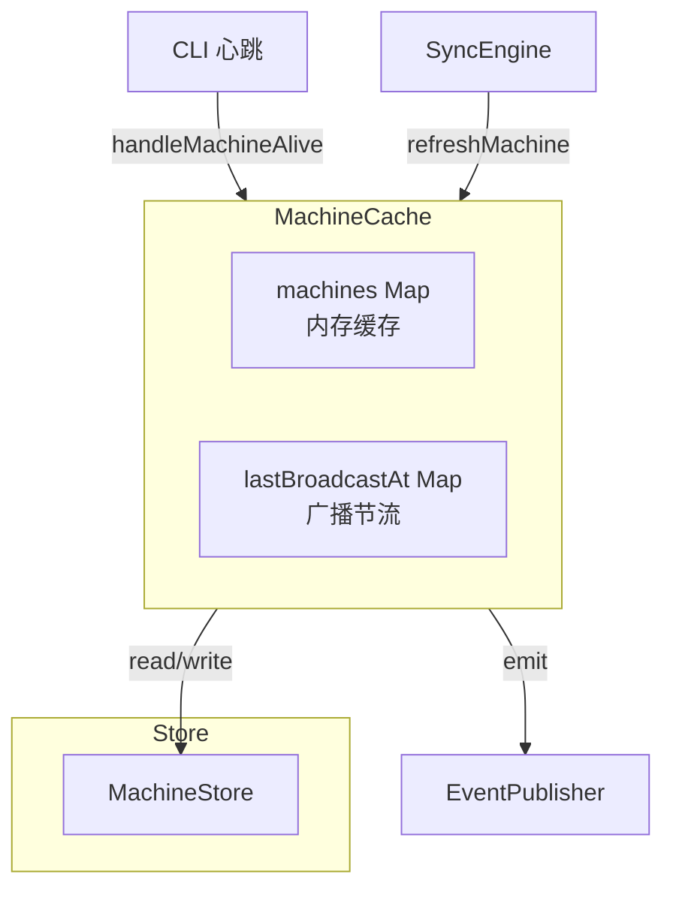
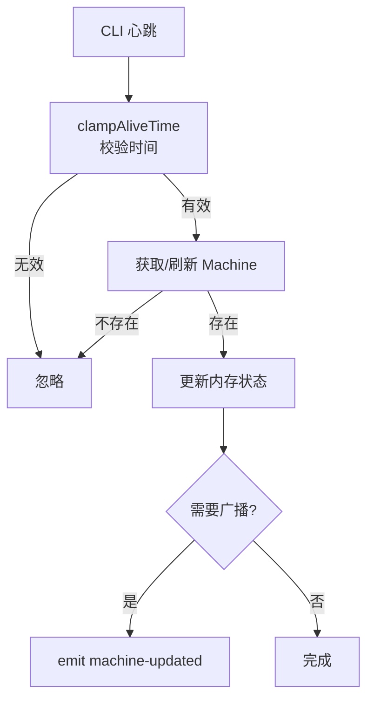

# MachineCache

**文件**: [`packages/hub/src/sync/machineCache.ts`](/packages/hub/src/sync/machineCache.ts)

机器缓存层，管理 CLI 客户端的内存状态。

## 架构



## 核心职责

| 职责 | 说明 |
|------|------|
| 内存缓存 | 维护 `machines: Map<string, Machine>` |
| 在线状态 | 管理 `active`（持久化到数据库） |
| 心跳处理 | 处理 CLI 心跳，更新活跃时间 |
| 过期清理 | 45 秒无心跳标记为离线 |

## 关键方法

| 方法 | 作用 |
|------|------|
| `getMachines()` | 获取所有机器 |
| `getMachinesByNamespace()` | 按命名空间获取 |
| `getOnlineMachines()` | 获取在线机器 |
| `getMachine()` | 获取单个机器 |
| `getOrCreateMachine()` | 获取或创建机器 |
| `refreshMachine()` | 从数据库刷新到内存 |
| `handleMachineAlive()` | 处理心跳 |
| `expireInactive()` | 清理不活跃机器 |
| `warmupCache()` | 启动时预热缓存 |

## 事件发布

**注意**：MachineCache 只有 `machine-updated` 事件，没有 `machine-added`/`machine-removed`。

- 机器被移除时发送 `machine-updated` + `data: null`
- 与 SessionCache 不同（SessionCache 有三种事件）

| 方法入口 | 触发点 | 事件类型 | 说明 |
|----------|--------|----------|------|
| `refreshMachine` | 机器从缓存移除 | `machine-updated` | data=null |
| `refreshMachine` | 机器加载到缓存 | `machine-updated` | 完整 Machine 数据 |
| `handleMachineAlive` | CLI 心跳更新状态 | `machine-updated` | 带节流（10s） |
| `expireInactive` | 机器超时离线 | `machine-updated` | active=false |

## Machine 元数据

```typescript
interface MachineMetadata {
    host: string           // 主机名
    platform: string       // 平台
    mobiCliVersion: string // CLI 版本
    displayName?: string   // 显示名称
    homeDir?: string       // 用户目录
    mobiHomeDir?: string   // Mobi 配置目录
    mobiLibDir?: string    // Mobi 库目录
}
```

## 与 SessionCache 的区别

| 特性 | SessionCache | MachineCache |
|------|--------------|--------------|
| active 持久化 | ❌ 仅内存 | ✅ 持久化到数据库 |
| 过期时间 | 30 秒 | 45 秒 |
| 预热数量 | 最近 100 个 | 全部 |

## 心跳流程



**广播条件**（节流 10 秒）：
- 从离线变为在线
- 距上次广播超过 10 秒

## 过期清理

```typescript
// SyncEngine 启动后，每 5 秒调用一次
// 检查所有缓存中的机器，将超时未心跳的机器标记为离线
expireInactive() {
    const machineTimeoutMs = 45_000  // 45 秒超时阈值（比 Session 的 30 秒更宽松）

    for (const machine of this.machines.values()) {
        if (!machine.active) continue                      // 跳过已离线的机器
        if (now - machine.activeAt <= machineTimeoutMs) continue  // 未超时，跳过

        machine.active = false                             // 标记为离线
        this.publisher.emit({                              // 广播状态变化
            type: 'machine-updated',
            machineId: machine.id,
            data: { active: false }
        })
    }
}
```
