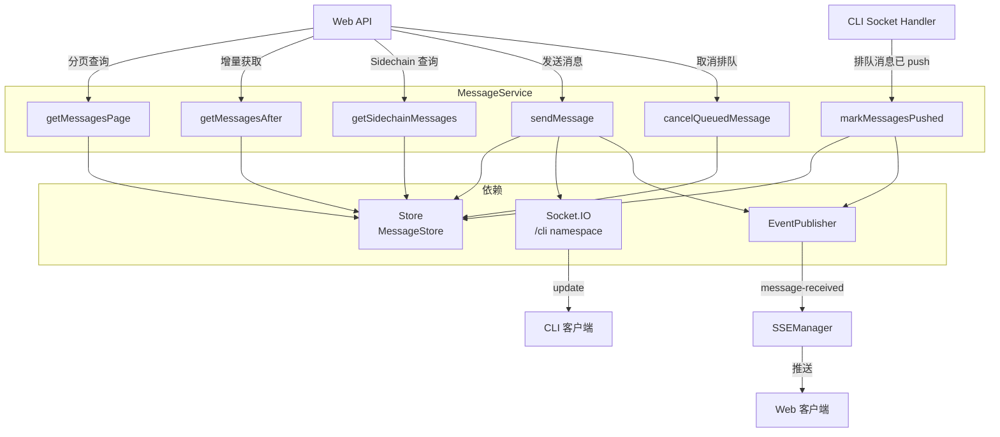
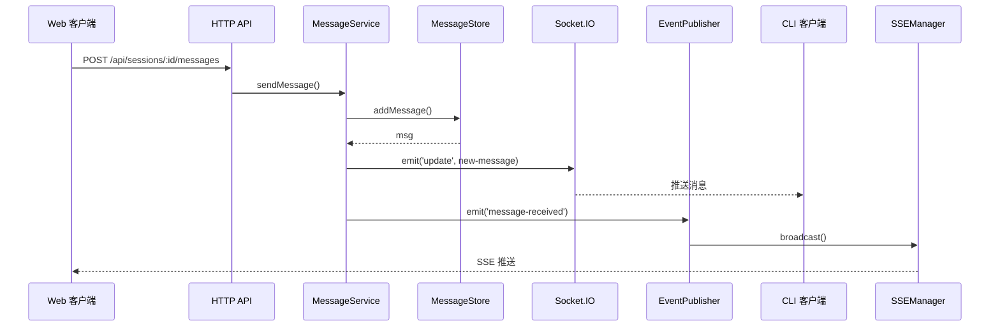
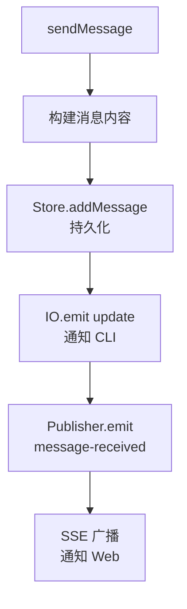

# MessageService

**文件**: [`packages/hub/src/sync/messageService.ts`](/packages/hub/src/sync/messageService.ts)

消息服务，处理消息的分页查询和发送。

## 架构



## 核心方法

| 方法 | 作用 |
|------|------|
| `getMessagesPage()` | 分页获取消息（支持向上翻页，首页 out-of-band 钉入排队消息） |
| `getMessagesAfter()` | 获取指定序号后的消息（增量同步） |
| `getSidechainMessages()` | 获取指定 toolUseId 的 Sidechain 消息 |
| `sendMessage()` | 发送消息 |
| `markMessagesPushed()` | 把 localId 对应的 queued 消息推进为 pushed（`lifecycle`/`lifecycleAt` 落库，first-write-wins） |
| `cancelQueuedMessage()` | 取消仍排队的消息（物理删除）；已 push 的不动 |

## 消息发送流程



### sendMessage 详细流程



**消息内容格式**：

```typescript
{
    role: 'user',
    content: {
        type: 'text',
        text: string,
        attachments?: AttachmentMetadata[]
    },
    meta: {
        sentFrom: 'webapp' | 'cli'
    }
}
```

## 分页查询

### getMessagesPage

```
GET /api/sessions/:id/messages?limit=50&beforeSeq=100
```

**返回结构**：

```typescript
{
    messages: DecryptedMessage[],
    page: {
        limit: number,
        beforeSeq: number | null,
        nextBeforeSeq: number | null,
        hasMore: boolean
    }
}
```

**首页 out-of-band 钉入**：`beforeSeq` 为 null（首页）时，额外查询仍排队的本地 user 消息（`lifecycle = 'queued'`，`getUnsubmittedLocalMessages`），追加到列表尾部。这些消息不参与 `nextBeforeSeq`/`hasMore` 计算，仅保证悬浮条可见。

**byPosition 分页**：消息按 `position_at DESC, seq DESC` 排序分页（`idx_messages_session_position` 索引），翻页游标取页内最老消息的 seq（`nextBeforeSeq`，不分 lifecycle）。

### getMessagesAfter

```
GET /api/sessions/:id/messages/after?afterSeq=100&limit=50
```

用于增量同步，获取指定序号之后的新消息。

## 事件发布

| 方法入口 | 触发点 | 事件类型 | 说明 |
|----------|--------|----------|------|
| `sendMessage` | 用户发送消息 | `message-received` | 包含完整消息内容 |
| `markMessagesPushed` | CLI push 排队消息 / session-end force-push | `messages-submitted` | `localIds` + `submittedAt`（即 push 时刻），Web 据此把悬浮消息翻为正式消息 |
