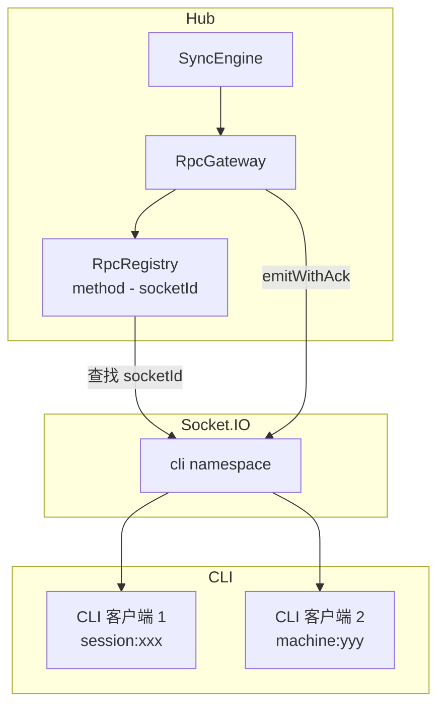
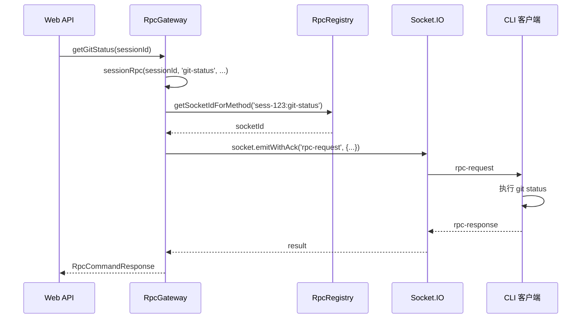

# RpcGateway

**文件**:
- [`packages/hub/src/sync/rpcGateway.ts`](/packages/hub/src/sync/rpcGateway.ts)
- [`packages/hub/src/socket/rpcRegistry.ts`](/packages/hub/src/socket/rpcRegistry.ts)

RPC 网关，通过 Socket.IO 调用 CLI 的功能。

## 架构



## 核心组件

### RpcRegistry

管理 RPC 方法到 Socket 的映射。

| 方法 | 作用 |
|------|------|
| `register(socket, method)` | 注册方法（CLI 连接时调用） |
| `unregister(socket, method)` | 注销单个方法 |
| `unregisterAll(socket)` | 注销该 socket 的所有方法（断开时调用） |
| `getSocketIdForMethod(method)` | 查找方法对应的 socketId |

**Method 命名规则**：
- Session 级别：`{sessionId}:{method}`（如 `sess-123:git-status`）
- Machine 级别：`{machineId}:{method}`（如 `mac-456:spawn-mobi-session`）

### RpcGateway

发起 RPC 调用。

| 方法 | 作用 | RPC Method |
|------|------|------------|
| `approvePermission` | 批准权限请求 | `{sessionId}:permission` |
| `denyPermission` | 拒绝权限请求 | `{sessionId}:permission` |
| `abortSession` | 中止会话 | `{sessionId}:abort` |
| `switchSession` | 切换 local/remote | `{sessionId}:switch` |
| `requestSessionConfig` | 请求配置更新 | `{sessionId}:set-session-config` |
| `killSession` | 杀死会话 | `{sessionId}:killSession` |
| `spawnSession` | 创建新会话（支持 `sessionType`/`worktreeName`/`resumeSessionId`/`effort` 参数） | `{machineId}:spawn-mobi-session` |
| `checkPathsExist` | 检查路径是否存在 | `{machineId}:path-exists` |
| `getGitStatus` | 获取 Git 状态 | `{sessionId}:git-status` |
| `readSessionFile` | 读取文件 | `{sessionId}:readFile` |
| `listDirectory` | 列出目录 | `{sessionId}:listDirectory` |
| `uploadFile` | 上传文件 | `{sessionId}:uploadFile` |
| `deleteUploadFile` | 删除上传文件 | `{sessionId}:deleteUpload` |
| `searchSessionFiles` | 搜索会话文件 | `{sessionId}:searchSessionFiles` |
| `listSessionDirectory` | 列出会话目录 | `{sessionId}:listSessionDirectory` |
| `listMachineDirectory` | 列出机器目录 | `{machineId}:list-directory` |
| `refreshMetadata` | 刷新 SDK 元数据 | `{sessionId}:refreshMetadata` |
| `stopTask` | 停止后台任务 | `{sessionId}:stop-task` |
| `runRipgrep` | 搜索代码 | `{sessionId}:ripgrep` |

## RPC 调用流程



## RPC 超时

```typescript
// 30 秒超时
socket.timeout(30_000).emitWithAck('rpc-request', {
    method,
    params: JSON.stringify(params)
})
```

## 错误处理

| 错误 | 场景 |
|------|------|
| `RPC handler not registered` | 方法未注册（CLI 未连接或已断开） |
| `RPC socket disconnected` | Socket 已断开 |
| 超时 | CLI 30 秒内未响应 |
