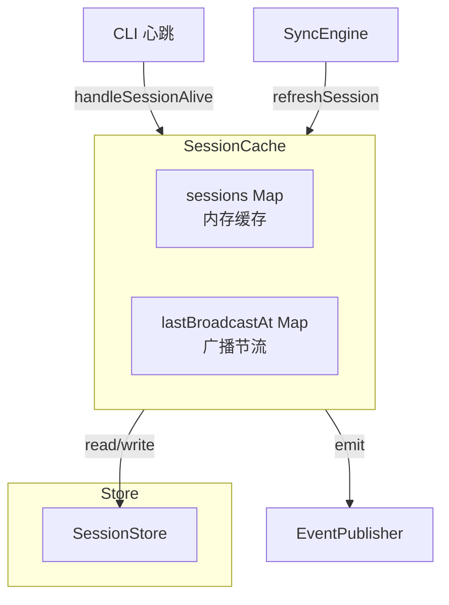
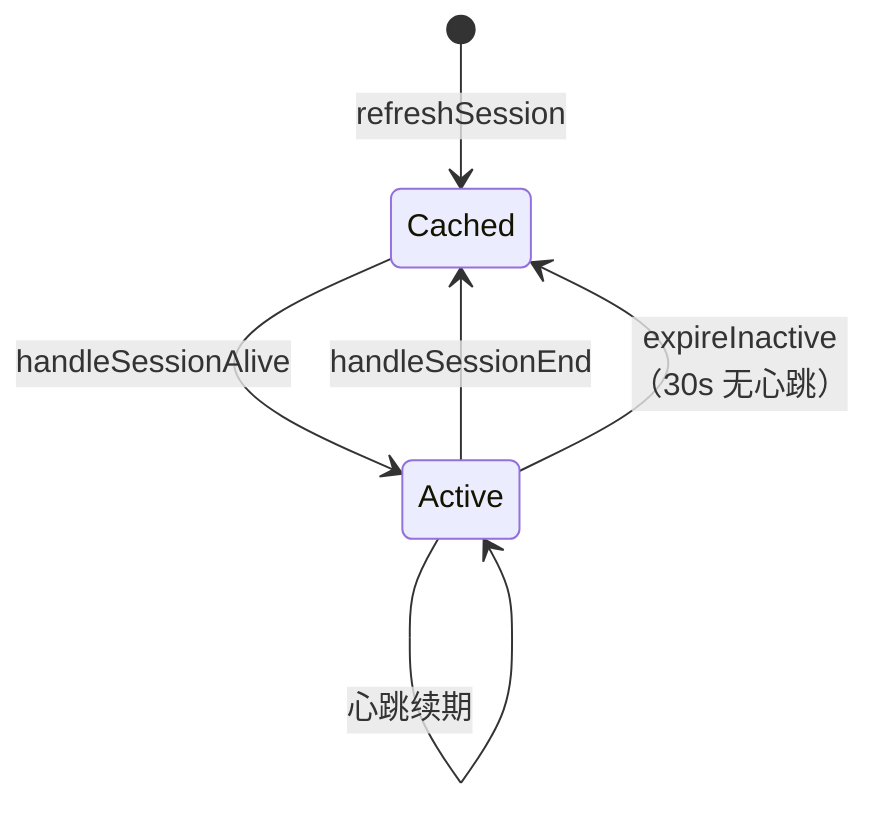
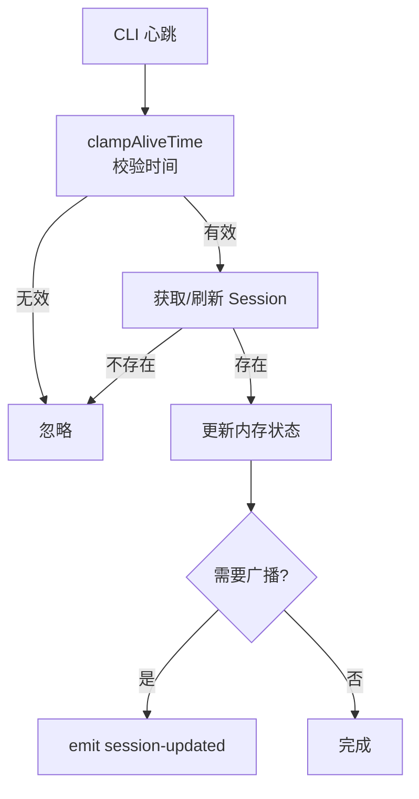

# SessionCache

**文件**: [`hub/src/sync/sessionCache.ts`](/hub/src/sync/sessionCache.ts)

会话缓存层，管理会话的内存状态和生命周期。

## 架构



## 核心职责

| 职责 | 说明 |
|------|------|
| 内存缓存 | 维护 `sessions: Map<string, Session>` |
| 活跃状态 | 管理 `active`、`thinking`（仅内存） |
| 心跳处理 | 处理 CLI 心跳，更新活跃时间 |
| 过期清理 | 30 秒无心跳标记为不活跃 |
| 事件广播 | 通过 EventPublisher 广播变化 |

## 关键方法

| 方法 | 作用 |
|------|------|
| `getSessions()` | 获取所有会话 |
| `getSessionsByNamespace()` | 按命名空间获取 |
| `getSession()` | 获取单个会话（内存） |
| `refreshSession()` | 从数据库刷新到内存 |
| `getOrCreateSession()` | 获取或创建会话 |
| `handleSessionAlive()` | 处理心跳 |
| `handleSessionEnd()` | 处理会话结束 |
| `expireInactive()` | 清理不活跃会话 |
| `warmupCache()` | 启动时预热缓存 |

## 事件发布

| 方法入口 | 触发点 | 事件类型 | 说明 |
|----------|--------|----------|------|
| `refreshSession` | 新会话加载到缓存 | `session-added` | 首次加入内存 |
| `refreshSession` | 会话从缓存移除 | `session-removed` | 数据库中已不存在 |
| `handleSessionAlive` | CLI 心跳更新状态 | `session-updated` | 带节流（10s） |
| `handleSessionEnd` | CLI 会话结束 | `session-updated` | active=false |
| `expireInactive` | 会话超时过期 | `session-updated` | 30s 无心跳 |
| `applySessionConfig` | 应用会话配置 | `session-updated` | permissionMode/model |
| `deleteSession` | 删除会话 | `session-removed` | 从数据库删除 |
| `mergeSessions` | 合并会话 | `session-removed` | 删除旧会话 |

## 活跃状态管理

**重要**：`active`、`activeAt`、`thinking`、`thinkingAt` 只存在于内存，不持久化。



## 心跳流程



**广播条件**（节流 10 秒）：
- 从不活跃变为活跃
- thinking 状态变化
- permissionMode 或 model 变化
- 距上次广播超过 10 秒

## 过期清理

```typescript
// SyncEngine 启动后，每 5 秒调用一次
// 检查所有缓存中的会话，将超时未心跳的会话标记为不活跃
expireInactive() {
    const sessionTimeoutMs = 30_000  // 30 秒超时阈值

    for (const session of this.sessions.values()) {
        if (!session.active) continue                    // 跳过已不活跃的会话
        if (now - session.activeAt <= sessionTimeoutMs) continue  // 未超时，跳过

        session.active = false                           // 标记为不活跃（仅内存）
        session.thinking = false                         // 同时清除思考状态
        this.publisher.emit({                            // 广播状态变化
            type: 'session-updated',
            sessionId: session.id,
            data: { active: false }
        })
    }
}
```

## 缓存预热

```typescript
warmupCache() {
    this.sessions.clear()                      // 先清空缓存，确保移除数据库中已删除的会话
    this.lastBroadcastAtBySessionId.clear()    // 清空节流记录

    const sessions = this.store.sessions.getRecentSessions(100)  // 只加载最近 100 个，避免启动过慢
    for (const session of sessions) {
        this.refreshSession(session.id)        // 逐个加载到内存缓存
    }
}
```
