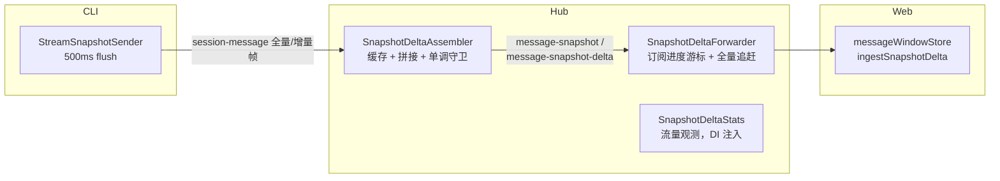

# Snapshot Delta 协议

**文件**: [`packages/shared/src/snapshotDelta.ts`](/packages/shared/src/snapshotDelta.ts)（协议类型 + apply 共享逻辑）

流式消息的增量传输协议（`.scratch/snapshot-delta` 特性）：CLI→hub→web 两段增量，替代每 500ms 全量重发，传输量 O(N) 而非 O(N²)。

## 链路与组件

- **发送端** `StreamSnapshotSender`（cli）：流首帧全量（`baseRev=null`）建立基线，此后每帧只发增量 op（`append` 后缀 / `new-block` / `replace-block`）。rev 按流单调递增，新 message 流归零重计。
- **hub 段** `SnapshotDeltaAssembler`：校验 baseRev 严格衔接才应用增量；断档丢弃（「丢弃优于错乱」），等全量重基线。
- **hub→web 段** `SnapshotDeltaForwarder`：per-subscription 游标（`{rev, at}`，TTL 10min）决定转发增量或从缓存构造全量追赶；`message-snapshot-delta` 不走 broadcast 的 namespace 过滤，由 forwarder `resolve` 路由。
- **web 段** `messageWindowStore.ingestSnapshotDelta`：定位窗口内 snapshot 行（`snapshot && snapshotRev !== undefined` 且 localId 匹配），克隆 blocks 后应用（shared 的 apply 就地变异；克隆防撕裂读与失败污染）。

## 重基线规则（何时必须重发全量）

| 场景 | 机制 |
|------|------|
| 流首帧 | 发送端 `needFull`（等待真实内容，空块不发） |
| CLI socket 重连 | 发送端 `forceFullFlush()`（绕过 dirty 守卫无条件重基线；full 已下发则 no-op 防幽灵重复） |
| web SSE 重连 | web 主动 `POST /api/events/snapshot-resync` → 清游标 + 补发该会话全部活跃流全量 |
| 单帧静默丢失 | 发送端周期 checkpoint：每 20 个增量帧插一帧全量，断档窗口封顶 ~10s |

## 生命周期清理

| 信号 | 动作 |
|------|------|
| `snapshot-stream-end`（CLI socket 事件，消息落库后发，localId=流 sdkUuid ≠ full message uuid） | assembler `cleanupMessage` + forwarder `dropMessage` 精确清缓存与跨订阅游标 |
| CLI disconnect | 仅当该 socket 仍是会话当前持有者（`sessionSocketIds` epoch 表）才 `cleanupSession`——迟到旧 socket 的 disconnect 不清新连接重建的缓存 |
| 游标 TTL | forwarder 查找时过期清除（10min），防无界泄漏 |

## 防御要点

- **单调守卫**（assembler `applyFull`）：入站全量 rev 低于缓存 rev → 忽略。防 socket.io-client 断线 `sendBuffer` 重放乱序（陈旧全量先于 connect 监听器的 forceFull 到达）。
- **属主校验**（`/snapshot-resync` 端点）：`sendTo` 绕过 namespace 过滤，订阅不属调用者 namespace → 404，防跨 namespace 注入。
- **delta 帧带 `snapshot:true`**：新 CLI + 老 hub 时老 hub 走快照透传路径，不把 delta 帧当普通消息落库污染 transcript。
- **legacy 全量**（老 CLI，无 frame）：直通下发、不建缓存链（`rev=null`），web 侧无 `snapshotRev` 不参与拼接。
