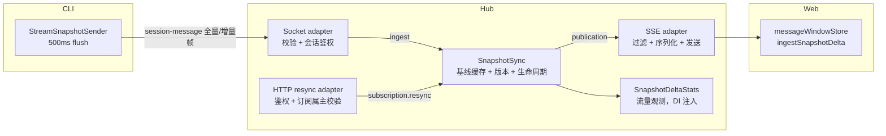

# Snapshot Delta 协议

**核心文件**：

- [`packages/shared/src/snapshotDelta.ts`](/packages/shared/src/snapshotDelta.ts)（协议类型 + apply 共享逻辑）
- [`packages/hub/src/sync/snapshotSync.ts`](/packages/hub/src/sync/snapshotSync.ts)（Hub 快照同步生命周期）

流式消息的增量传输协议（`.scratch/snapshot-delta` 特性）：CLI→hub→web 两段增量，替代每 500ms 全量重发，传输量 O(N) 而非 O(N²)。

## 链路与组件

- **发送端** `StreamSnapshotSender`（cli）：流首帧全量（`baseRev=null`）建立基线，此后每帧只发增量 op（`append` 后缀 / `new-block` / `replace-block`）。rev 按流单调递增，新 message 流归零重计。
- **hub 核心** `SnapshotSync`：唯一拥有完整基线缓存、版本校验、per-subscription 游标、CLI 连接 lease、resync 与 TTL 清理。增量到达时是在当前缓存 blocks 上应用 op 并推进版本，并非每帧从头重建消息；保留完整内容是为了让迟加入、重连或断档的 Web 能获得可独立解释的基线。
- **Socket adapter**：只解析协议载荷并完成 session 访问校验，再调用 `ingest()`；module 返回 publication，不直接网络发送。
- **SSE adapter**：先做 namespace / session 过滤，再用每个连接持有的 `SnapshotSubscription.resolve()` 决定下发原增量还是当前完整基线，最后负责序列化和发送。
- **HTTP resync adapter**：校验 session 权限和 subscription 属主后，调用 `SSEManager.resyncSnapshots()`；不读取快照缓存内部结构。
- **web 段** `messageWindowStore.ingestSnapshotDelta`：定位窗口内 snapshot 行（`snapshot && snapshotRev !== undefined` 且 localId 匹配），克隆 blocks 后应用（shared 的 apply 就地变异；克隆防撕裂读与失败污染）。

## 模块边界（非目标）

`SnapshotSync` 是纯状态机——只决定快照内容（衔接判定 / 游标 / 缓存 / 生命周期），以下边界由依赖巡航规则 `snapshot-sync-boundary` 与测试锁定，越界即腐化起点：

| 边界 | 归属 | 禁止 |
|------|------|------|
| 网络发送 | socket / sse adapter | module 不 import `sse/**`、`socket/**`，不直接发送 |
| 持久化 | adapter 层查 DB 后喂入 | module 不 import `store/**`（历史回放若要做，也不在本 module 内自查） |
| 投递元数据 | 投递层盖章（如 namespace） | module 纯透传，不派生——入站未携带则产出连键都不出现（测试锁定） |
| 观测 | `SnapshotDeltaStats`（DI 注入） | 只记录不聚合，导出 / 采样 / 上报格式不进本 module |

## 重基线规则（何时必须重发全量）

| 场景 | 机制 |
|------|------|
| 流首帧 | 发送端 `needFull`（等待真实内容，空块不发） |
| CLI socket 重连 | 发送端 `forceFullFlush()`（绕过 dirty 守卫无条件重基线；full 已下发则 no-op 防幽灵重复） |
| web SSE 重连 | web 主动 `POST /api/events/snapshot-resync` → 清游标 + 补发该会话全部活跃流全量 |
| 单帧静默丢失 | 发送端周期 checkpoint：每 20 个增量帧插一帧全量，断档窗口封顶 ~10s |

## 生命周期清理

| 信号 | 动作 |
|------|------|
| `snapshot-stream-end`（CLI socket 事件，消息落库后发，localId=流 sdkUuid ≠ full message uuid） | `SnapshotSync.endStream()` 精确清缓存与全部订阅游标 |
| 普通终态消息落库 | `messagePersisted()` 兼容按消息 localId 清理；因它可能不等于流 sdkUuid，不能代替 `snapshot-stream-end` |
| CLI disconnect | 当前连接的 lease 才能清会话；迟到旧 lease 的 `disconnect()` 不清新连接重建的缓存 |
| 缓存 / 游标 TTL | module 在下一次 ingest、resolve 或 resync 时惰性清理（默认 10min），防无界泄漏 |
| SSE disconnect / Hub stop | subscription handle `close()` 撤销该订阅全部游标 |

## 防御要点

- **结构化忽略原因**（`SnapshotSync.ingest`）：陈旧全量、缺基线、版本断档、非法增量分别返回 `stale-full` / `missing-baseline` / `revision-gap` / `invalid-delta`，适配器不靠异常控制正常丢帧。
- **单调守卫**：入站全量 rev 低于缓存 rev → 忽略。防 socket.io-client 断线 `sendBuffer` 重放乱序（陈旧全量先于 connect 监听器的 forceFull 到达）。
- **属主校验**（`/snapshot-resync` 端点）：定向 resync 不经过 broadcast 过滤，订阅不属调用者 namespace → 404，防跨 namespace 注入。
- **delta 帧带 `snapshot:true`**：新 CLI + 老 hub 时老 hub 走快照透传路径，不把 delta 帧当普通消息落库污染 transcript。
- **legacy 全量**（老 CLI，无 frame）：直通下发、不建缓存链（`rev=null`），web 侧无 `snapshotRev` 不参与拼接。
