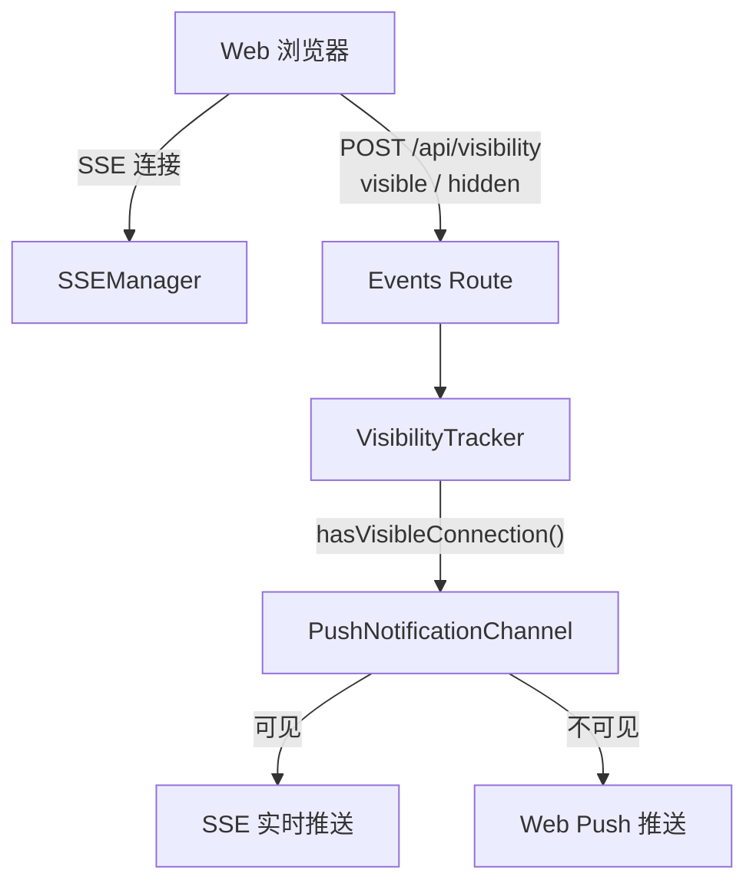
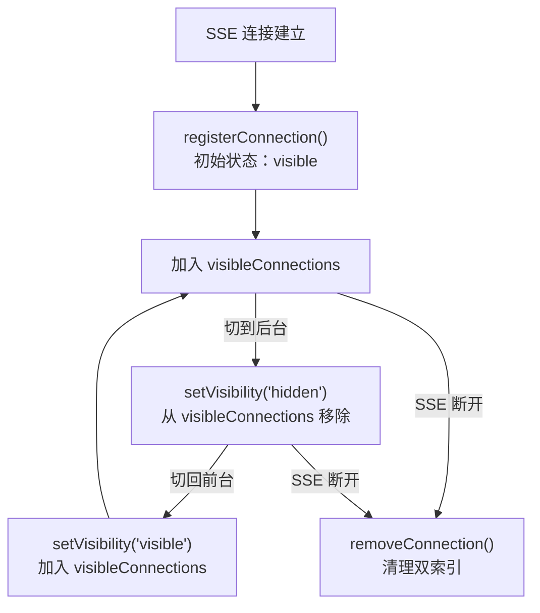
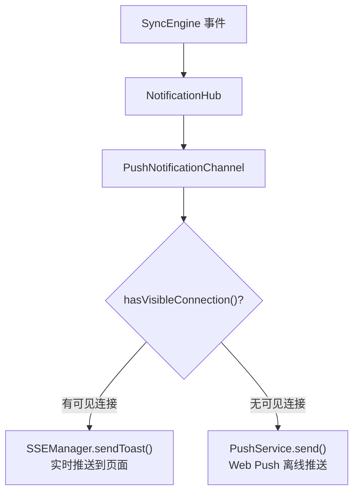

# VisibilityTracker 页面可见性追踪

**文件**: [`packages/hub/src/visibility/visibilityTracker.ts`](/packages/hub/src/visibility/visibilityTracker.ts)

VisibilityTracker 追踪 SSE 连接的页面可见性状态，用于决定通知的投递策略：页面可见时走 SSE 实时推送，页面不可见时降级为 Web Push。

## 架构



VisibilityTracker 被 SSEManager、PushNotificationChannel 和 WebServer 共享依赖。

## 数据结构

双索引 Map，支持快速双向查找：

```
visibleConnections:      Map<namespace, Set<subscriptionId>>  // 命名空间 → 可见连接集合
subscriptionToNamespace: Map<subscriptionId, namespace>        // 连接 → 命名空间（反向索引）
```

只有 `visible` 状态的连接才进入 `visibleConnections`，`hidden` 状态的连接仅保留反向索引。

## 核心方法

| 方法 | 触发场景 | 说明 |
|------|----------|------|
| `registerConnection(id, ns, state)` | SSE 连接建立 | 注册连接，记录初始可见性 |
| `setVisibility(id, ns, state)` | 页面切换前后台 | 更新连接可见性状态 |
| `removeConnection(id)` | SSE 断开 | 清理连接的所有追踪数据 |
| `hasVisibleConnection(ns)` | 发送通知时 | 查询命名空间是否有可见连接 |
| `isVisibleConnection(id)` | 查询单个连接 | 检查指定连接是否可见 |

## 生命周期



### 注册

SSE 连接建立时调用 `registerConnection`，先清理可能存在的旧数据，再建立索引。如果初始状态为 `visible`，同时加入 `visibleConnections`。

### 可见性切换

Web 端通过 `POST /api/visibility` 上报页面可见性变化：

```json
{ "subscriptionId": "xxx", "visibility": "visible" | "hidden" }
```

验证流程：
1. 通过反向索引查找连接所属 namespace
2. 验证请求的 namespace 与追踪的 namespace 匹配
3. `visible` → 加入 `visibleConnections`
4. `hidden` → 从 `visibleConnections` 移除

### 断开清理

SSE 连接断开时调用 `removeConnection`，同时清理反向索引和可见连接集合。

## 与通知系统的配合

VisibilityTracker 是通知降级策略的核心依据：



**设计意图**：当用户正在查看页面时，SSE 实时推送延迟更低、体验更好；当页面在后台或关闭时，通过 Web Push 发送浏览器通知。

## 与其他模块的关系

| 模块 | 使用方式 |
|------|----------|
| SSEManager | 构造时注入，SSE 连接建立/断开时注册/移除 |
| PushNotificationChannel | 构造时注入，发送通知前查询可见性 |
| WebServer (events route) | SSE 连接和可见性变更时更新 |
| SyncEngine | 不直接使用 |

VisibilityTracker 在 `index.ts` 中创建，通过依赖注入传递给 SSEManager、WebServer 和 PushNotificationChannel。
