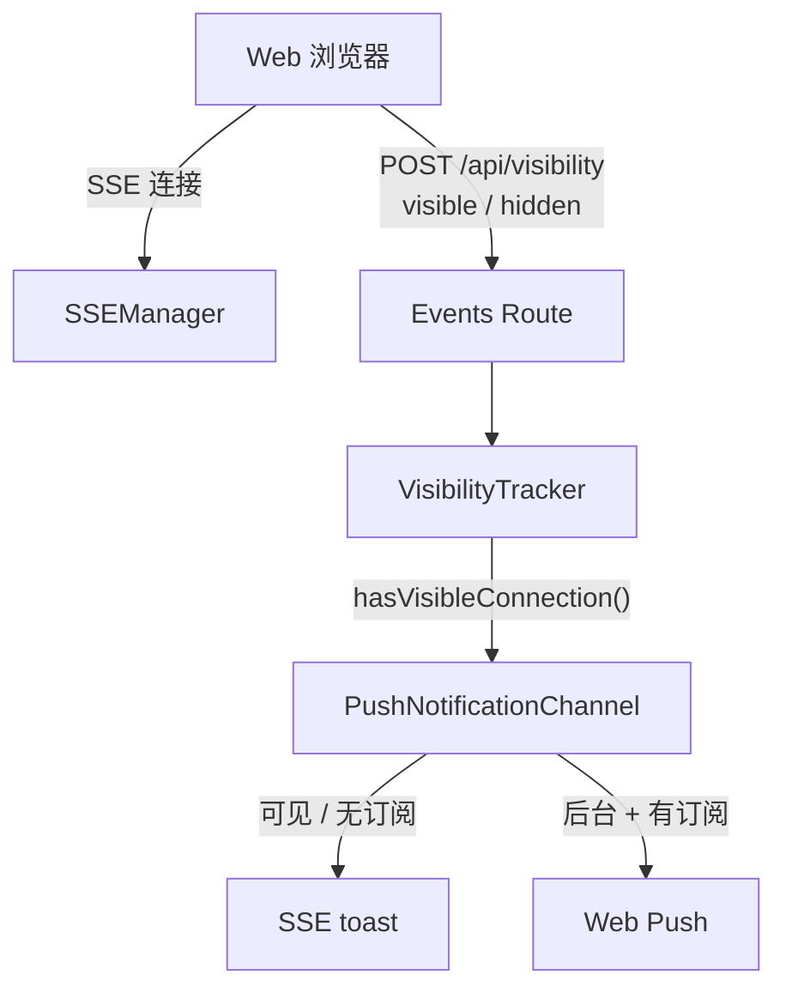
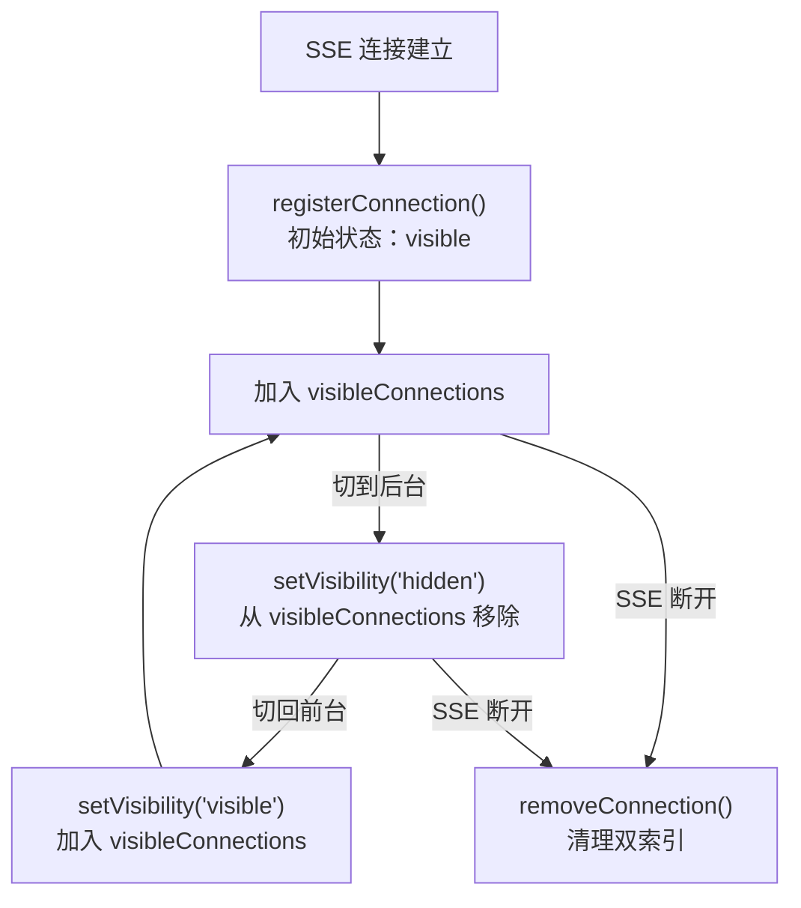
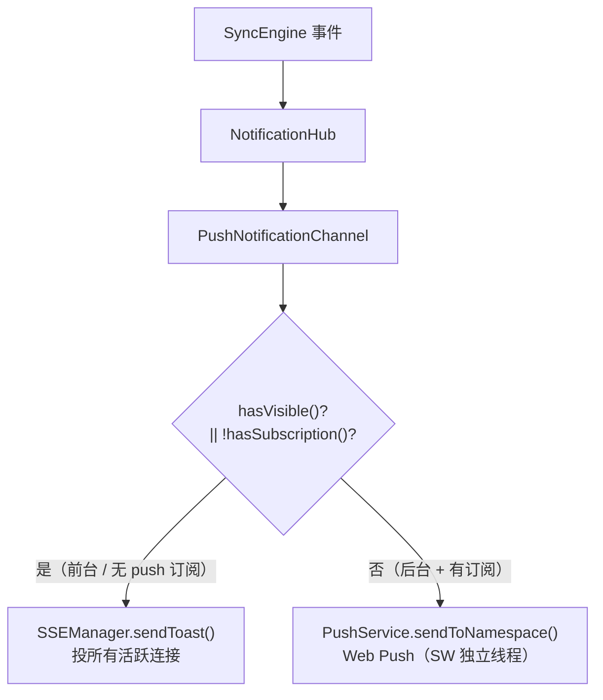

# VisibilityTracker 页面可见性追踪

**文件**: [`packages/hub/src/visibility/visibilityTracker.ts`](/packages/hub/src/visibility/visibilityTracker.ts)

VisibilityTracker 追踪 SSE 连接的页面可见性状态，是通知投递决策的核心依据：页面可见时走 SSE 实时推送，页面不可见且已订阅 push 时降级为 Web Push（无订阅则 SSE toast 兜底）。

## 架构



VisibilityTracker 被 SSEManager、PushNotificationChannel 和 WebServer 共享依赖。

## 数据结构

双索引 Map，支持快速双向查找：

```
visibleConnections:      Map<namespace, Set<subscriptionId>>  // 命名空间 → 可见连接集合
subscriptionToNamespace: Map<subscriptionId, namespace>        // 连接 → 命名空间（反向索引）
```

只有 `visible` 状态的连接才进入 `visibleConnections`，`hidden` 状态的连接仅保留反向索引。

## 核心方法

| 方法 | 触发场景 | 说明 |
|------|----------|------|
| `registerConnection(id, ns, state)` | SSE 连接建立 | 注册连接，记录初始可见性 |
| `setVisibility(id, ns, state)` | 页面切换前后台 | 更新连接可见性状态 |
| `removeConnection(id)` | SSE 断开 | 清理连接的所有追踪数据 |
| `hasVisibleConnection(ns)` | 发送通知时 | 查询命名空间是否有可见连接 |
| `isVisibleConnection(id)` | 查询单个连接 | 检查指定连接是否可见 |

## 生命周期



### 注册

SSE 连接建立时调用 `registerConnection`，先清理可能存在的旧数据，再建立索引。如果初始状态为 `visible`，同时加入 `visibleConnections`。

### 可见性切换

Web 端通过 `POST /api/visibility` 上报页面可见性变化：

```json
{ "subscriptionId": "xxx", "visibility": "visible" | "hidden" }
```

验证流程：
1. 通过反向索引查找连接所属 namespace
2. 验证请求的 namespace 与追踪的 namespace 匹配
3. `visible` → 加入 `visibleConnections`
4. `hidden` → 从 `visibleConnections` 移除

### 断开清理

SSE 连接断开时调用 `removeConnection`，同时清理反向索引和可见连接集合。

## 与通知系统的关系

VisibilityTracker 是通知投递决策的核心依赖。`PushNotificationChannel` 通过 `sseManager.hasVisibleConnection()` 间接消费它，按「可见性 + push 订阅」分级选择投递路径：



决策公式：`shouldUseToast = hasVisibleConnection(ns) || !hasSubscription(ns)`

- **有可见连接**（用户在前台）→ SSE toast，不打扰正在使用的用户
- **无 push 订阅**（无法走 Web Push，如未装推送服务的环境）→ SSE toast 兜底，由前端收到后转系统通知
- **后台 + 已订阅 push** → Web Push，经 Service Worker 独立线程投递，不依赖页面 JS 存活，长时后台仍可靠

`sendToast()` 始终投递该 namespace **所有活跃连接（含后台 hidden）**；「要不要打扰」由前端本地三分支判定（visible+当前 session→忽略 / visible+其他→页面 Toast+角标 / hidden→系统通知）。

## 与其他模块的关系

| 模块 | 使用方式 |
|------|----------|
| SSEManager | 构造时注入；连接建立/断开时 register/remove；暴露 `hasVisibleConnection()` 供 channel 决策 |
| WebServer (events route) | SSE 连接和可见性变更时更新 |
| PushNotificationChannel | 间接依赖——通过 `sseManager.hasVisibleConnection()` 消费（构造未直接注入 VT） |
| SyncEngine | 不直接使用 |
