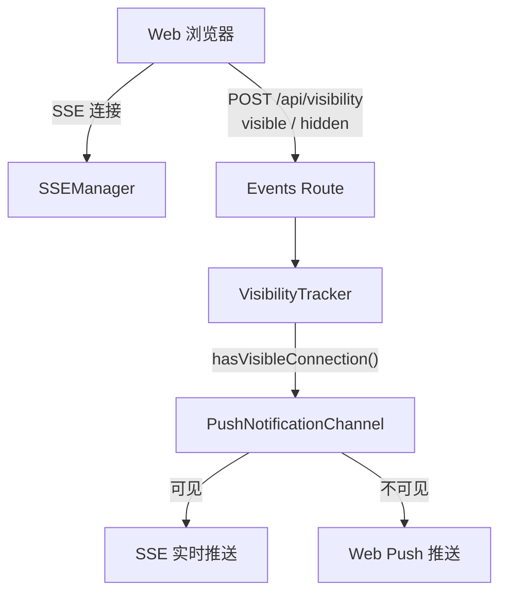
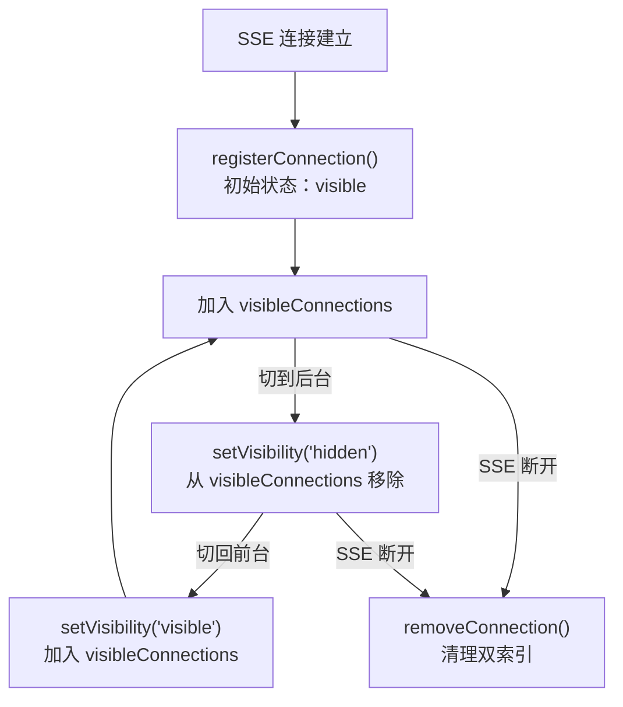
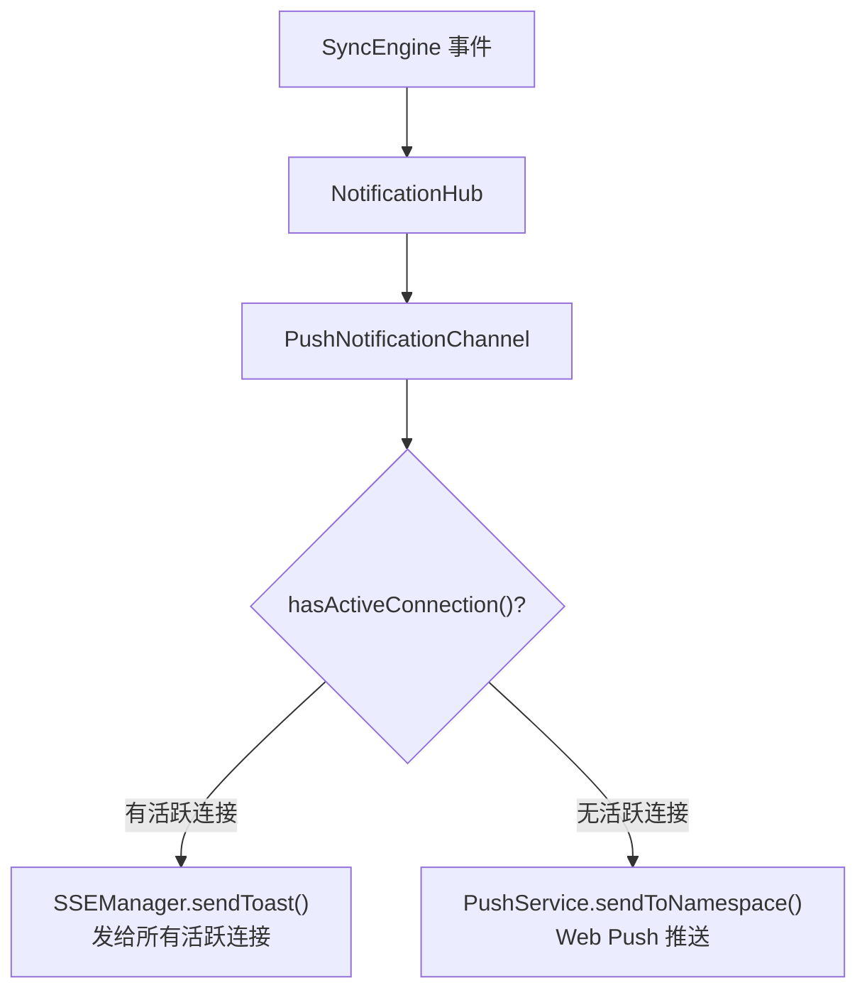

# VisibilityTracker 页面可见性追踪

**文件**: [`packages/hub/src/visibility/visibilityTracker.ts`](/packages/hub/src/visibility/visibilityTracker.ts)

VisibilityTracker 追踪 SSE 连接的页面可见性状态，用于决定通知的投递策略：页面可见时走 SSE 实时推送，页面不可见时降级为 Web Push。

## 架构



VisibilityTracker 被 SSEManager、PushNotificationChannel 和 WebServer 共享依赖。

## 数据结构

双索引 Map，支持快速双向查找：

```
visibleConnections:      Map<namespace, Set<subscriptionId>>  // 命名空间 → 可见连接集合
subscriptionToNamespace: Map<subscriptionId, namespace>        // 连接 → 命名空间（反向索引）
```

只有 `visible` 状态的连接才进入 `visibleConnections`，`hidden` 状态的连接仅保留反向索引。

## 核心方法

| 方法 | 触发场景 | 说明 |
|------|----------|------|
| `registerConnection(id, ns, state)` | SSE 连接建立 | 注册连接，记录初始可见性 |
| `setVisibility(id, ns, state)` | 页面切换前后台 | 更新连接可见性状态 |
| `removeConnection(id)` | SSE 断开 | 清理连接的所有追踪数据 |
| `hasVisibleConnection(ns)` | 发送通知时 | 查询命名空间是否有可见连接 |
| `isVisibleConnection(id)` | 查询单个连接 | 检查指定连接是否可见 |

## 生命周期



### 注册

SSE 连接建立时调用 `registerConnection`，先清理可能存在的旧数据，再建立索引。如果初始状态为 `visible`，同时加入 `visibleConnections`。

### 可见性切换

Web 端通过 `POST /api/visibility` 上报页面可见性变化：

```json
{ "subscriptionId": "xxx", "visibility": "visible" | "hidden" }
```

验证流程：
1. 通过反向索引查找连接所属 namespace
2. 验证请求的 namespace 与追踪的 namespace 匹配
3. `visible` → 加入 `visibleConnections`
4. `hidden` → 从 `visibleConnections` 移除

### 断开清理

SSE 连接断开时调用 `removeConnection`，同时清理反向索引和可见连接集合。

## 与通知系统的关系

VisibilityTracker **不再被通知链路消费**。通知通道选择已改为基于「有无活跃 SSE 连接」（`sseManager.hasActiveConnection(namespace)`）：



「要不要打扰」由前端本地三分支判定（visible+当前 session→忽略 / visible+其他→页面 Toast+角标 / hidden→系统通知），不再由 Hub 端按可见性过滤。

**当前状态**：VisibilityTracker 类一期保留不删（降风险），数据结构、生命周期、方法表均保留，但通知链路已不再注入它。后续清理项见 [docs/pending.md](../../../pending.md) #17。

## 与其他模块的关系

| 模块 | 使用方式 |
|------|----------|
| SSEManager | 构造时注入（一期保留），SSE 连接建立/断开时注册/移除 |
| WebServer (events route) | SSE 连接和可见性变更时更新 |
| PushNotificationChannel | **不再注入**（构造参数已移除，通知链路改为基于 `hasActiveConnection()`） |
| SyncEngine | 不直接使用 |

> 注：VisibilityTracker 当前仅被 SSEManager 和 WebServer 依赖，用于追踪连接可见性状态。通知链路已不再消费它（详见上文「与通知系统的关系」）。
