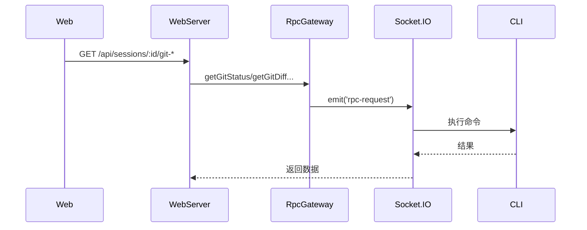

# Git 与文件 API

**文件**: [`hub/src/web/routes/git.ts`](/hub/src/web/routes/git.ts)

## 端点

| 方法 | 路径 | 说明 |
|------|------|------|
| `GET` | `/api/sessions/:id/git-status` | 获取 Git 状态 |
| `GET` | `/api/sessions/:id/git-diff-numstat` | 获取变更统计 |
| `GET` | `/api/sessions/:id/git-diff-file` | 获取文件 diff |
| `GET` | `/api/sessions/:id/file` | 读取文件 |
| `GET` | `/api/sessions/:id/files` | 搜索文件 |
| `GET` | `/api/sessions/:id/directory` | 列出目录 |

## Git 操作

### Git 状态

```
GET /api/sessions/:id/git-status
```

### 变更统计

```
GET /api/sessions/:id/git-diff-numstat?staged=true|false
```

### 文件 Diff

```
GET /api/sessions/:id/git-diff-file?path=xxx&staged=true|false
```

## 文件操作

### 读取文件

```
GET /api/sessions/:id/file?path=xxx
```

### 搜索文件

```
GET /api/sessions/:id/files?query=xxx&limit=200
```

使用 ripgrep 搜索文件名。

### 列出目录

```
GET /api/sessions/:id/directory?path=xxx
```

## 流程



所有操作都通过 RpcGateway 调用 CLI 执行。
