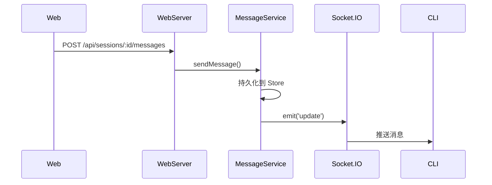

# 消息 API

**文件**: [`hub/src/web/routes/messages.ts`](/hub/src/web/routes/messages.ts)

## 端点

| 方法 | 路径 | 说明 |
|------|------|------|
| `GET` | `/api/sessions/:id/messages` | 分页获取消息 |
| `POST` | `/api/sessions/:id/messages` | 发送消息 |

## 分页获取消息

### 请求参数

| 参数 | 类型 | 说明 |
|------|------|------|
| `limit` | number | 每页数量（1-200，默认 50） |
| `beforeSeq` | number | 获取此序号之前的消息 |

### 响应

```typescript
{
    messages: DecryptedMessage[],
    page: {
        limit: number,
        beforeSeq: number | null,
        nextBeforeSeq: number | null,
        hasMore: boolean
    }
}
```

## 发送消息

### 请求体

```typescript
{
    text: string,                    // 消息文本
    localId?: string,                // 客户端本地 ID
    attachments?: AttachmentMetadata[]  // 附件
}
```

### 响应

```json
{ "ok": true }
```

## 流程


