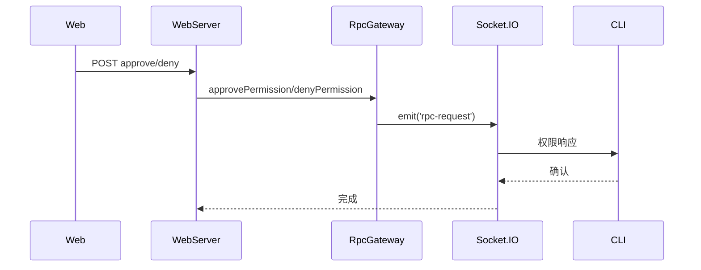

# 权限 API

**文件**: [`hub/src/web/routes/permissions.ts`](/hub/src/web/routes/permissions.ts)

## 端点

| 方法 | 路径 | 说明 |
|------|------|------|
| `POST` | `/api/sessions/:id/permissions/:requestId/approve` | 批准权限请求 |
| `POST` | `/api/sessions/:id/permissions/:requestId/deny` | 拒绝权限请求 |

## 批准权限请求

### 请求体

```typescript
{
    mode?: PermissionMode,           // 权限模式
    allowTools?: string[],           // 允许的工具列表
    decision?: 'approved' | 'approved_for_session' | 'denied' | 'abort',
    answers?: Record<string, string[]> | Record<string, { answers: string[] }>
}
```

### 响应

```json
{ "ok": true }
```

### 错误

| 状态码 | 说明 |
|--------|------|
| 404 | 请求不存在 |
| 400 | 无效的权限模式 |

## 拒绝权限请求

### 请求体

```typescript
{
    decision?: 'approved' | 'approved_for_session' | 'denied' | 'abort'
}
```

### 响应

```json
{ "ok": true }
```

## 流程


