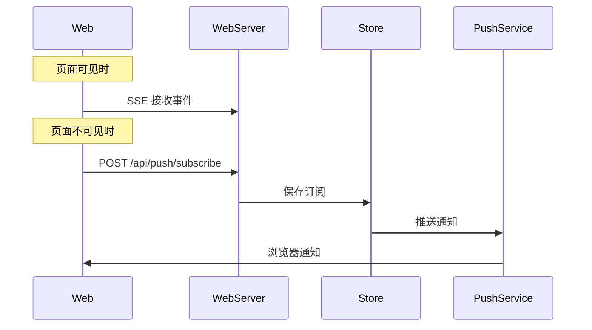

# Web Push API

**文件**: [`hub/src/web/routes/push.ts`](/hub/src/web/routes/push.ts)

Web Push 用于在页面不可见时推送通知。

## 端点

| 方法 | 路径 | 说明 |
|------|------|------|
| `GET` | `/api/push/vapid-public-key` | 获取 VAPID 公钥 |
| `POST` | `/api/push/subscribe` | 订阅推送 |
| `DELETE` | `/api/push/subscribe` | 取消订阅 |

## 获取公钥

```
GET /api/push/vapid-public-key
```

### 响应

```json
{ "publicKey": "xxx" }
```

## 订阅推送

### 请求体

```typescript
{
    endpoint: string,
    keys: {
        p256dh: string,
        auth: string
    }
}
```

### 响应

```json
{ "ok": true }
```

## 取消订阅

### 请求体

```typescript
{
    endpoint: string
}
```

### 响应

```json
{ "ok": true }
```

## 推送流程


