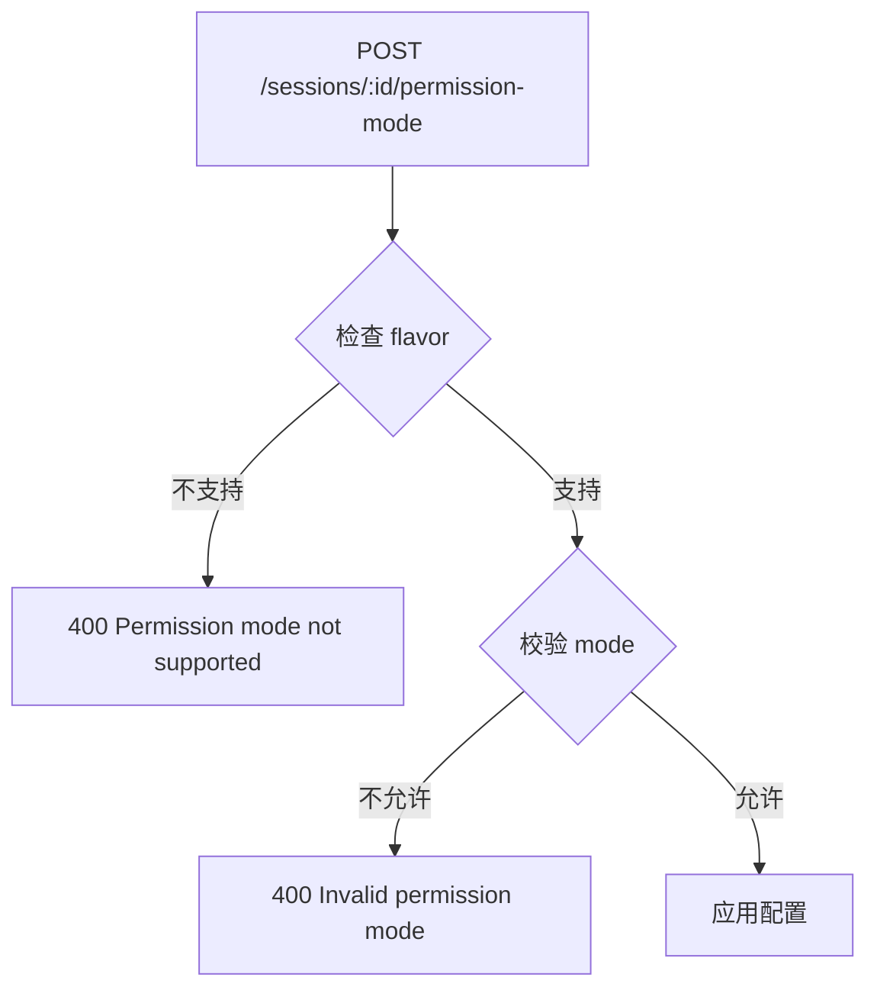

# Sessions API

**文件**：
- [`hub/src/web/routes/sessions.ts`](/hub/src/web/routes/sessions.ts)
- [`hub/src/web/routes/sessionGroups.ts`](/hub/src/web/routes/sessionGroups.ts)

会话相关的 HTTP API，包括会话管理和分组查询。

## 路由总览

### Sessions 路由 (`/api/sessions`)

| 方法 | 路径 | 功能 | 要求 |
|------|------|------|------|
| GET | `/sessions` | 获取会话列表 | - |
| GET | `/sessions/:id` | 获取会话详情 | - |
| POST | `/sessions/:id/resume` | 恢复会话 | - |
| POST | `/sessions/:id/upload` | 上传文件 | 会话活跃 |
| POST | `/sessions/:id/upload/delete` | 删除上传文件 | 会话活跃 |
| POST | `/sessions/:id/abort` | 中止会话 | 会话活跃 |
| POST | `/sessions/:id/archive` | 归档会话 | 会话活跃 |
| POST | `/sessions/:id/switch` | 切换到远程模式 | 会话活跃 |
| POST | `/sessions/:id/permission-mode` | 设置权限模式 | 会话活跃 |
| POST | `/sessions/:id/model` | 设置模型 | 会话活跃 |
| PATCH | `/sessions/:id` | 重命名会话 | - |
| DELETE | `/sessions/:id` | 删除会话 | 会话非活跃 |
| GET | `/sessions/:id/slash-commands` | 获取斜杠命令 | - |
| GET | `/sessions/:id/skills` | 获取技能列表 | - |

### Session Groups 路由 (`/api/session-groups`)

| 方法 | 路径 | 功能 |
|------|------|------|
| GET | `/session-groups` | 获取分组列表 |
| GET | `/session-groups/sessions` | 获取分组内会话（分页） |

## 权限模式

权限模式受 `flavor`（Agent 类型）限制，不同 Agent 支持不同的权限模式。

## 守卫函数

**文件**：[`hub/src/web/routes/guards.ts`](/hub/src/web/routes/guards.ts)

| 函数 | 作用 |
|------|------|
| `requireSyncEngine` | 确保 SyncEngine 可用 |
| `requireSessionFromParam` | 确保会话存在且属于当前 namespace |
