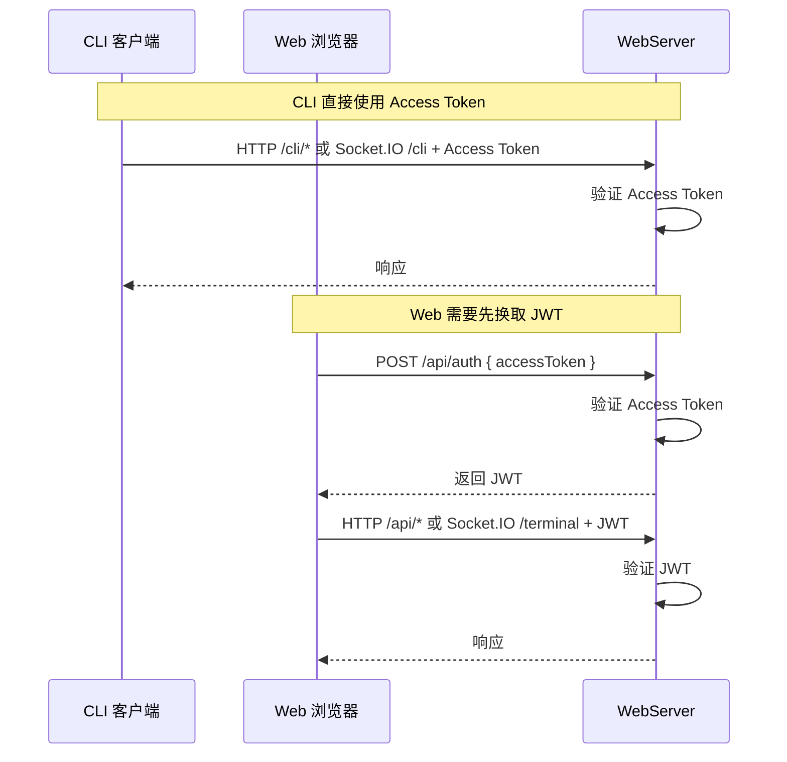
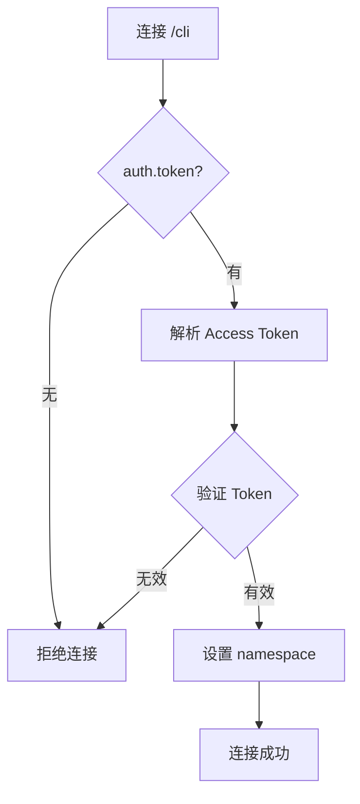
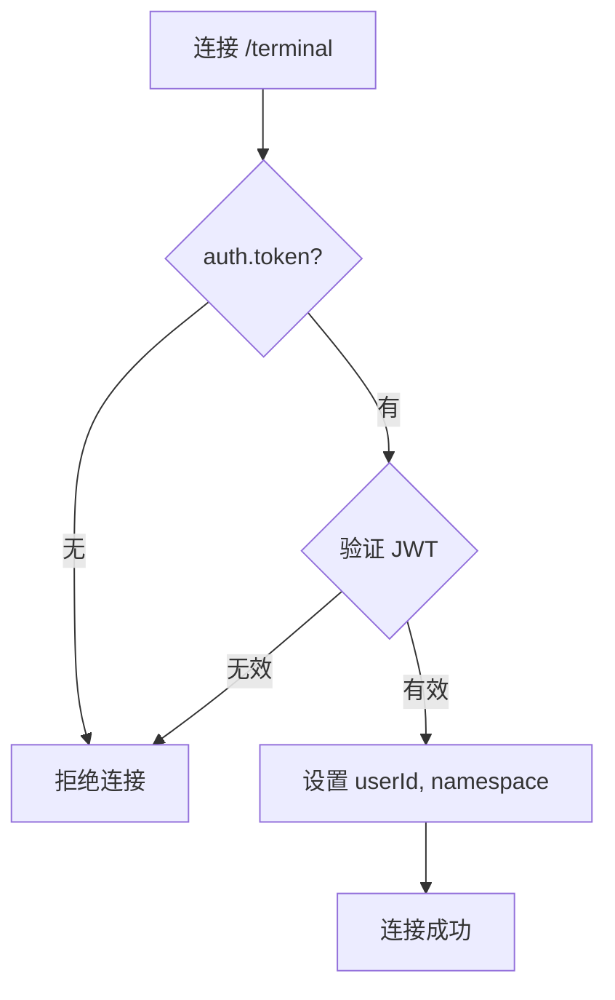
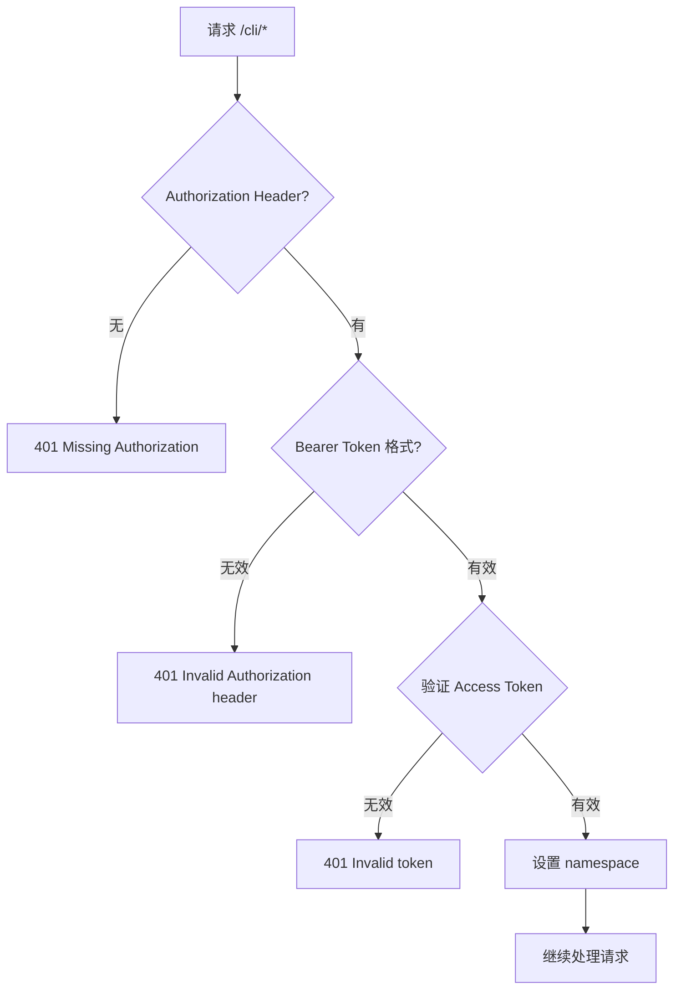
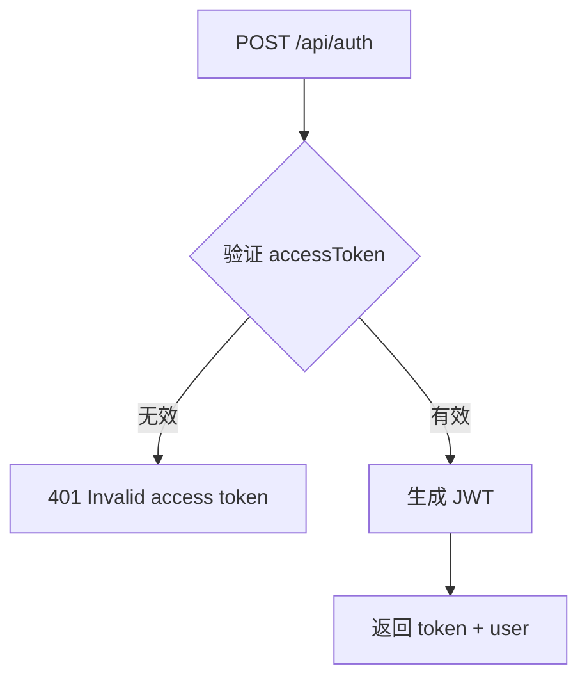
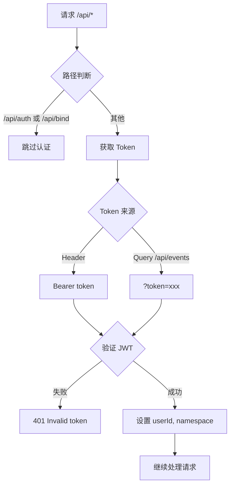

# WebServer 认证机制

## 概述

WebServer 有两套认证机制：

| 认证方式 | 使用者 | HTTP 路由 | Socket.IO 命名空间 |
|----------|--------|-----------|-------------------|
| **Access Token** | CLI 客户端 | `/cli/*` | `/cli` |
| **JWT** | Web 浏览器 | `/api/*` | `/terminal` |

## 认证流程



## 路由认证要求

| 路由 | 认证 | 说明 |
|------|------|------|
| `/health` | 无 | 健康检查 |
| `/cli/*` | Access Token | CLI 专用 API |
| `POST /api/auth` | 无 | 登录 |
| `GET /api/auth/status` | 无 | 检查认证状态 |
| `/api/events` | JWT | SSE 支持 Query 传 token |
| 其他 `/api/*` | JWT | Header 传 Bearer token |

## Socket.IO 认证

**文件**: [`hub/src/socket/server.ts`](/hub/src/socket/server.ts)

Socket.IO 通过命名空间隔离，认证逻辑与 HTTP 相同，但传递方式不同：

| 命名空间 | 认证 | 使用者 | Token 传递 |
|----------|------|--------|------------|
| `/cli` | Access Token | CLI 客户端 | `auth.token`（handshake） |
| `/terminal` | JWT | Web 终端 | `auth.token`（handshake） |

```typescript
// 客户端连接示例
import { io } from 'socket.io-client'

// CLI 连接
const cliSocket = io('/cli', {
    auth: { token: 'your-access-token' }
})

// Terminal 连接
const terminalSocket = io('/terminal', {
    auth: { token: 'your-jwt' }
})
```

### /cli 命名空间



### /terminal 命名空间



## CLI 认证（Access Token）

**文件**: [`hub/src/web/routes/cli.ts`](/hub/src/web/routes/cli.ts)

CLI 路由通过中间件验证 Access Token：



- Token 格式：`Authorization: Bearer <accessToken>`
- Access Token 即 CLI_API_TOKEN（可带 namespace 前缀）

## Web 认证（JWT）

### 登录流程

**文件**: [`hub/src/web/routes/auth.ts`](/hub/src/web/routes/auth.ts)



- 输入：`accessToken`（即 CLI_API_TOKEN）
- 输出：JWT（有效期 1 天）+ 用户信息

### JWT 中间件

**文件**: [`hub/src/web/middleware/auth.ts`](/hub/src/web/middleware/auth.ts)



### JWT Payload

```typescript
{
    uid: number,    // 用户 ID
    ns: string      // 命名空间
}
```

## 密钥来源

### CLI_API_TOKEN（Access Token）

**文件**: [`hub/src/config/cliApiToken.ts`](/hub/src/config/cliApiToken.ts)

| 优先级 | 来源 | 说明 |
|--------|------|------|
| 1 | 环境变量 `CLI_API_TOKEN` | 最高优先级 |
| 2 | 配置文件 `~/.mobi/settings.json` | 持久化存储 |
| 3 | 自动生成 | 首次启动时生成并保存 |

首次启动时会打印到控制台：
```
======================================================================
  NEW CLI_API_TOKEN GENERATED
======================================================================
  Token: xxxxxxxx
  Saved to: ~/.mobi/settings.json
======================================================================
```

### JWT Secret

**文件**: [`hub/src/config/jwtSecret.ts`](/hub/src/config/jwtSecret.ts)

| 来源 | 说明 |
|------|------|
| 文件 `~/.mobi/jwt-secret.json` | 首次启动时自动生成（32字节随机数） |

文件格式：
```json
{
    "secretBase64": "base64编码的32字节密钥"
}
```
