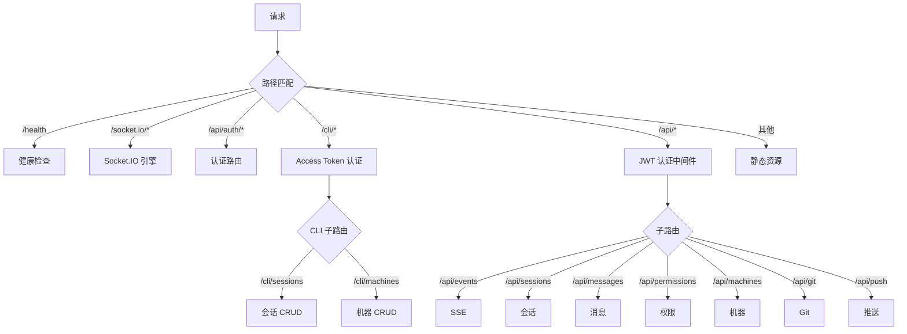
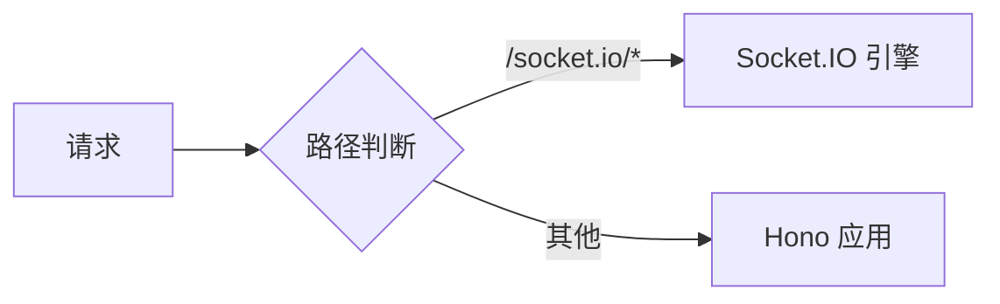

# WebServer 架构

**文件**: [`packages/hub/src/web/server.ts`](/packages/hub/src/web/server.ts)

HTTP 服务器，使用 Hono 框架。

## 路由结构

路由按客户端分类：

| 路由前缀 | 客户端 | 认证方式 | 用途 |
|---------|--------|---------|------|
| `/cli/*` | CLI | Access Token | CLI 初始化、查询（Session/Machine CRUD） |
| `/api/*` | Web | JWT | Web 端操作（会话管理、消息、权限、Git 等） |

详细端点：

| 路径 | 认证 | 说明 |
|------|------|------|
| `/health` | 无 | 健康检查 |
| `/socket.io/*` | [按命名空间](./auth.md) | Socket.IO（见下方说明） |
| `/api/auth/*` | 无 | [登录、验证](./auth.md) |
| `/cli/*` | [Access Token](./auth.md) | [CLI 专用 API](./cli/cli.md) |
| `/api/events` | [JWT](./auth.md) | [SSE 事件推送](./api/sse-events.md) |
| `/api/sessions/*` | [JWT](./auth.md) | [会话管理](./api/sessions.md) |
| `/api/session-groups/*` | [JWT](./auth.md) | [会话分组](./api/sessions.md) |
| `/api/messages/*` | [JWT](./auth.md) | [消息管理](./api/messages.md) |
| `/api/permissions/*` | [JWT](./auth.md) | [权限操作](./api/permissions.md) |
| `/api/machines/*` | [JWT](./auth.md) | 机器管理 |
| `/api/git/*` | [JWT](./auth.md) | [Git 与文件操作](./api/git.md) |
| `/api/push/*` | [JWT](./auth.md) | [推送订阅](./api/push.md) |
| `/*` | - | 静态资源（Web UI） |

## 路由注册顺序

## 两个核心函数

| 函数 | 作用 |
|------|------|
| `createWebApp()` | 创建 Hono 应用，配置路由 |
| `startWebServer()` | 启动服务器，分发请求 |

## 请求分发逻辑

## 静态资源

两种模式：
1. **开发模式**：从 `web/dist` 目录读取
2. **编译模式**：从内嵌资源读取

## Socket.IO 命名空间

| 命名空间 | 认证 | 使用者 |
|----------|------|--------|
| `/cli` | Access Token | CLI 客户端 |
| `/terminal` | JWT | Web 终端 |

认证逻辑在 [`packages/hub/src/socket/server.ts`](/packages/hub/src/socket/server.ts)，通过 Socket.IO 中间件实现。
