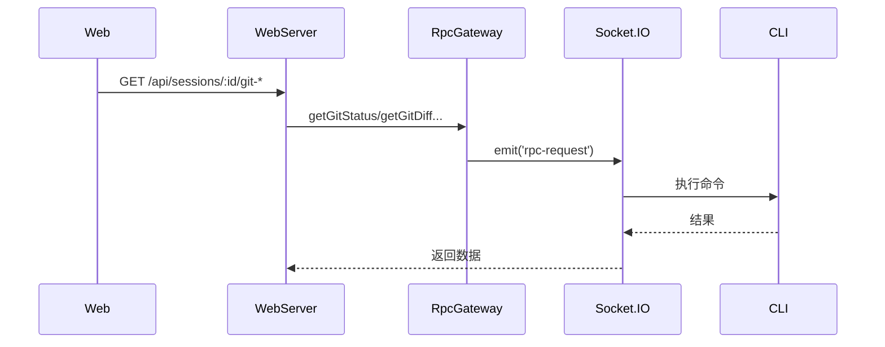

# Git 与文件 API

**文件**: [`packages/hub/src/web/routes/git.ts`](/packages/hub/src/web/routes/git.ts)

## 端点

| 方法 | 路径 | 说明 |
|------|------|------|
| `GET` | `/api/sessions/:id/git-status` | 获取 Git 状态 |
| `GET` | `/api/sessions/:id/git-diff-numstat` | 获取变更统计 |
| `GET` | `/api/sessions/:id/git-diff-file` | 获取文件 diff |
| `GET` | `/api/sessions/:id/file` | 读取文件 |
| `GET` | `/api/sessions/:id/files` | 搜索文件 |
| `GET` | `/api/sessions/:id/directory` | 列出目录 |

## Git 操作

### Git 状态

```
GET /api/sessions/:id/git-status
```

```json
// Response
{
    "branch": "feature-auth",
    "ahead": 2,
    "behind": 0,
    "staged": ["src/auth.ts"],
    "modified": ["src/utils.ts"],
    "untracked": ["temp.log"]
}
```

### 变更统计

```
GET /api/sessions/:id/git-diff-numstat?staged=true|false
```

```json
// Response
[
    { "path": "src/auth.ts", "added": 15, "deleted": 3 },
    { "path": "src/utils.ts", "added": 2, "deleted": 8 }
]
```

### 文件 Diff

```
GET /api/sessions/:id/git-diff-file?path=xxx&staged=true|false
```

```json
// Response (text/plain)
"diff --git a/src/auth.ts b/src/auth.ts\n..."
```

## 文件操作

### 读取文件

```
GET /api/sessions/:id/file?path=src/auth.ts
```

```json
// Response
{
    "content": "export function authenticate() { ... }",
    "path": "src/auth.ts"
}
```

### 搜索文件

```
GET /api/sessions/:id/files?query=auth&limit=20
```

使用 ripgrep 搜索文件名。

```json
// Response
[
    "src/auth.ts",
    "src/auth/middleware.ts",
    "tests/auth.test.ts"
]
```

### 列出目录

```
GET /api/sessions/:id/directory?path=src
```

```json
// Response
{
    "path": "src",
    "entries": [
        { "name": "auth.ts", "type": "file" },
        { "name": "auth", "type": "directory" },
        { "name": "utils.ts", "type": "file" }
    ]
}
```

## 流程



所有操作都通过 RpcGateway 调用 CLI 执行。
