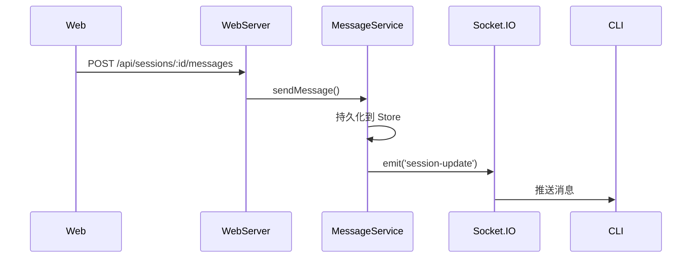

# 消息 API

**文件**: [`packages/hub/src/web/routes/messages.ts`](/packages/hub/src/web/routes/messages.ts)

## 端点

| 方法 | 路径 | 说明 |
|------|------|------|
| `GET` | `/api/sessions/:id/messages` | 分页获取消息 |
| `POST` | `/api/sessions/:id/messages` | 发送消息 |
| `DELETE` | `/api/sessions/:id/messages/:messageId` | 取消排队消息（`messageId` 为 localId） |

## 分页获取消息

### 请求参数

| 参数 | 类型 | 说明 |
|------|------|------|
| `limit` | number | 每页数量（1-200，默认 50） |
| `beforeSeq` | number | 获取此序号之前的消息 |

### 响应

```typescript
{
    messages: DecryptedMessage[],
    page: {
        limit: number,           // 每页数量
        beforeSeq: number | null, // 当前游标
        nextBeforeSeq: number | null, // 下一页游标（null 表示无更多）
        hasMore: boolean         // 是否还有更多消息
    }
}
```

**示例**：

```
GET /api/sessions/sess-abc123/messages?limit=50&beforeSeq=200
```

```json
{
    "messages": [
        {
            "id": "msg-001",
            "seq": 199,
            "localId": "local-xyz",
            "lifecycle": "pushed",
            "lifecycleAt": 1712000000000,
            "content": { "role": "user", "content": "你好" },
            "createdAt": 1712000000000
        },
        {
            "id": "msg-002",
            "seq": 200,
            "localId": null,
            "content": { "role": "assistant", "content": [{ "type": "text", "text": "你好！有什么..." }] },
            "createdAt": 1712000001000
        }
    ],
    "page": {
        "limit": 50,
        "beforeSeq": 200,
        "nextBeforeSeq": 150,
        "hasMore": true
    }
}
```

> 类型定义详见 [共享类型](./types.md#decryptedmessage)

## 取消排队消息

### 请求

```
DELETE /api/sessions/:id/messages/:messageId
```

`messageId` 为消息的 `localId`。采用**两阶段取消**：先查 DB（`lifecycle` 已非 queued？已删？），再兜底 RPC 通知 CLI 删除内存缓冲。

### 响应

```typescript
{ status: 'cancelled' | 'submitted' }
```

| 状态 | 含义 |
|------|------|
| `cancelled` | DB 层已物理删除该排队消息，并已通知 CLI 清理内存缓冲 |
| `submitted` | 消息已被 CLI push 给 Claude Code（`lifecycle` 已非 `queued`）或 CLI 已抢先处理，无法取消 |

## 发送消息

### 请求体（双格式 union，2026-08-27 content block 化）

**新格式**——content 为 block 数组（AG-UI 对齐的 `UserContentBlock[]`：text/image/document/quote 四型，schema 见 shared `userContentSchema.ts`）：

```typescript
{
    content: string | UserContentBlock | UserContentBlock[],  // 三形态之一
    localId?: string
}
```

```json
{
    "content": [
        { "type": "quote", "messageId": "local-…", "role": "agent", "excerpt": "…" },
        { "type": "document", "source": { "type": "url", "value": ".mobi/uploads/x.pdf", "mimeType": "application/pdf" }, "id": "…", "filename": "x.pdf", "size": 1024 },
        { "type": "text", "text": "请帮我修复 auth 模块的 bug" }
    ],
    "localId": "client-msg-001"
}
```

**旧平铺格式**（旧版 web/PWA 窗口期兼容；hub 归一后以数组落库）：

```typescript
{
    text: string,
    localId?: string,
    attachments?: AttachmentMetadata[]
}
```

> 类型定义详见 [共享类型](./types.md#attachmentmetadata) 与 shared `userContentSchema.ts`。
> 两种格式经同一 `normalizeUserContent` 归一为 block 数组落库（无效内容返回 **400**）。

### 响应

```json
{ "ok": true }
```

## 流程


