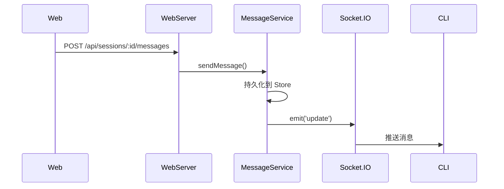

# 消息 API

**文件**: [`packages/hub/src/web/routes/messages.ts`](/packages/hub/src/web/routes/messages.ts)

## 端点

| 方法 | 路径 | 说明 |
|------|------|------|
| `GET` | `/api/sessions/:id/messages` | 分页获取消息 |
| `POST` | `/api/sessions/:id/messages` | 发送消息 |

## 分页获取消息

### 请求参数

| 参数 | 类型 | 说明 |
|------|------|------|
| `limit` | number | 每页数量（1-200，默认 50） |
| `beforeSeq` | number | 获取此序号之前的消息 |

### 响应

```typescript
{
    messages: DecryptedMessage[],
    page: {
        limit: number,           // 每页数量
        beforeSeq: number | null, // 当前游标
        nextBeforeSeq: number | null, // 下一页游标（null 表示无更多）
        hasMore: boolean         // 是否还有更多消息
    }
}
```

**示例**：

```
GET /api/sessions/sess-abc123/messages?limit=50&beforeSeq=200
```

```json
{
    "messages": [
        {
            "id": "msg-001",
            "seq": 199,
            "localId": "local-xyz",
            "content": { "role": "user", "content": "你好" },
            "createdAt": 1712000000000
        },
        {
            "id": "msg-002",
            "seq": 200,
            "localId": null,
            "content": { "role": "assistant", "content": [{ "type": "text", "text": "你好！有什么..." }] },
            "createdAt": 1712000001000
        }
    ],
    "page": {
        "limit": 50,
        "beforeSeq": 200,
        "nextBeforeSeq": 150,
        "hasMore": true
    }
}
```

> 类型定义详见 [共享类型](./types.md#decryptedmessage)

## 发送消息

### 请求体

```typescript
{
    text: string,                    // 消息文本
    localId?: string,                // 客户端本地 ID（用于去重）
    attachments?: AttachmentMetadata[]  // 附件列表
}
```

**示例**：

```json
{
    "text": "请帮我修复 auth 模块的 bug",
    "localId": "client-msg-001",
    "attachments": [
        {
            "id": "att-abc",
            "filename": "screenshot.png",
            "mimeType": "image/png",
            "size": 102400,
            "path": "/uploads/att-abc.png",
            "previewUrl": "/api/files/att-abc/preview"
        }
    ]
}
```

> 类型定义详见 [共享类型](./types.md#attachmentmetadata)

### 响应

```json
{ "ok": true }
```

## 流程


