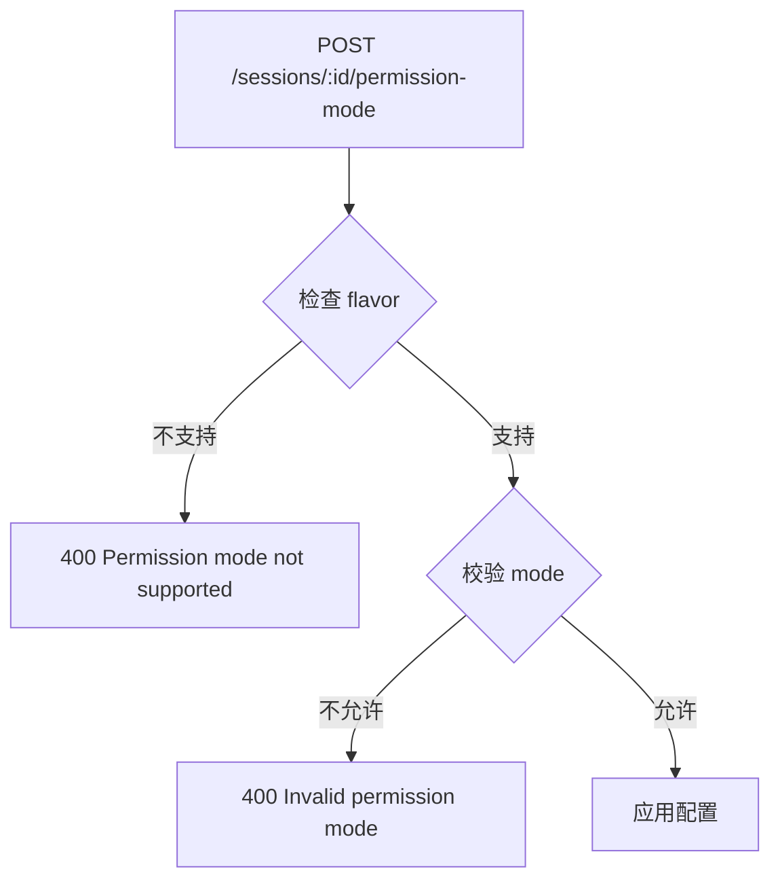

# Sessions API

**文件**：
- [`packages/hub/src/web/routes/sessions.ts`](/packages/hub/src/web/routes/sessions.ts)
- [`packages/hub/src/web/routes/sessionGroups.ts`](/packages/hub/src/web/routes/sessionGroups.ts)
- [`packages/hub/src/web/routes/serveFileContent.ts`](/packages/hub/src/web/routes/serveFileContent.ts)（read-file / serve-file 共享的文件服务逻辑）

会话相关的 HTTP API，包括会话管理和分组查询。

## 路由总览

### Sessions 路由 (`/api/sessions`)

| 方法 | 路径 | 功能 | 要求 |
|------|------|------|------|
| GET | `/sessions` | 获取会话列表 | - |
| GET | `/sessions/:id` | 获取会话详情 | - |
| POST | `/sessions/:id/resume` | 恢复会话 | - |
| POST | `/sessions/:id/upload` | 上传文件 | 会话活跃 |
| POST | `/sessions/:id/upload/delete` | 删除上传文件 | 会话活跃 |
| POST | `/sessions/:id/abort` | 中止会话 | 会话活跃 |
| POST | `/sessions/:id/archive` | 归档会话 | 会话活跃 |
| POST | `/sessions/:id/switch` | 切换到远程模式 | 会话活跃 |
| POST | `/sessions/:id/permission-mode` | 设置权限模式 | 会话活跃 |
| POST | `/sessions/:id/model` | 设置模型 | 会话活跃 |
| PATCH | `/sessions/:id` | 重命名会话 | - |
| DELETE | `/sessions/:id` | 删除会话 | 会话非活跃 |
| GET | `/sessions/:id/slash-commands` | 获取斜杠命令 | - |
| GET | `/sessions/:id/skills` | 获取技能列表 | - |

### Session Groups 路由 (`/api/session-groups`)

| 方法 | 路径 | 功能 |
|------|------|------|
| GET | `/session-groups` | 获取分组列表 |
| GET | `/session-groups/sessions` | 获取分组内会话（分页） |


### GET /sessions — 获取会话列表

```json
// Response
[
    {
        "id": "sess-abc123",
        "namespace": "/Users/dev/project",
        "seq": 5,
        "active": true,
        "running": true,
        "runningAt": 1712000050000,
        "mode": "local",
        "metadata": {
            "sessionName": "feature-auth",
            "workingDir": "/Users/dev/project"
        },
        "permissionMode": "default",
        "createdAt": 1712000000000,
        "updatedAt": 1712000060000
    }
]
```

### GET /sessions/:id — 获取会话详情

```json
// Response
{
    "id": "sess-abc123",
    "namespace": "/Users/dev/project",
    "seq": 5,
    "active": true,
    "activeAt": 1712000060000,
    "running": true,
    "runningAt": 1712000050000,
    "mode": "local",
    "thinking": false,
    "metadata": { "sessionName": "feature-auth" },
    "runtimeState": { "model": "sonnet" },
    "permissionMode": "default"
}
```

### POST /sessions/:id/permission-mode — 设置权限模式

```json
// Request
{ "mode": "acceptEdits" }

// Response
{ "ok": true }

// Error (不支持的模式)
{ "error": "Permission mode not supported" }    // 400
```

### POST /sessions/:id/model — 设置模型

```json
// Request
{ "model": "opus" }

// Response
{ "ok": true }
```

### PATCH /sessions/:id — 重命名会话

```json
// Request
{ "sessionName": "新名称" }

// Response
{ "ok": true }
```

### GET /sessions/:id/slash-commands — 获取斜杠命令

```json
// Response
[
    { "name": "/commit", "description": "创建提交", "argumentHint": "" },
    { "name": "/review", "description": "代码审查", "argumentHint": "" }
]
```

### Session Groups

#### GET /session-groups — 获取分组列表

```json
// Response
[
    { "groupKey": "/Users/dev/project", "count": 3, "latestActiveAt": 1712000060000 },
    { "groupKey": "/Users/dev/other", "count": 1, "latestActiveAt": 1711990000000 }
]
```

#### GET /session-groups/sessions — 获取分组内会话（分页）

```
GET /api/session-groups/sessions?groupKey=/Users/dev/project&limit=20&offset=0
```

```json
// Response
{
    "sessions": [...],
    "total": 3
}
```

## 权限模式



权限模式受 `flavor`（Agent 类型）限制，不同 Agent 支持不同的权限模式。

## 守卫函数

**文件**：[`packages/hub/src/web/routes/guards.ts`](/packages/hub/src/web/routes/guards.ts)

| 函数 | 作用 |
|------|------|
| `requireSyncEngine` | 确保 SyncEngine 可用 |
| `requireSessionFromParam` | 确保会话存在且属于当前 namespace |

## 文件访问端点

文件读取相关端点（均在 sessions.ts，需会话鉴权，cookie 同源自动带）：

| 方法 | 路径 | 功能 |
|------|------|------|
| GET | `/sessions/:id/read-file?path=<abs>` | 读单文件（绝对路径，源码/下载/媒体直连） |
| GET | `/sessions/:id/serve-file/:path{.*}` | **静态资源服务**（相对 cwd 的 path 段，HTML 预览用） |
| GET | `/sessions/:id/file-meta?path=<abs>` | 文件元信息（mime/size/etag，不下载内容） |
| GET | `/sessions/:id/list-directory?path=<abs>` | 列目录 |
| GET | `/sessions/:id/search-files?...` | 搜索文件 |

### 共享文件服务：`serveFileContent()`

**文件**：[`serveFileContent.ts`](/packages/hub/src/web/routes/serveFileContent.ts)

从 read-file 抽出的共享逻辑，吃绝对路径输出流式响应：`readFileMeta` → 304 协商缓存 → Range(206) 解析 → 响应头 → stream 分片翻译（含客户端断开兜底）。`read-file` 与 `serve-file` 都委托给它，避免复制粘贴。

- meta 失败时分流状态码：cli stat 对不存在文件抛 ENOENT（文案含 `enoent`）→ **404**；其他错误 → 500
- `download` 选项仅 `read-file` 用（追加 `content-disposition: attachment`）
- `extraHeaders` 选项供 `serve-file` 追加 `x-content-type-options: nosniff`

### read-file vs serve-file 分工

两者共享 `serveFileContent()`，但**端点分离**——安全边界与路径语义不同：

| | read-file | serve-file |
|---|---|---|
| 路径形式 | query `path`（绝对路径） | path 段 `:path{.*}`（相对 cwd） |
| 安全边界 | homeDir + 黑名单（浏览查看） | **严格 cwd 内**（`isWithinDir`，可执行站点） |
| 相对路径基准 | 无（单文件） | 天然（浏览器按 URL 层级解析，供 HTML 引用 `./css`/`./js`/`./img`） |
| `download` 选项 | 有 | 无 |
| `nosniff` | — | **必加**（通用静态端点防 MIME 嗅探） |

**为何不合并**：安全边界根本不同（homeDir 宽松浏览 vs cwd 严格站点），合并会牵动 web 端多个 read-file 调用点（ImageContentView / MediaContentView / PdfContentView / useFileContent / FileDownloadPrompt）做破坏性改动且收益为零。正确复用层次：**端点分（职责与安全边界不同），实现合（共享 serveFileContent）**。

### serve-file 路径安全

- `relPath` 经 `:path{.*}` 命名通配捕获（hono 4.12 的 `/*` splat `param('*')` 取不到值，须用命名通配）
- `resolve(cwd, relPath)` 后用 `isWithinDir(absPath, cwd)` 校验，越界 → **403**
- **前导 `/` 绝对路径注入**（`serve-file//etc/passwd`）会被 `resolve` 重置为绝对路径 → 越界 403。这是真实可达的越界向量（`..` 在 URL 层已被浏览器/hono 规范化，到不了端点）
- cwd 未知（`session.metadata.path` 缺失）→ 500
