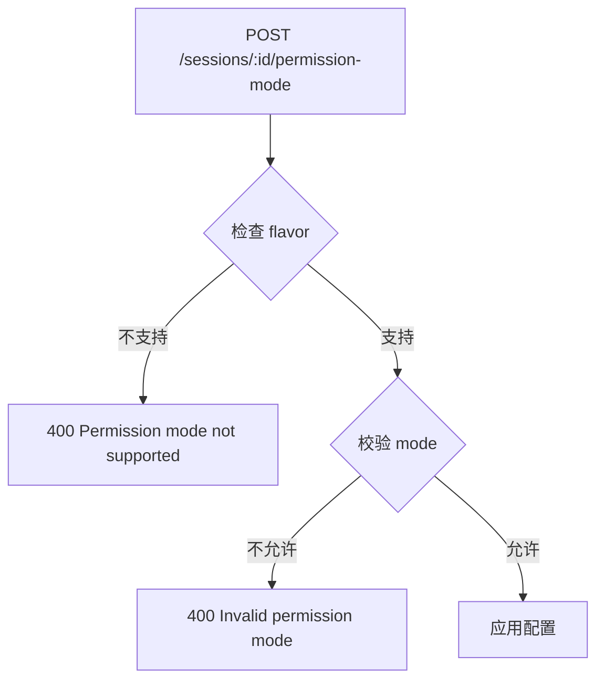

# Sessions API

**文件**：
- [`packages/hub/src/web/routes/sessions.ts`](/packages/hub/src/web/routes/sessions.ts)
- [`packages/hub/src/web/routes/sessionGroups.ts`](/packages/hub/src/web/routes/sessionGroups.ts)

会话相关的 HTTP API，包括会话管理和分组查询。

## 路由总览

### Sessions 路由 (`/api/sessions`)

| 方法 | 路径 | 功能 | 要求 |
|------|------|------|------|
| GET | `/sessions` | 获取会话列表 | - |
| GET | `/sessions/:id` | 获取会话详情 | - |
| POST | `/sessions/:id/resume` | 恢复会话 | - |
| POST | `/sessions/:id/upload` | 上传文件 | 会话活跃 |
| POST | `/sessions/:id/upload/delete` | 删除上传文件 | 会话活跃 |
| POST | `/sessions/:id/abort` | 中止会话 | 会话活跃 |
| POST | `/sessions/:id/archive` | 归档会话 | 会话活跃 |
| POST | `/sessions/:id/switch` | 切换到远程模式 | 会话活跃 |
| POST | `/sessions/:id/permission-mode` | 设置权限模式 | 会话活跃 |
| POST | `/sessions/:id/model` | 设置模型 | 会话活跃 |
| PATCH | `/sessions/:id` | 重命名会话 | - |
| DELETE | `/sessions/:id` | 删除会话 | 会话非活跃 |
| GET | `/sessions/:id/slash-commands` | 获取斜杠命令 | - |
| GET | `/sessions/:id/skills` | 获取技能列表 | - |

### Session Groups 路由 (`/api/session-groups`)

| 方法 | 路径 | 功能 |
|------|------|------|
| GET | `/session-groups` | 获取分组列表 |
| GET | `/session-groups/sessions` | 获取分组内会话（分页） |


### GET /sessions — 获取会话列表

```json
// Response
[
    {
        "id": "sess-abc123",
        "namespace": "/Users/dev/project",
        "seq": 5,
        "active": true,
        "metadata": {
            "sessionName": "feature-auth",
            "workingDir": "/Users/dev/project"
        },
        "permissionMode": "default",
        "createdAt": 1712000000000,
        "updatedAt": 1712000060000
    }
]
```

### GET /sessions/:id — 获取会话详情

```json
// Response
{
    "id": "sess-abc123",
    "namespace": "/Users/dev/project",
    "seq": 5,
    "active": true,
    "activeAt": 1712000060000,
    "thinking": false,
    "metadata": { "sessionName": "feature-auth" },
    "runtimeState": { "model": "sonnet" },
    "permissionMode": "default"
}
```

### POST /sessions/:id/permission-mode — 设置权限模式

```json
// Request
{ "mode": "acceptEdits" }

// Response
{ "ok": true }

// Error (不支持的模式)
{ "error": "Permission mode not supported" }    // 400
```

### POST /sessions/:id/model — 设置模型

```json
// Request
{ "model": "opus" }

// Response
{ "ok": true }
```

### PATCH /sessions/:id — 重命名会话

```json
// Request
{ "sessionName": "新名称" }

// Response
{ "ok": true }
```

### GET /sessions/:id/slash-commands — 获取斜杠命令

```json
// Response
[
    { "name": "/commit", "description": "创建提交", "argumentHint": "" },
    { "name": "/review", "description": "代码审查", "argumentHint": "" }
]
```

### Session Groups

#### GET /session-groups — 获取分组列表

```json
// Response
[
    { "groupKey": "/Users/dev/project", "count": 3, "latestActiveAt": 1712000060000 },
    { "groupKey": "/Users/dev/other", "count": 1, "latestActiveAt": 1711990000000 }
]
```

#### GET /session-groups/sessions — 获取分组内会话（分页）

```
GET /api/session-groups/sessions?groupKey=/Users/dev/project&limit=20&offset=0
```

```json
// Response
{
    "sessions": [...],
    "total": 3
}
```

## 权限模式



权限模式受 `flavor`（Agent 类型）限制，不同 Agent 支持不同的权限模式。

## 守卫函数

**文件**：[`packages/hub/src/web/routes/guards.ts`](/packages/hub/src/web/routes/guards.ts)

| 函数 | 作用 |
|------|------|
| `requireSyncEngine` | 确保 SyncEngine 可用 |
| `requireSessionFromParam` | 确保会话存在且属于当前 namespace |
