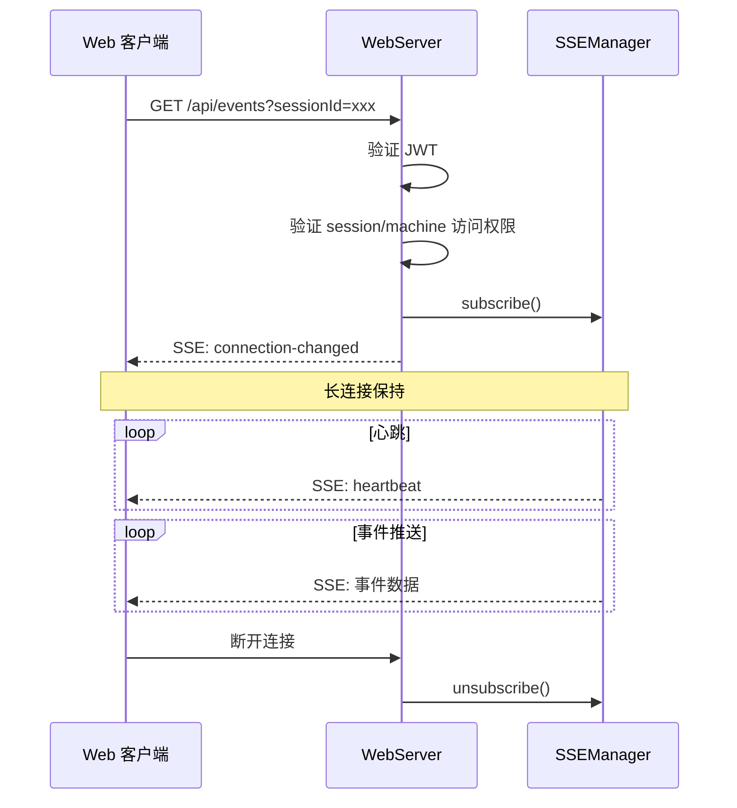

# SSE 事件推送

**文件**: [`packages/hub/src/web/routes/events.ts`](/packages/hub/src/web/routes/events.ts)

Server-Sent Events（SSE）用于向 Web 客户端推送实时事件。

> 底层实现：[SSEManager](../../sse)

## 端点

| 方法 | 路径 | 说明 |
|------|------|------|
| `GET` | `/api/events` | 建立 SSE 连接 |
| `POST` | `/api/visibility` | 更新页面可见性 |

## SSE 连接

### 请求参数

| 参数 | 类型 | 说明 |
|------|------|------|
| `all` | boolean | 订阅所有事件（默认 false） |
| `sessionId` | string | 订阅特定会话 |
| `machineId` | string | 订阅特定机器 |
| `visibility` | `visible` / `hidden` | 页面可见性（默认 hidden） |

### 连接流程



### 事件格式

```typescript
// 连接成功
{
    type: 'connection-changed',
    data: {
        status: 'connected',
        subscriptionId: 'uuid'
    },
    connected: true
}

// 重连成功
{
    type: 'connection-changed',
    data: {
        status: 'connected',
        subscriptionId: 'uuid'
    },
    reconnected: true
}

// 心跳
{
    type: 'heartbeat',
    namespace: 'xxx',
    data: {
        timestamp: 1700000000000
    }
}

// 消息快照（流式消息，未落库）
{
    type: 'message-snapshot',
    sessionId: 'xxx',
    message: {
        id: 'snapshot-pending',
        seq: null,
        localId: null,
        snapshot: true,
        content: { ... },
        createdAt: 1700000000000
    }
}

// 空闲超时预警
{
    type: 'idle-timeout-warning',
    sessionId: 'xxx',
    data: {
        timeoutAt: 1700000060000,
        remainingMs: 120000
    }
}

// 业务事件
{
    type: 'session-updated',
    sessionId: 'xxx',
    // ...
}
```

## 页面可见性

用于告知服务器当前页面是否可见，影响推送策略（如推送通知只在页面不可见时发送）。

### 请求

```http
POST /api/visibility
Content-Type: application/json
Authorization: Bearer <jwt>

{
    "subscriptionId": "uuid",
    "visibility": "visible"
}
```

### 响应

```json
// 成功
{ "ok": true }

// 订阅不存在
{ "error": "Subscription not found" }
```

## 订阅模式

| 模式 | 参数 | 接收的事件 |
|------|------|------------|
| 全局 | `all=true` | 所有事件 |
| 会话 | `sessionId=xxx` | 该会话相关事件 |
| 机器 | `machineId=xxx` | 该机器相关事件 |
