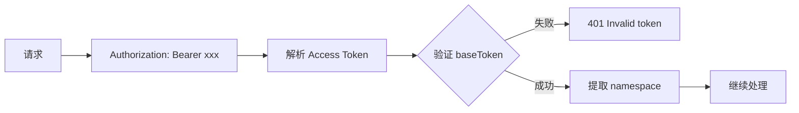
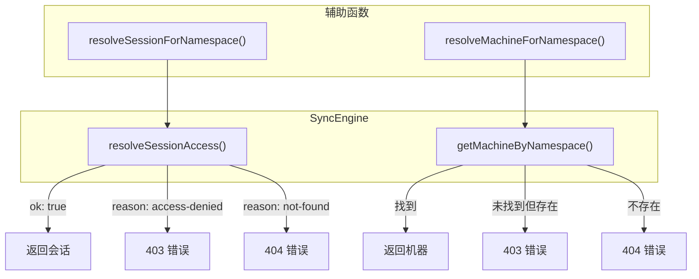
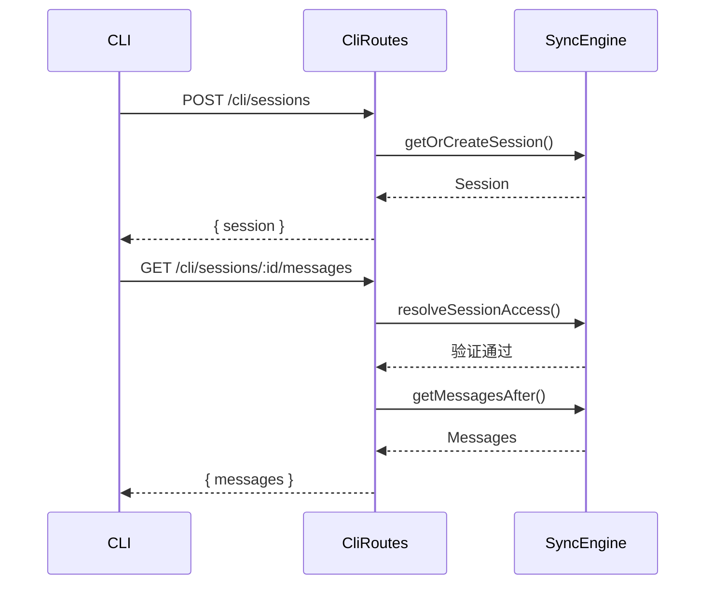

# CLI 路由

**文件**: [`packages/hub/src/web/routes/cli.ts`](/packages/hub/src/web/routes/cli.ts)

CLI 专用的 HTTP API，用于会话和机器的初始化与查询。

## 认证

使用 Bearer Token 认证，Token 格式为 Access Token（包含 namespace 信息）。



## 路由总览

| 方法 | 路径 | 功能 |
|------|------|------|
| POST | `/cli/sessions` | 创建或加载会话 |
| GET | `/cli/sessions/by-claude-session/:claudeSessionId` | 通过 Claude Session ID 查找 |
| GET | `/cli/sessions/:id` | 获取会话 |
| GET | `/cli/sessions/:id/messages` | 获取消息列表 |
| POST | `/cli/machines` | 创建或加载机器 |
| GET | `/cli/machines/:id` | 获取机器 |

## 会话操作

### 创建/加载会话

```
POST /cli/sessions
```

**请求体**：

```typescript
{
    tag: string,            // 会话标签
    metadata: unknown,      // 会话元数据
    agentState?: unknown,   // Agent 状态（可选）
    mode?: 'local' | 'remote',
    runtimeState?: unknown,
    projectId?: string      // 归属项目（Web spawn 透传；缺省 = 游离）
}
```

**响应**：

```json
{ "session": { ... }, "project": { ... } }
```

`project` 为会话归属的项目实体（未归属时为 `null`），CLI 据此校验归属并把 folders 冻结进 `metadata.additionalDirectories`。

**错误**：

| 状态码 | 说明 |
|--------|------|
| 404 | Project not found（projectId 不存在或不属于当前 namespace） |
| 403 | Project belongs to a different machine（项目 folders 是机器本地路径；metadata.machineId 缺失的老数据放行） |

调用 `SyncEngine.getOrCreateSession()`，根据 tag 查找或创建会话。

### 通过 Claude Session ID 查找

```
GET /cli/sessions/by-claude-session/:claudeSessionId
```

**响应**：

```json
{ "session": { ... } }
```

**错误**：404 Session not found

调用 `SyncEngine.getSessionByClaudeSessionId()`。

### 获取会话

```
GET /cli/sessions/:id
```

**响应**：

```json
{ "session": { ... } }
```

**错误**：

| 状态码 | 说明 |
|--------|------|
| 403 | Session access denied |
| 404 | Session not found |

### 获取消息列表

```
GET /cli/sessions/:id/messages?afterSeq=0&limit=200
```

**查询参数**：

| 参数 | 类型 | 默认值 | 说明 |
|------|------|--------|------|
| afterSeq | number | 必填 | 起始序列号 |
| limit | number | 200 | 最大返回数量 |

**响应**：

```json
{ "messages": [ ... ] }
```

## 机器操作

### 创建/加载机器

```
POST /cli/machines
```

**请求体**：

```typescript
{
    id: string,           // 机器 ID
    metadata: unknown,    // 机器元数据
    runnerState?: unknown // Runner 状态（可选）
}
```

**响应**：

```json
{ "machine": { ... } }
```

调用 `SyncEngine.getOrCreateMachine()`，根据 ID 查找或创建机器。

### 获取机器

```
GET /cli/machines/:id
```

**响应**：

```json
{ "machine": { ... } }
```

**错误**：

| 状态码 | 说明 |
|--------|------|
| 403 | Machine access denied |
| 404 | Machine not found |

## 命名空间隔离

所有操作都基于 namespace 进行隔离，确保不同 CLI 客户端只能访问自己的数据。



## 与 SyncEngine 交互



## 响应头

所有响应都包含协议版本头：

```
X-Mobi-Protocol-Version: <version>
```
