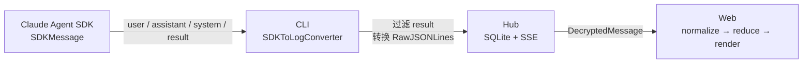
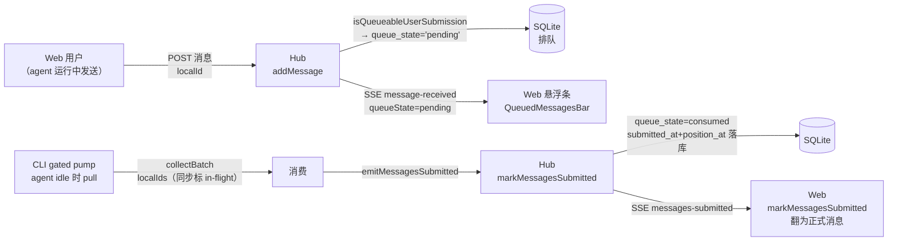
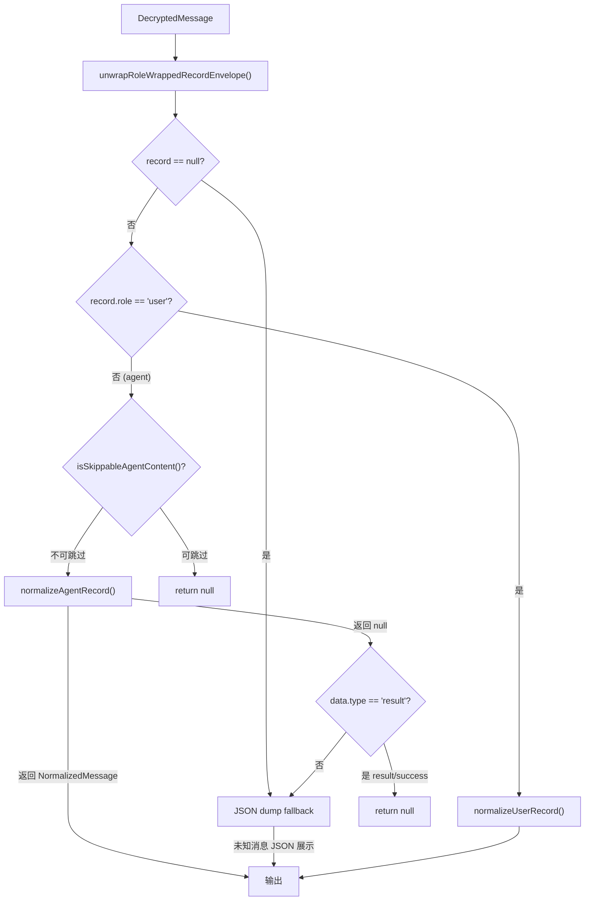

# 消息生命周期：从 SDK 到 UI

本文档追踪一条消息从 Claude Agent SDK 产生，经过 CLI 转换、Hub 存储、SSE 同步，到 Web 端标准化、归约、最终渲染的完整路径。重点关注：哪些消息被丢弃、哪些被处理、每一步的转换规则是什么。

## 全局流程



---

## 消息分类体系

**设计文档**：`docs/superpowers/specs/2026-06-07-message-classification-filtering-design.md`
**实现文件**：`packages/shared/src/messageClassification.ts`

消息分类规则定义在 `@mobi/shared`，CLI 和 Hub 共享，单一事实来源。采用**黑名单**模式：只有明确匹配到 `discard` 或 `ephemeral` 规则的消息才会被特殊处理，**其余一律默认 `persistent`**。

### 三级分类

```typescript
type MessageCategory = 'discard' | 'ephemeral' | 'persistent'
```

| 级别 | 含义 | CLI | Hub 存储 | Hub 历史查询 | SSE 推送 |
|------|------|-----|---------|-------------|---------|
| `discard` | 直接丢弃 | ✘ 不发送 | — | — | — |
| `ephemeral` | 实时临时 | → 发送 | ✓ 存储 | ✘ 过滤 | ✓ 推送 |
| `persistent` | 完整保留 | → 发送 | ✓ 存储 | ✓ 返回 | ✓ 推送 |

### 分类规则

**discard（CLI 直接丢弃，不发送到 Hub）**：

| type | subtype | 说明 |
|------|---------|------|
| `system` | `thinking_tokens` | 内部 token 计数 |
| `system` | `hook_started` | Hook 启动通知 |
| `system` | `hook_progress` | Hook 执行输出 |
| `system` | `hook_response` | Hook 执行结果 |
| `system` | `plugin_install` | 插件安装进度 |
| `system` | `files_persisted` | 文件检查点 |
| `auth_status` | — | 认证流程状态 |
| `rate_limit_event` | — | 限流事件 |

**ephemeral（存 DB，历史查询时过滤，SSE 实时推送不变）**：

| type | subtype | 说明 | Web 标准化结果 |
|------|---------|------|---------------|
| `system` | `task_progress` | 任务执行指标 | `AgentEvent { type: 'agent-progress' }` |
| `system` | `task_started` | 后台任务启动 | `AgentEvent { type: 'bg-task-started' }` |
| `system` | `task_updated` | 后台任务状态变更 | `AgentEvent { type: 'bg-task-updated' }` |
| `system` | `task_notification` | 任务完成通知 | — |
| `tool_progress` | — | 工具执行进度 | `AgentEvent { type: 'agent-progress', toolUseId, metrics, summary }` |
| `tool_use_summary` | — | 工具使用汇总 | `AgentEvent { type: 'agent-progress', toolUseId, metrics, summary }` |
| `prompt_suggestion` | — | 下一步建议 | — |
| `system` | `status` | 压缩/权限状态 | — |

**persistent（默认，完整保留）**：所有未命中上述黑名单的消息，包括 `assistant`、`user`、`system:init`、`system:compact_boundary`、`system:api_error`、`system:api_retry` 等。

### 分类在管线中的位置

```
                         CLI                        Hub                        Web
                    ┌──────────┐              ┌──────────────┐         ┌──────────┐
 SDK 消息 ────────→ │ convert  │              │              │         │          │
                    │   ↓      │              │  classify    │         │          │
                    │ classify │              │   ↓          │         │          │
                    │   ↓      │   discard    │  store +     │  SSE    │ 实时渲染 │
                    │ discard? ├──────────────✘│  broadcast   ├────────→│ (不变)   │
                    │   ↓      │   发送        │              │         │          │
                    │ enqueue  ├──────────────→│  category=   │         │          │
                    └──────────┘              │  ephemeral/  │         │          │
                                              │  persistent  │         │          │
                                              │      ↓       │         │          │
                                              │  历史查询     │         │ 历史渲染 │
                                              │  WHERE != '  ├────────→│ (更轻量) │
                                              │  ephemeral'  │         │          │
                                              └──────────────┘         └──────────┘
```

### 向后兼容

| 保障点 | 机制 |
|--------|------|
| 未知消息 | `classifyMessage()` 未匹配任何规则 → `persistent` |
| 提取失败 | Hub 提取 type/subtype 失败 → `persistent` |
| 存量数据 | `ALTER TABLE ADD COLUMN DEFAULT 'persistent'`，自动填充 |
| SSE 推送 | `ephemeral` 消息仍通过 SSE 实时推送，行为不变 |
| Web 端 | 零改动，两层过滤（分类层 + Web 可见性白名单）互不干扰 |

---

## 第 1 步：SDK 消息产生

Claude Agent SDK 的 `query()` 异步迭代器产出 `SDKMessage`，共四种类型：

| SDK `type` | 来源 | 包含内容 |
|------------|------|----------|
| `user` | 用户输入 / tool_result | `message.content`（string 或 ContentBlock 数组） |
| `assistant` | Claude 回复 | `message.content`（text / thinking / tool_use）+ `message.usage` |
| `system` | SDK 系统事件 | `subtype`（`init` / `api_error` / `api_retry` / `turn_duration` / `compact_boundary` 等）+ `model` / `tools` |
| `result` | 轮次结束标记 | `subtype`、`terminal_reason`、`is_error`、`num_turns`、`duration_ms`、`usage`、`result`（echo） |

**关键点**：`result` 是 SDK 的内部控制消息，不是对话内容。它标志一轮 agent loop 的结束，用于传递 token 用量、中断原因等元数据。

**来源文件**：`@anthropic-ai/claude-agent-sdk` 类型定义

---

## 第 2 步：CLI 转换（SDKToLogConverter）

**文件**：`packages/cli/src/claude/utils/sdkToLogConverter.ts`

将 `SDKMessage` 转换为 Hub 可存储的 `RawJSONLines` 格式。

### 转换规则

| SDK 类型 | 输出 | 处理 |
|----------|------|------|
| `user` | `RawJSONLines (type=user)` | 检查 tool_result，附加权限审批 mode |
| `assistant` | `RawJSONLines (type=assistant)` | 附加 requestId |
| `system` (subtype=`init`) | `RawJSONLines (type=system)` | 更新 sessionId，全字段透传 |
| `system` (其他) | `RawJSONLines (type=system)` | 全字段透传 |
| **`result`** | **`null`（丢弃）** | 不生成日志消息 |

### 消息分类过滤

**文件**：`packages/cli/src/claude/claudeRemoteLauncher.ts`

`onMessage` 回调中，`convert()` 之后、`enqueue()` 之前调用 `classifyMessage(type, subtype)`：
- 分类为 `discard` 的消息直接 `return`，不发送到 Hub
- 分类为 `ephemeral` / `persistent` 的消息正常入队
- 过滤在 `convert()` 之后：确保格式转换完成，type/subtype 字段可被分类函数读取

**输出格式** (`RawJSONLines`) 基础字段：

```typescript
{
    uuid: string           // 消息唯一标识（优先用 SDK 自带 uuid）
    parentUuid: string     // 上一条消息的 UUID（链式结构，指向 lastUuid）
    isSidechain: boolean   // 是否子链（Task 工具的 subagent）
    userType: 'external'   // 固定值
    cwd: string            // 工作目录
    sessionId: string      // 会话 ID
    version: string        // CLI 版本
    gitBranch: string      // 当前 git 分支
    timestamp: string      // ISO 时间戳
}
```

### UUID 链路

```
主链：lastUuid 追踪，每条非 summary 消息推进
子链：sidechainLastUUID 追踪，按 parent_tool_use_id 分组
      子链消息不影响主链的 lastUuid
```

**注意**：`parentUuid` 命名容易误解为"父节点 UUID"，实际语义是**上一条消息的 UUID**（`this.lastUuid`），本质是链表的 prev 指针。

### 流式 Snapshot（StreamSnapshotSender）

**文件**：`packages/cli/src/claude/utils/streamSnapshotSender.ts`

在等待完整 assistant 消息期间，CLI 通过 `StreamSnapshotSender` 向 Web 端发送实时快照，实现打字机效果。

**流程**：

```
SDK stream_event → StreamSnapshotSender 累积 delta → 每 500ms 发送 snapshot
                                                       ↓
                                               Hub 透传（不落库）
                                                       ↓
                                               Web 接收并渲染
```

**关键设计**：

| 要点 | 说明 |
|------|------|
| snapshot id | 使用 SDK `stream_event` 的 uuid，与最终 assistant 消息的 uuid **不同**（它们是两条不同的 JSON 日志行） |
| snapshot 标识 | `DecryptedMessage.snapshot = true` 区分快照和正式消息 |
| Hub 处理 | snapshot 不写入 SQLite，直接通过 SSE `message-snapshot` 事件透传给 Web |
| 关联清理 | Web 端通过 **`parentUuid`** 关联同一轮次的 snapshot 和 full message；前提：CLI `AssistantPartialAssembler` 把 SDK 拆分的 full 按 `message.id` 聚合成一条 → snapshot/full 1-vs-1 → parentUuid 不漂移 → 清理可靠（= message queue 之前稳定态）。reducer 的 `(messageId, type)` 过滤兜底 parentUuid 边界（双保险，见 [streaming.md](web/streaming.md) 关键设计 1） |

### 特殊方法

| 方法 | 用途 |
|------|------|
| `convertSidechainUserMessage(toolUseId, content)` | Task 工具 subagent 的虚拟 user 消息 |
| `generateInterruptedToolResult(toolUseId, parentToolUseId?)` | 工具被中断时的错误 tool_result |
| `resetParentChain()` | 新会话开始时清空主链 |

---

## 第 3 步：Hub 存储、分类与同步

**存储**：`packages/hub/src/store/index.ts` — SQLite WAL 模式

转换后的 `RawJSONLines` 通过 `OutgoingMessageQueue` 发送到 Hub，存入 `messages` 表。

### 消息分类处理

**分类文件**：`packages/shared/src/messageClassification.ts`（与 CLI 共享）
**存储层**：`packages/hub/src/store/messages.ts`

1. **接收时分类**：Hub 在 `message` handler 中解析消息内容，提取 `type`/`subtype`，调用 `classifyMessage()` 得到 `category`
2. **带 category 存储**：`messages` 表有 `category TEXT NOT NULL DEFAULT 'persistent'` 列，新增索引 `idx_messages_session_category(session_id, category, seq)`
3. **历史查询过滤**：`getMessages` / `getMessagesAfter` / `getSidechainMessages` 均加 `WHERE category != 'ephemeral'` 条件
4. **SSE 推送不变**：`ephemeral` 消息照常通过 SSE 实时推送给 Web，与分类前行为完全一致

### type/subtype 提取路径

消息经 CLI `sendClaudeSessionMessage()` 包装后有两种结构，Hub 按优先级提取：

| 优先级 | 提取路径 | 适用消息 |
|--------|---------|---------|
| 1 | `content.content.data.type` + `content.content.data.subtype` | agent output 消息 |
| 2 | `content.content.type` + `content.content.subtype` | event 消息 |
| 3 | `content.role` | 兜底（user/agent） |
| 兜底 | 返回 `'persistent'` | 提取失败时 |

### OutgoingMessageQueue（`packages/cli/src/claude/utils/OutgoingMessageQueue.ts`）：透传所有消息，不做过滤。消息过滤由前端 `isClaudeChatVisibleMessage()` 等逻辑负责，这样如果后续有消息未渲染，在前端更容易发现。

**主键策略**：Hub 的 `addMessage` 使用 `localId ?? randomUUID()` 作为消息 `id`，即优先使用 CLI 提供的 SDK uuid，仅当无 `localId` 时才生成随机 UUID。

**同步**：`packages/hub/src/sync/syncEngine.ts` — SSE 推送

Hub 通过 SSE 向 Web 端推送 `SyncEvent`：
- `session-updated`：会话状态变化（心跳、agent state）
- `message-received`：新消息到达（落库后的完整消息）
- `message-snapshot`：流式快照透传（不落库，`snapshot: true`）
- `session-added` / `session-removed`：会话增删
- `machine-updated`：机器状态变化
- `toast`：通知消息
- `heartbeat`：心跳
- `connection-changed`：连接状态变化
- `idle-timeout-warning`：空闲超时预警
- `messages-submitted`：排队消息被 agent 真正消费（`queue_state=consumed` + `submittedAt` 落库），Web 据此把悬浮消息翻为正式消息

Web 端 `SSEProvider` 接收事件，更新 React Query 缓存触发 UI 刷新。

### SSE 消息缓存更新

**文件**：`packages/web/src/core/providers/SSEProvider.tsx`

`SSEProvider` 使用 `upsertMessageCache` 辅助函数统一处理消息缓存更新：

| 事件类型 | 处理方式 |
|----------|----------|
| `message-snapshot` | 同 id 原地更新（覆盖旧 snapshot），新 id 追加 |
| `message-received` | 先通过 `parentUuid` 清除同轮次 snapshot（assembler 聚合 full 后 parentUuid 不漂移；reducer 再按 `(messageId, type)` 兜底），再 upsert |

**snapshot 清理机制（双保险）**：SDK `includePartialMessages` 把一条 message 的多 content block 拆成多条 full（共享 `message.id`、各自 uuid），与 snapshot（一条累积）粒度不匹配。CLI `AssistantPartialAssembler` 按 `message.id` 把拆分的 full **聚合成一条**，使 snapshot/full 1-vs-1，`parentUuid` 不再漂移（`d7260a2` 之前稳定态）。

> - **第一道（messageCache `resolveMessageCache`）**：full 到达按 `parentUuid` 删同轮次 snapshot。assembler 聚合后可靠，已知边界（`parentUuid` 为 null 的会话首条、SSE 乱序）可能漏清。
> - **第二道（reducer `dedupeSnapshotBlocks`）**：兜底第一道——snapshot 的 block 若已被同 `(messageId, type)` 的 full 覆盖则不渲染。`type`（reasoning/text）是内容自带的稳定标识。
> - **历史**：`3d2433d` 修 uuid 覆盖的 resume bug 时误删 assembler（见 [streaming.md](web/streaming.md) 坑 2），full 从此拆分裸奔，parentUuid 清理失效 → thinking 双气泡。恢复 assembler（不恢复 uuid 覆盖）修正前提。

---

## 排队消息生命周期（Queued Messages）

当 Web 用户在 agent 运行中发送消息时，消息不会立即送给 Claude，而是进入"排队悬浮"状态，等 agent 闲置后才被真正消费。

### 三语义解耦模型

排队状态、消费时间、排序锚点是三个独立关注点，由不同列承载（不再由 `submitted_at` 一列重载）：

| 列 / 字段 | 含义 |
|------|------|
| `queue_state` (`messages.queue_state` / `DecryptedMessage.queueState`) | 排队生命周期：`NULL`（非排队轨道，如 agent/CLI/system 输出）/ `'pending'`（等消费）/ `'consumed'`（已消费）。「是否排队」的唯一读取依据 |
| `submitted_at` (`submittedAt`) | 被 agent 消费的时刻；**仅** `pending→consumed` 时写入，非排队消息恒 `NULL`。不参与排序 |
| `position_at` (`positionAt`) | 排序锚点；insert 时 = `created_at`，排队消息消费时跳到消费时刻（保留「运行中消费的消息排在 turn 之后」UX） |

### 不变量与单一决策点

- **写入决策只在 Hub `addMessage`**：用 shared 谓词 `isQueueableUserSubmission(content, localId)`（**denylist**：`role==='user' && localId && sentFrom!=='cli'`）决定 `queue_state='pending'`。
  - 只有 CLI 来源一定不排队（CLI 消息是 Claude Code 输出流回显，已在对话里）；webapp 及未来端默认排队。
- **读取只看显式状态**：Web `isQueuedInMobi` = `queueState==='pending'`，不再反推来源或时间戳。

### 完整流程



### 关键环节

| 环节 | 位置 | 行为 |
|------|------|------|
| **入库决策** | Hub `addMessage` + shared `isQueueableUserSubmission` | denylist：非 CLI 的 user+localId → `queue_state='pending'`；其余 → `NULL` |
| **Gated Pump（C-2）** | CLI `userInputLoop` | agent 运行时不 pull，等 result 才拉取，消息始终停留在 MessageQueue |
| **消费通知** | CLI `collectBatch`（同步标记 `inFlightLocalIds`）→ `onBatchConsumed` → `emitMessagesSubmitted` | → Hub `messages-submitted` handler → `markMessagesSubmitted`（pending→consumed，first-write-wins）→ SSE `messages-submitted` |
| **首页钉入** | Hub `getMessagesPage` | 首页（`beforeSeq=null`）out-of-band 查询仍排队的本地消息（`queue_state='pending'`），追加到列表尾部。翻页游标 `nextBeforeSeq` 只取**非 pending**消息的 seq（position 稳定，防游标漂移） |
| **session-end 兜底** | Hub `sessionHandlers` | CLI 离线时 force-consume 所有剩余 `queue_state='pending'` 消息，防止悬浮条卡死 |
| **取消（CLI 权威）** | Web `DELETE` → Hub | Hub 先 `getMessageSubmitState`；DB 仍 pending 时问 CLI `cancel-queued-message`：`tryCancel` 返回 `submitted`（in-flight，已 collect）/`cancelled`（仍在队列）/`not-in-queue`（尚未送达）。仅 `cancelled`/`not-in-queue` 才物理删 DB——**in-flight 绝不删**，防幽灵消息 |

### Web 端处理

| 组件 | 职责 |
|------|------|
| `QueuedMessagesBar` | composer 上方悬浮条，展示排队消息，✕ 取消 / ✎ 编辑（回填草稿）/ ⚡ steer |
| `useSendMessage` | 乐观注入：`isRunning` → `queueState='pending'`+`status='queued'`，否则 `status='sending'` |
| `useCancelQueuedMessage` | 乐观删除缓存中的 localId 消息；`status='sent'` 时失效重拉 |
| `markMessagesSubmitted` | SSE `messages-submitted` 到达时，把命中 localId 的消息 `queueState='consumed'`（first-write-wins） |
| `isQueuedInMobi` | `queueState==='pending'`（剔除 `status='sending'/'failed'`）。排队判定的唯一入口 |
| `ChatContainer` | 线程过滤掉排队消息（`isQueuedInMobi`），仅在悬浮条展示 |
| `ChatComposer` | `canSend` 去掉 `!running` 门控，运行中允许发送（→排队） |

---

## 第 4 步：Web 标准化（normalize）

**入口**：`packages/web/src/domain/chat/normalize.ts` → `normalizeDecryptedMessage()`

将 API 返回的 `DecryptedMessage` 转换为 `NormalizedMessage`。

### 处理流程



### 消息过滤规则

**`isSkippableAgentContent()`** 决定消息是否直接跳过：

| 条件 | 结果 |
|------|------|
| `isMeta === true` | 跳过（元数据消息） |
| `isCompactSummary === true` | 跳过（压缩摘要） |
| `isClaudeChatVisibleMessage()` 返回 false | 跳过 |
| 以上均不满足 | 不跳过，进入 normalizeAgentRecord |

**`isClaudeChatVisibleMessage()`**：只要 `type` 不是 `system` 就返回 true。对于 `system` 类型，只有以下 subtype 可见：`api_error`、`api_retry`、`turn_duration`、`microcompact_boundary`、`compact_boundary`、`task_progress`、`task_notification`、`task_started`、`task_updated`。其他 system subtype（如 `init`）被跳过。

### normalizeAgentRecord 处理

**文件**：`packages/web/src/domain/chat/normalizeAgent.ts`

根据 `content` 的具体结构分发处理：

| content 结构 | 处理方式 |
|-------------|---------|
| `content.type === 'text'` | 提取文本 → `role: 'agent'` + text blocks |
| `content.type === 'assistant'`（assistant output） | 解析 message.content 中的 text / thinking / tool_use blocks |
| `content.type === 'user'`（user output） | 解析 message.content 中的 text / tool_result blocks；sidechain 字符串 → `sidechain` block |
| `content.type === 'system'` | 分发到具体 subtype：`init` → ready event，`api_error` → api-error event，`api_retry` → api-retry event，`turn_duration` → turn-duration event 等 |
| `content.type === 'output'` + `data.type === 'result'` | **aborted** → aborted event；**error** → execution-error event；**success** → `null`（静默忽略） |
| `content.type === 'output'` + 其他 data.type | 打印 warning，返回 null |
| `content.type === 'event'` | 解析为 AgentEvent |
| `content.type === 'summary'` | 提取 summary 文本 |

### result 消息的三层处理

result 消息在整个管线中有三层处理：

| 层级 | 位置 | 行为 |
|------|------|------|
| **CLI 转换** | `sdkToLogConverter.ts` | `case 'result': return null` — 不写入 Hub |
| **Web 过滤兜底** | `normalize.ts` | 检查 `data.type === 'result'` → return null — 即使漏过 CLI 也不渲染 |
| **Web 标准化** | `normalizeAgent.ts` | aborted → event, error → event, success → null |

### normalizeUserRecord 处理

**文件**：`packages/web/src/domain/chat/normalizeUser.ts`

| 输入 | 输出 |
|------|------|
| `typeof content === 'string'` | `role: 'user'` + text block |
| `content.type === 'text'` | `role: 'user'` + text block + 可选 attachments |
| 其他 | 返回 null（fallback 由 normalize.ts 处理） |

### NormalizedMessage 类型

标准化后的消息有三种形态：

```typescript
// 用户消息
{ role: 'user', content: { type: 'text', text: string, attachments?: [...] } }

// Agent 消息（含 text / reasoning / tool-call / tool-result / summary / sidechain blocks）
{ role: 'agent', content: NormalizedAgentContent[] }

// 事件消息（API 错误、耗时、压缩、中断、执行错误等）
{ role: 'event', content: AgentEvent }
```

所有形态共享 `id`、`localId`、`createdAt`、`isSidechain`、`meta`、`usage`、`status`、`originalText` 字段。

---

## 第 5 步：Web 归约（reduce）

**文件**：`packages/web/src/domain/chat/reducer.ts` → `reduceChatBlocks()`

将 `NormalizedMessage[]` 转换为可渲染的 `ChatBlock[]`。

### 处理步骤

```
NormalizedMessage[]
  → traceMessages()        // 追踪父子关系和 sidechain 分组
  → reduceTimeline()       // 按类型转换为 ChatBlock
  → dedupeAgentEvents()    // 去重事件
  → foldApiErrorEvents()   // 合并连续 API 错误
  → ChatBlock[]
```

### reduceTimeline 转换规则

**文件**：`packages/web/src/domain/chat/reducerTimeline.ts`

| NormalizedMessage | ChatBlock | 说明 |
|-------------------|-----------|------|
| `role: 'user'` | `UserTextBlock (kind: 'user-text')` | 用户文本 |
| `role: 'event'` (type=`ready`) | 不输出 | ready 事件仅标记 hasReadyEvent |
| `role: 'event'` (其他) | `AgentEventBlock (kind: 'agent-event')` | 系统事件 |
| `role: 'agent'` + text block | `AgentTextBlock (kind: 'agent-text')` | 文本合并到已有 block 或新建 |
| `role: 'agent'` + reasoning block | `AgentReasoningBlock (kind: 'agent-reasoning')` | 思考过程 |
| `role: 'agent'` + tool-call block | `ToolCallBlock (kind: 'tool-call')` | 工具调用（含子 block）；`isHiddenTool()` 返回 true 的工具跳过不渲染 |
| `role: 'agent'` + tool-result block | 嵌入对应 ToolCallBlock | 作为工具调用的子节点 |
| `role: 'agent'` + sidechain block | `AgentTextBlock (kind: 'agent-text')` | subagent prompt 展示 |
| `role: 'agent'` + summary block | `AgentTextBlock (kind: 'agent-text')` | 摘要文本 |

### ChatBlock 类型

```typescript
type ChatBlock =
    | UserTextBlock        // kind: 'user-text'
    | AgentTextBlock       // kind: 'agent-text'
    | AgentReasoningBlock  // kind: 'agent-reasoning'
    | CliOutputBlock       // kind: 'cli-output'
    | ToolCallBlock        // kind: 'tool-call'（含 children: ChatBlock[]）
    | AgentEventBlock      // kind: 'agent-event'
```

---

## 第 6 步：Web 渲染（render）

**文件**：`packages/web/src/components/chat/ChatContainer.tsx`（主列表容器：`VirtuosoChatList` 虚拟化，内部 Bubble 单组件 + role 模板）

`renderChatBlock()` 根据 `block.kind` 选择渲染组件（在 `VirtuosoChatList` 容器内）：

| ChatBlock kind | 渲染组件 | 说明 |
|----------------|----------|------|
| `user-text` | XMarkdown（TextBlock） | 右对齐，带 `isSynthetic` 柔和样式 |
| `agent-text` | XMarkdown（TextBlock） | 左对齐，Markdown 渲染 |
| `agent-reasoning` | `Think` 组件 | 可折叠的思考过程 |
| `cli-output` | 命令/输出展示 | CLI 输出内容 |
| `tool-call` | `ToolCallRenderer` | 根据 `tool.name` 路由到对应 ToolCard 视图 |
| `agent-event` | 事件格式化 | 根据 `display` 属性决定对齐/颜色/边距 |

### 事件渲染提示

`EventDisplay` 控制 agent-event 的渲染样式：

| event.type | align | color | padding |
|------------|-------|-------|---------|
| `turn-duration` | left | default | false |
| `api-error` | — | error | true |
| `api-retry` | — | error | true |
| `execution-error` | — | error | true |
| 其他 | — | default | true |

---

## 消息命运总结

### 三层过滤

消息在整个管线中经历三层过滤，各层职责独立：

| 层 | 位置 | 职责 | 时机 |
|----|------|------|------|
| **分类层**（CLI + Hub） | CLI `onMessage` + Hub 存储 | 传输 + 存储 + 查询优化 | 数据链路层 |
| **可见性白名单**（Web） | `isClaudeChatVisibleMessage()` | 渲染过滤 | 展示层 |
| **隐藏工具**（Web） | `isHiddenTool()` | 隐藏内部工具调用 | 展示层 |

### 第一层：分类层（discard / ephemeral / persistent）

| 分类 | 消息 | 分类位置 | 效果 |
|------|------|----------|------|
| `discard` | `thinking_tokens`、`hook_*`、`plugin_install`、`files_persisted`、`auth_status`、`rate_limit_event` | CLI `onMessage` | 不发送到 Hub，全链路不可见 |
| `ephemeral` | `task_progress`、`task_started`、`task_updated`、`task_notification`、`tool_progress`、`tool_use_summary`、`prompt_suggestion`、`system:status` | Hub 存储时标记 | 存 DB，SSE 实时推送，历史查询时过滤 |
| `persistent` | 所有未命中上述规则的消息 | — | 完整保留，正常存储和查询 |

### 第二层：完全丢弃（normalize 阶段，不进入后续流程）

| 消息 | 丢弃位置 | 原因 |
|------|----------|------|
| SDK `result` (success) | CLI `sdkToLogConverter.ts` | SDK 内部控制消息，非对话内容 |
| SDK `result` (漏过 CLI 的) | Web `normalize.ts` 兜底 | 防御性检查 |
| `isMeta === true` | Web `normalizeAgent.ts` | 元数据消息 |
| `isCompactSummary === true` | Web `normalizeAgent.ts` | 压缩摘要 |
| 隐藏工具（ToolSearch 等） | Web `reducerTimeline.ts` | `isHiddenTool()` 返回 true 的 tool-call/tool-result 不渲染 |
| System 非可见 subtype | Web `normalizeAgent.ts` | 如非 `api_error`/`api_retry`/`turn_duration`/`compact_boundary`/`task_progress`/`task_notification`/`task_started`/`task_updated` 等 |

### 转换为事件（不直接展示文本）

| 消息 | 转换结果 |
|------|----------|
| SDK `result` (aborted) | `AgentEvent { type: 'aborted', numTurns }` |
| SDK `result` (error) | `AgentEvent { type: 'execution-error', subtype, errors, numTurns }` |
| System `api_error` | `AgentEvent { type: 'api-error', retryAttempt, maxRetries, error }` |
| System `api_retry` | `AgentEvent { type: 'api-retry', attempt, maxRetries, retryDelayMs, errorStatus, error }`（连续重试去重，只保留最新一条） |
| System `turn_duration` | `AgentEvent { type: 'turn-duration', durationMs }` |
| System `compact_boundary` | `AgentEvent { type: 'compact', trigger, preTokens }` |
| System `init` (model: ready) | 不输出（标记 hasReadyEvent） |

### 流式 Snapshot 生命周期

| 阶段 | 事件 | 处理 |
|------|------|------|
| SDK stream_event 到达 | CLI `StreamSnapshotSender` 累积 delta | 每 500ms 生成 snapshot |
| Snapshot 发送 | Hub 收到 `snapshot: true` 的消息 | 不落库，直接 SSE `message-snapshot` 透传 |
| Web 收到 snapshot | `SSEProvider` → `upsertMessageCache` | 同 id 原地更新，新 id 追加 |
| Web 渲染 snapshot | `reducerTimeline` → `isSnapshot` 标记 | `AgentTextBlock` / `AgentReasoningBlock` 带 `isSnapshot` 标记，ChatContainer 对最后一个 running snapshot 启用 typing 光标 |
| Full message 到达 | `SSEProvider` → `upsertMessageCache` | 通过 `parentUuid` 清除同轮次 snapshot（assembler 聚合后可靠），full message 正常 upsert |

### 隐藏工具

**文件**：`packages/web/src/domain/chat/reducerTools.ts` → `isHiddenTool()`

部分工具是 SDK 内部调用，不需要渲染：

| 工具名 | 说明 | 额外处理 |
|--------|------|----------|
| `ToolSearch` | SDK 自动调用的工具搜索 | 无 |
| `mcp__mobi__change_title` / `mobi__change_title` | 改标题工具 | 提取标题，生成 `title-changed` 事件（不渲染工具卡片本身） |

### 正常渲染

| 消息 | 渲染为 |
|------|--------|
| User text | 用户气泡（Markdown） |
| User tool_result | 嵌入对应工具卡片 |
| Assistant text | Agent 气泡（Markdown） |
| Assistant thinking | 可折叠思考过程 |
| Assistant tool_use | 工具卡片（按工具名路由视图） |
| Sidechain prompt | Agent 文本块（subagent 输入展示） |

---

## 关键文件索引

| 层级 | 文件 | 职责 |
|------|------|------|
| SDK 类型 | `@anthropic-ai/claude-agent-sdk` | SDKMessage 类型定义 |
| CLI 转换 | `packages/cli/src/claude/utils/sdkToLogConverter.ts` | SDK → RawJSONLines |
| CLI 类型 | `packages/cli/src/claude/types.ts` | RawJSONLines Schema 定义 |
| CLI 启动 | `packages/cli/src/claude/claudeRemoteLauncher.ts` | 创建 Converter，管理消息流 |
| CLI 队列 | `packages/cli/src/claude/utils/OutgoingMessageQueue.ts` | 消息发送队列（保序、延迟发送、透传） |
| CLI 循环 | `packages/cli/src/claude/claudeRemote.ts` | 处理 result 控制信号、流式 snapshot 事件分发、gated pump（排队消息门控） |
| CLI 快照发送 | `packages/cli/src/claude/utils/streamSnapshotSender.ts` | 累积 stream_event delta，定时发送 snapshot |
| Hub 存储 | `packages/hub/src/store/index.ts` | SQLite 消息持久化（queue_state/position_at 列、byPosition 分页） |
| Hub 同步 | `packages/hub/src/sync/syncEngine.ts` | SSE 推送、cancelQueuedMessage 委托 |
| Hub 消息服务 | `packages/hub/src/sync/messageService.ts` | 分页查询（首页钉排队）、markMessagesSubmitted/cancelQueuedMessage |
| Web SSE | `packages/web/src/core/providers/SSEProvider.tsx` | 接收实时事件、snapshot 缓存管理（upsertMessageCache + 按 `parentUuid` 关联清理，assembler 聚合后可靠）、messages-submitted 处理 |
| Web 排队消费标记 | `packages/web/src/core/lib/markMessagesSubmitted.ts` | 排队消息 queueState 翻为 consumed（first-write-wins） |
| Web 排队悬浮条 | `packages/web/src/components/chat/QueuedMessagesBar.tsx` | composer 上方悬浮排队消息（✕取消 / ✎编辑） |
| Web 标准化入口 | `packages/web/src/domain/chat/normalize.ts` | DecryptedMessage → NormalizedMessage |
| Web Agent 标准化 | `packages/web/src/domain/chat/normalizeAgent.ts` | Agent 消息详细解析 |
| Web User 标准化 | `packages/web/src/domain/chat/normalizeUser.ts` | User 消息解析 |
| Web 类型 | `packages/web/src/domain/chat/types.ts` | NormalizedMessage / ChatBlock 类型 |
| Web 归约 | `packages/web/src/domain/chat/reducer.ts` | NormalizedMessage[] → ChatBlock[] |
| Web 时间线归约 | `packages/web/src/domain/chat/reducerTimeline.ts` | 时间线 → ChatBlock 转换、隐藏工具过滤（isHiddenTool） |
| Web 工具过滤 | `packages/web/src/domain/chat/reducerTools.ts` | isHiddenTool / isChangeTitleToolName 判断 |
| Web 渲染 | `packages/web/src/components/chat/ChatContainer.tsx` | ChatBlock → UI 组件 |
| 共享工具 | `packages/shared/src/messages.ts` | unwrapRole / isSkippable / isVisible |
| 共享分类 | `packages/shared/src/messageClassification.ts` | classifyMessage / shouldSendToHub / shouldIncludeInHistory |
