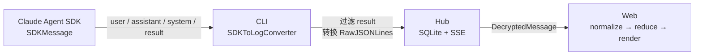
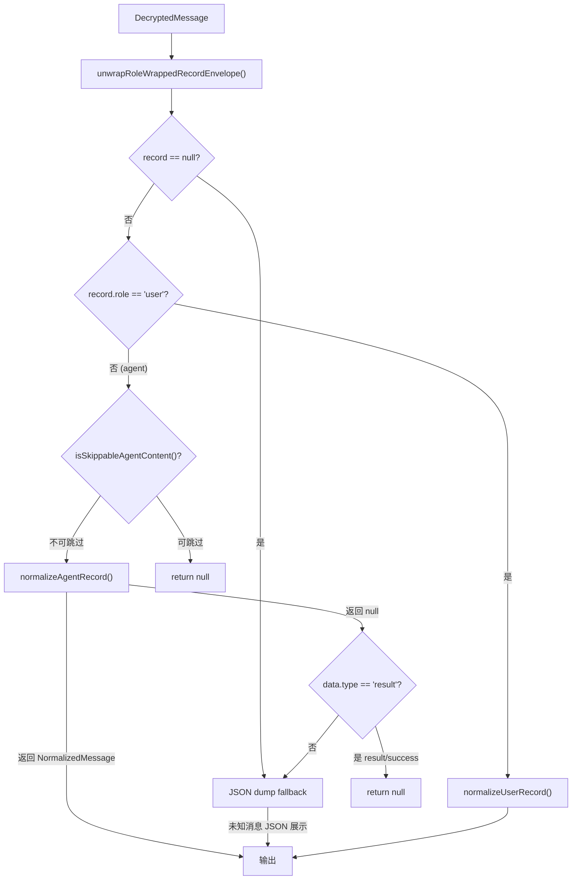

# 消息生命周期：从 SDK 到 UI

本文档追踪一条消息从 Claude Agent SDK 产生，经过 CLI 转换、Hub 存储、SSE 同步，到 Web 端标准化、归约、最终渲染的完整路径。重点关注：哪些消息被丢弃、哪些被处理、每一步的转换规则是什么。

## 全局流程



---

## 第 1 步：SDK 消息产生

Claude Agent SDK 的 `query()` 异步迭代器产出 `SDKMessage`，共四种类型：

| SDK `type` | 来源 | 包含内容 |
|------------|------|----------|
| `user` | 用户输入 / tool_result | `message.content`（string 或 ContentBlock 数组） |
| `assistant` | Claude 回复 | `message.content`（text / thinking / tool_use）+ `message.usage` |
| `system` | SDK 系统事件 | `subtype`（`init` / `api_error` / `api_retry` / `turn_duration` / `compact_boundary` 等）+ `model` / `tools` |
| `result` | 轮次结束标记 | `subtype`、`terminal_reason`、`is_error`、`num_turns`、`duration_ms`、`usage`、`result`（echo） |

**关键点**：`result` 是 SDK 的内部控制消息，不是对话内容。它标志一轮 agent loop 的结束，用于传递 token 用量、中断原因等元数据。

**来源文件**：`@anthropic-ai/claude-agent-sdk` 类型定义

---

## 第 2 步：CLI 转换（SDKToLogConverter）

**文件**：`packages/cli/src/claude/utils/sdkToLogConverter.ts`

将 `SDKMessage` 转换为 Hub 可存储的 `RawJSONLines` 格式。

### 转换规则

| SDK 类型 | 输出 | 处理 |
|----------|------|------|
| `user` | `RawJSONLines (type=user)` | 检查 tool_result，附加权限审批 mode |
| `assistant` | `RawJSONLines (type=assistant)` | 附加 requestId |
| `system` (subtype=`init`) | `RawJSONLines (type=system)` | 更新 sessionId，全字段透传 |
| `system` (其他) | `RawJSONLines (type=system)` | 全字段透传 |
| **`result`** | **`null`（丢弃）** | 不生成日志消息 |

**输出格式** (`RawJSONLines`) 基础字段：

```typescript
{
    uuid: string           // 消息唯一标识（优先用 SDK 自带 uuid）
    parentUuid: string     // 上一条消息的 UUID（链式结构，指向 lastUuid）
    isSidechain: boolean   // 是否子链（Task 工具的 subagent）
    userType: 'external'   // 固定值
    cwd: string            // 工作目录
    sessionId: string      // 会话 ID
    version: string        // CLI 版本
    gitBranch: string      // 当前 git 分支
    timestamp: string      // ISO 时间戳
}
```

### UUID 链路

```
主链：lastUuid 追踪，每条非 summary 消息推进
子链：sidechainLastUUID 追踪，按 parent_tool_use_id 分组
      子链消息不影响主链的 lastUuid
```

**注意**：`parentUuid` 命名容易误解为"父节点 UUID"，实际语义是**上一条消息的 UUID**（`this.lastUuid`），本质是链表的 prev 指针。

### 流式 Snapshot（StreamSnapshotSender）

**文件**：`packages/cli/src/claude/utils/streamSnapshotSender.ts`

在等待完整 assistant 消息期间，CLI 通过 `StreamSnapshotSender` 向 Web 端发送实时快照，实现打字机效果。

**流程**：

```
SDK stream_event → StreamSnapshotSender 累积 delta → 每 500ms 发送 snapshot
                                                       ↓
                                               Hub 透传（不落库）
                                                       ↓
                                               Web 接收并渲染
```

**关键设计**：

| 要点 | 说明 |
|------|------|
| snapshot id | 使用 SDK `stream_event` 的 uuid，与最终 assistant 消息的 uuid **不同**（它们是两条不同的 JSON 日志行） |
| snapshot 标识 | `DecryptedMessage.snapshot = true` 区分快照和正式消息 |
| Hub 处理 | snapshot 不写入 SQLite，直接通过 SSE `message-snapshot` 事件透传给 Web |
| 关联清理 | Web 端通过 `parentUuid` 关联同一轮次的 snapshot 和 full message；snapshot 和 full message 共享相同的 `parentUuid`（因为 `convertSnapshot` 不更新 `this.lastUuid`） |

### 特殊方法

| 方法 | 用途 |
|------|------|
| `convertSidechainUserMessage(toolUseId, content)` | Task 工具 subagent 的虚拟 user 消息 |
| `generateInterruptedToolResult(toolUseId, parentToolUseId?)` | 工具被中断时的错误 tool_result |
| `resetParentChain()` | 新会话开始时清空主链 |

---

## 第 3 步：Hub 存储与同步

**存储**：`packages/hub/src/store/index.ts` — SQLite WAL 模式

转换后的 `RawJSONLines` 通过 `OutgoingMessageQueue` 发送到 Hub，存入 `messages` 表。

**OutgoingMessageQueue**（`packages/cli/src/claude/utils/OutgoingMessageQueue.ts`）：透传所有消息，不做过滤。消息过滤由前端 `isClaudeChatVisibleMessage()` 等逻辑负责，这样如果后续有消息未渲染，在前端更容易发现。

**主键策略**：Hub 的 `addMessage` 使用 `localId ?? randomUUID()` 作为消息 `id`，即优先使用 CLI 提供的 SDK uuid，仅当无 `localId` 时才生成随机 UUID。

**同步**：`packages/hub/src/sync/syncEngine.ts` — SSE 推送

Hub 通过 SSE 向 Web 端推送 `SyncEvent`：
- `session-updated`：会话状态变化（心跳、agent state）
- `message-received`：新消息到达（落库后的完整消息）
- `message-snapshot`：流式快照透传（不落库，`snapshot: true`）
- `session-added` / `session-removed`：会话增删

Web 端 `SSEProvider` 接收事件，更新 React Query 缓存触发 UI 刷新。

### SSE 消息缓存更新

**文件**：`packages/web/src/core/providers/SSEProvider.tsx`

`SSEProvider` 使用 `upsertMessageCache` 辅助函数统一处理消息缓存更新：

| 事件类型 | 处理方式 |
|----------|----------|
| `message-snapshot` | 同 id 原地更新（覆盖旧 snapshot），新 id 追加 |
| `message-received` | 先通过 `parentUuid` 清除同轮次的残留 snapshot，再 upsert |

**snapshot 清理机制**：由于 SDK `stream_event` uuid ≠ 最终 `assistant` 消息 uuid，snapshot 和 full message 的 id 不同，无法通过 id 匹配替换。因此通过提取 raw content 中的 `parentUuid`（`content.content.data.parentUuid`）关联同一轮次的消息——同一轮次的 snapshot 和第一条 full message 共享相同的 `parentUuid`。

---

## 第 4 步：Web 标准化（normalize）

**入口**：`packages/web/src/chat/normalize.ts` → `normalizeDecryptedMessage()`

将 API 返回的 `DecryptedMessage` 转换为 `NormalizedMessage`。

### 处理流程



### 消息过滤规则

**`isSkippableAgentContent()`** 决定消息是否直接跳过：

| 条件 | 结果 |
|------|------|
| `isMeta === true` | 跳过（元数据消息） |
| `isCompactSummary === true` | 跳过（压缩摘要） |
| `isClaudeChatVisibleMessage()` 返回 false | 跳过 |
| 以上均不满足 | 不跳过，进入 normalizeAgentRecord |

**`isClaudeChatVisibleMessage()`**：只要 `type` 不是 `system` 就返回 true。对于 `system` 类型，只有以下 subtype 可见：`api_error`、`api_retry`、`turn_duration`、`microcompact_boundary`、`compact_boundary`。其他 system subtype（如 `init`）被跳过。

### normalizeAgentRecord 处理

**文件**：`packages/web/src/chat/normalizeAgent.ts`

根据 `content` 的具体结构分发处理：

| content 结构 | 处理方式 |
|-------------|---------|
| `content.type === 'text'` | 提取文本 → `role: 'agent'` + text blocks |
| `content.type === 'assistant'`（assistant output） | 解析 message.content 中的 text / thinking / tool_use blocks |
| `content.type === 'user'`（user output） | 解析 message.content 中的 text / tool_result blocks；sidechain 字符串 → `sidechain` block |
| `content.type === 'system'` | 分发到具体 subtype：`init` → ready event，`api_error` → api-error event，`api_retry` → api-retry event，`turn_duration` → turn-duration event 等 |
| `content.type === 'output'` + `data.type === 'result'` | **aborted** → aborted event；**error** → execution-error event；**success** → `null`（静默忽略） |
| `content.type === 'output'` + 其他 data.type | 打印 warning，返回 null |
| `content.type === 'event'` | 解析为 AgentEvent |
| `content.type === 'summary'` | 提取 summary 文本 |

### result 消息的三层处理

result 消息在整个管线中有三层处理：

| 层级 | 位置 | 行为 |
|------|------|------|
| **CLI 转换** | `sdkToLogConverter.ts` | `case 'result': return null` — 不写入 Hub |
| **Web 过滤兜底** | `normalize.ts` | 检查 `data.type === 'result'` → return null — 即使漏过 CLI 也不渲染 |
| **Web 标准化** | `normalizeAgent.ts` | aborted → event, error → event, success → null |

### normalizeUserRecord 处理

**文件**：`packages/web/src/chat/normalizeUser.ts`

| 输入 | 输出 |
|------|------|
| `typeof content === 'string'` | `role: 'user'` + text block |
| `content.type === 'text'` | `role: 'user'` + text block + 可选 attachments |
| 其他 | 返回 null（fallback 由 normalize.ts 处理） |

### NormalizedMessage 类型

标准化后的消息有三种形态：

```typescript
// 用户消息
{ role: 'user', content: { type: 'text', text: string, attachments?: [...] } }

// Agent 消息（含 text / reasoning / tool-call / tool-result / summary / sidechain blocks）
{ role: 'agent', content: NormalizedAgentContent[] }

// 事件消息（API 错误、耗时、压缩、中断、执行错误等）
{ role: 'event', content: AgentEvent }
```

所有形态共享 `id`、`localId`、`createdAt`、`isSidechain`、`meta`、`usage`、`status`、`originalText` 字段。

---

## 第 5 步：Web 归约（reduce）

**文件**：`packages/web/src/chat/reducer.ts` → `reduceChatBlocks()`

将 `NormalizedMessage[]` 转换为可渲染的 `ChatBlock[]`。

### 处理步骤

```
NormalizedMessage[]
  → traceMessages()        // 追踪父子关系和 sidechain 分组
  → reduceTimeline()       // 按类型转换为 ChatBlock
  → dedupeAgentEvents()    // 去重事件
  → foldApiErrorEvents()   // 合并连续 API 错误
  → ChatBlock[]
```

### reduceTimeline 转换规则

**文件**：`packages/web/src/chat/reducerTimeline.ts`

| NormalizedMessage | ChatBlock | 说明 |
|-------------------|-----------|------|
| `role: 'user'` | `UserTextBlock (kind: 'user-text')` | 用户文本 |
| `role: 'event'` (type=`ready`) | 不输出 | ready 事件仅标记 hasReadyEvent |
| `role: 'event'` (其他) | `AgentEventBlock (kind: 'agent-event')` | 系统事件 |
| `role: 'agent'` + text block | `AgentTextBlock (kind: 'agent-text')` | 文本合并到已有 block 或新建 |
| `role: 'agent'` + reasoning block | `AgentReasoningBlock (kind: 'agent-reasoning')` | 思考过程 |
| `role: 'agent'` + tool-call block | `ToolCallBlock (kind: 'tool-call')` | 工具调用（含子 block）；`isHiddenTool()` 返回 true 的工具跳过不渲染 |
| `role: 'agent'` + tool-result block | 嵌入对应 ToolCallBlock | 作为工具调用的子节点 |
| `role: 'agent'` + sidechain block | `AgentTextBlock (kind: 'agent-text')` | subagent prompt 展示 |
| `role: 'agent'` + summary block | `AgentTextBlock (kind: 'agent-text')` | 摘要文本 |

### ChatBlock 类型

```typescript
type ChatBlock =
    | UserTextBlock        // kind: 'user-text'
    | AgentTextBlock       // kind: 'agent-text'
    | AgentReasoningBlock  // kind: 'agent-reasoning'
    | CliOutputBlock       // kind: 'cli-output'
    | ToolCallBlock        // kind: 'tool-call'（含 children: ChatBlock[]）
    | AgentEventBlock      // kind: 'agent-event'
```

---

## 第 6 步：Web 渲染（render）

**文件**：`packages/web/src/components/chat/ChatContainer.tsx`

`renderChatBlock()` 根据 `block.kind` 选择渲染组件：

| ChatBlock kind | 渲染组件 | 说明 |
|----------------|----------|------|
| `user-text` | `Bubble.List` + XMarkdown | 右对齐，带 `isSynthetic` 柔和样式 |
| `agent-text` | `Bubble.List` + XMarkdown | 左对齐，Markdown 渲染 |
| `agent-reasoning` | `Think` 组件 | 可折叠的思考过程 |
| `cli-output` | 命令/输出展示 | CLI 输出内容 |
| `tool-call` | `ToolCallRenderer` | 根据 `tool.name` 路由到对应 ToolCard 视图 |
| `agent-event` | 事件格式化 | 根据 `display` 属性决定对齐/颜色/边距 |

### 事件渲染提示

`EventDisplay` 控制 agent-event 的渲染样式：

| event.type | align | color | padding |
|------------|-------|-------|---------|
| `turn-duration` | left | default | false |
| `api-error` | — | error | true |
| `api-retry` | — | error | true |
| `execution-error` | — | error | true |
| 其他 | — | default | true |

---

## 消息命运总结

### 完全丢弃（不进入任何后续流程）

| 消息 | 丢弃位置 | 原因 |
|------|----------|------|
| SDK `result` (success) | CLI `sdkToLogConverter.ts` | SDK 内部控制消息，非对话内容 |
| SDK `result` (漏过 CLI 的) | Web `normalize.ts` 兜底 | 防御性检查 |
| `isMeta === true` | Web `normalizeAgent.ts` | 元数据消息 |
| `isCompactSummary === true` | Web `normalizeAgent.ts` | 压缩摘要 |
| 隐藏工具（ToolSearch 等） | Web `reducerTimeline.ts` | `isHiddenTool()` 返回 true 的 tool-call/tool-result 不渲染 |
| System 非可见 subtype | Web `normalizeAgent.ts` | 如非 `api_error`/`api_retry`/`turn_duration`/`compact_boundary` 等 |

### 转换为事件（不直接展示文本）

| 消息 | 转换结果 |
|------|----------|
| SDK `result` (aborted) | `AgentEvent { type: 'aborted', numTurns }` |
| SDK `result` (error) | `AgentEvent { type: 'execution-error', subtype, errors, numTurns }` |
| System `api_error` | `AgentEvent { type: 'api-error', retryAttempt, maxRetries, error }` |
| System `api_retry` | `AgentEvent { type: 'api-retry', attempt, maxRetries, retryDelayMs, errorStatus, error }`（连续重试去重，只保留最新一条） |
| System `turn_duration` | `AgentEvent { type: 'turn-duration', durationMs }` |
| System `compact_boundary` | `AgentEvent { type: 'compact', trigger, preTokens }` |
| System `init` (model: ready) | 不输出（标记 hasReadyEvent） |

### 流式 Snapshot 生命周期

| 阶段 | 事件 | 处理 |
|------|------|------|
| SDK stream_event 到达 | CLI `StreamSnapshotSender` 累积 delta | 每 500ms 生成 snapshot |
| Snapshot 发送 | Hub 收到 `snapshot: true` 的消息 | 不落库，直接 SSE `message-snapshot` 透传 |
| Web 收到 snapshot | `SSEProvider` → `upsertMessageCache` | 同 id 原地更新，新 id 追加 |
| Web 渲染 snapshot | `reducerTimeline` → `isSnapshot` 标记 | `AgentTextBlock` / `AgentReasoningBlock` 带 `isSnapshot` 标记，ChatContainer 对最后一个 running snapshot 启用 typing 光标 |
| Full message 到达 | `SSEProvider` → `upsertMessageCache` | 通过 `parentUuid` 清除同轮次 snapshot，full message 正常 upsert |

### 隐藏工具

**文件**：`packages/web/src/domain/chat/reducerTools.ts` → `isHiddenTool()`

部分工具是 SDK 内部调用，不需要渲染：

| 工具名 | 说明 | 额外处理 |
|--------|------|----------|
| `ToolSearch` | SDK 自动调用的工具搜索 | 无 |
| `mcp__mobi__change_title` / `mobi__change_title` | 改标题工具 | 提取标题，生成 `title-changed` 事件（不渲染工具卡片本身） |

### 正常渲染

| 消息 | 渲染为 |
|------|--------|
| User text | 用户气泡（Markdown） |
| User tool_result | 嵌入对应工具卡片 |
| Assistant text | Agent 气泡（Markdown） |
| Assistant thinking | 可折叠思考过程 |
| Assistant tool_use | 工具卡片（按工具名路由视图） |
| Sidechain prompt | Agent 文本块（subagent 输入展示） |

---

## 关键文件索引

| 层级 | 文件 | 职责 |
|------|------|------|
| SDK 类型 | `@anthropic-ai/claude-agent-sdk` | SDKMessage 类型定义 |
| CLI 转换 | `packages/cli/src/claude/utils/sdkToLogConverter.ts` | SDK → RawJSONLines |
| CLI 类型 | `packages/cli/src/claude/types.ts` | RawJSONLines Schema 定义 |
| CLI 启动 | `packages/cli/src/claude/claudeRemoteLauncher.ts` | 创建 Converter，管理消息流 |
| CLI 队列 | `packages/cli/src/claude/utils/OutgoingMessageQueue.ts` | 消息发送队列（保序、延迟发送、透传） |
| CLI 循环 | `packages/cli/src/claude/claudeRemote.ts` | 处理 result 控制信号、流式 snapshot 事件分发 |
| CLI 快照发送 | `packages/cli/src/claude/utils/streamSnapshotSender.ts` | 累积 stream_event delta，定时发送 snapshot |
| Hub 存储 | `packages/hub/src/store/index.ts` | SQLite 消息持久化 |
| Hub 同步 | `packages/hub/src/sync/syncEngine.ts` | SSE 推送 |
| Web SSE | `packages/web/src/providers/SSEProvider.tsx` | 接收实时事件、snapshot 缓存管理（upsertMessageCache + parentUuid 关联清理） |
| Web 标准化入口 | `packages/web/src/chat/normalize.ts` | DecryptedMessage → NormalizedMessage |
| Web Agent 标准化 | `packages/web/src/chat/normalizeAgent.ts` | Agent 消息详细解析 |
| Web User 标准化 | `packages/web/src/chat/normalizeUser.ts` | User 消息解析 |
| Web 类型 | `packages/web/src/chat/types.ts` | NormalizedMessage / ChatBlock 类型 |
| Web 归约 | `packages/web/src/chat/reducer.ts` | NormalizedMessage[] → ChatBlock[] |
| Web 时间线归约 | `packages/web/src/chat/reducerTimeline.ts` | 时间线 → ChatBlock 转换、隐藏工具过滤（isHiddenTool） |
| Web 工具过滤 | `packages/web/src/chat/reducerTools.ts` | isHiddenTool / isChangeTitleToolName 判断 |
| Web 渲染 | `packages/web/src/components/chat/ChatContainer.tsx` | ChatBlock → UI 组件 |
| 共享工具 | `packages/shared/src/messages.ts` | unwrapRole / isSkippable / isVisible |
