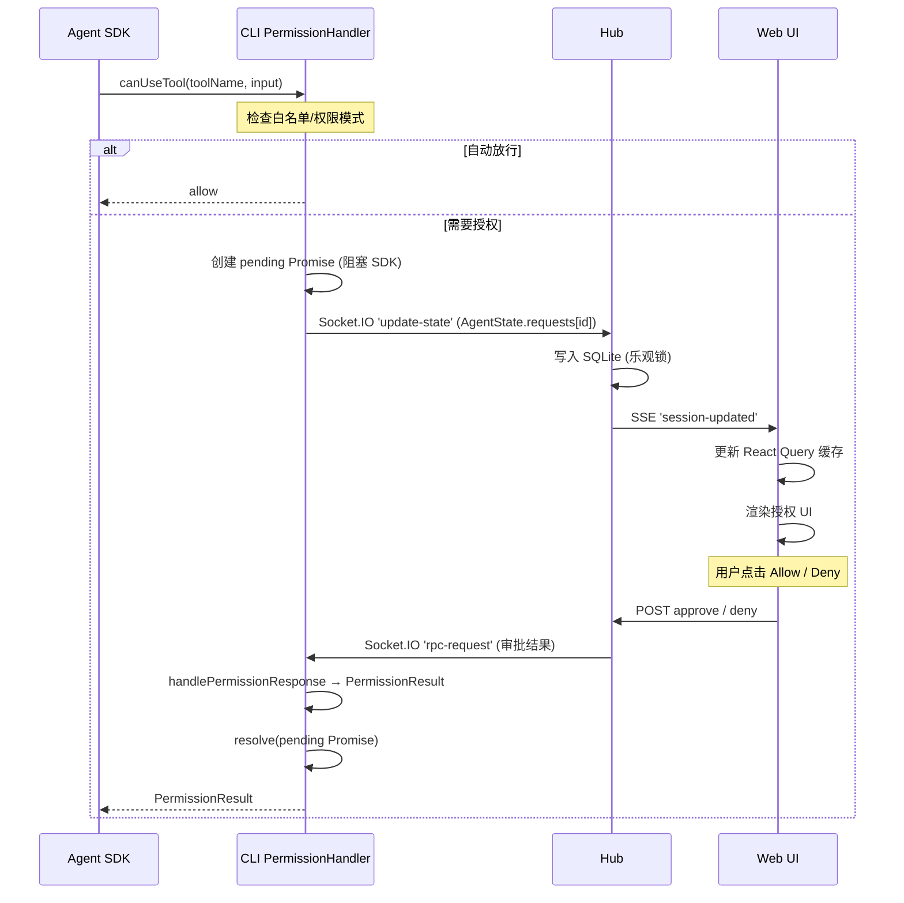

# 工具权限审批流

本文档描述当 Claude Agent SDK 调用工具需要用户授权时，请求如何到达 Web 端、用户操作后结果如何回传到 SDK 的完整链路。

四种场景共用同一套基础设施，但在审批结果处理上各有差异：

| 场景 | 核心差异 |
|------|----------|
| **普通工具** | allow/deny，`updatedInput` 原样透传 |
| **ExitPlanMode** | 批准时"欺骗" SDK：deny + 注入重启消息，实现中途切换权限模式 |
| **AskUserQuestion** | 批准时将用户答案注入 `updatedInput`，用权限通道传输数据 |
| **RequestUserInput** | 与 AskUserQuestion 类似，但使用独立的 `RequestUserInputFooter` 组件，支持不同的问题格式 |

---

## 基础设施

### 共享协议（Shared）

**AgentState** — `packages/shared/src/schemas.ts`

SDK 每次需要权限时，CLI 将请求存入 `AgentState.requests`：

```typescript
AgentState.requests: Record<toolCallId, {
    tool: string
    arguments: unknown
    createdAt: number
    sdkHints?: SDKUIHints  // SDK 提供的 UI 提示（标题、描述等）
}>
```

**PermissionMode** — `packages/shared/src/modes.ts`

六种权限模式（自由度递增，auto 置顶）：`'auto'`（自动审批，智能放行常规、拦截危险）、`'default'`（逐次审批）、`'acceptEdits'`（自动允许编辑）、`'plan'`（规划模式，不允许编辑操作）、`'dontAsk'`（未预批准的一律拒绝、不弹窗）、`'bypassPermissions'`（跳过所有）。

**Socket.IO 事件** — `packages/shared/src/socket.ts`

| 事件 | 方向 | 用途 |
|------|------|------|
| `update-state` | CLI → Hub | 同步 `AgentState`（含 pending 权限请求） |
| `rpc-request` | Hub → CLI | 转发 Web 端的审批结果 |
| `rpc-register` / `rpc-unregister` | CLI → Hub | 注册/注销 RPC 方法 |

### CLI 端

**PermissionHandler** — `packages/cli/src/claude/utils/permissionHandler.ts`

核心类，实现 SDK 的 `canUseTool` 回调。职责：

1. 检查白名单（`allowedTools`、`allowedBashPrefixes`）和权限模式 → 自动放行
2. 未命中 → 创建 pending Promise，阻塞 SDK
3. 收到 RPC 审批结果 → 转换为 `PermissionResult` → resolve Promise

**BasePermissionHandler** — `packages/cli/src/modules/common/permission/BasePermissionHandler.ts`

抽象基类，提供：

- `pendingRequests` Map 管理
- `updateAgentState()` — 修改 `AgentState.requests` 并同步到 Hub
- RPC handler 注册 — 注册 `'permission'` 方法，接收审批结果

**SDK 接入点** — `packages/cli/src/claude/claudeRemote.ts`

```typescript
// SDK 配置
canUseTool: async (toolName, input, options) => {
    return await opts.canCallTool(toolName, input, options)  // → PermissionHandler.handleToolCall
}
```

### Hub 端

**HTTP 路由** — `packages/hub/src/web/routes/permissions.ts`

| 路由 | 用途 |
|------|------|
| `POST /sessions/:id/permissions/:requestId/approve` | 批准，可附带 `{ mode, allowTools, decision, answers }` |
| `POST /sessions/:id/permissions/:requestId/deny` | 拒绝，可附带 `{ decision, reason }` |

**RpcGateway** — `packages/hub/src/sync/rpcGateway.ts`

通过 Socket.IO `rpc-request` 将审批结果转发到 CLI 端。查找 RpcRegistry 中注册的 CLI socket 发送。

**AgentState 同步** — `packages/hub/src/socket/handlers/cli/sessionHandlers.ts`

CLI 发送 `update-state` 后，Hub 写入 SQLite（乐观锁），广播 `session-updated` SSE 事件。

### Web 端

**SSE 接收** — `packages/web/src/core/providers/SSEProvider.tsx`

收到 `session-updated` 事件后，更新 React Query 缓存中的 `session.agentState`。

**权限提取** — `packages/web/src/domain/chat/reducerTools.ts`

`getPermissions(agentState)` 遍历 `agentState.requests`，生成 pending 权限条目。

**UI 渲染** — `packages/web/src/components/chat/blocks/ToolCallBlock.tsx`

`status === 'pending'` 时根据工具类型渲染对应 Footer：
- 普通工具 / ExitPlanMode → `PermissionFooter`
- AskUserQuestion → `AskUserQuestionFooter`

---

## 完整数据流



---

## 场景一：普通工具

**触发**：SDK 调用 Bash、Edit、Write 等需要授权的工具。

**Web UI**：`PermissionFooter` — 提供 Allow（本次）、Allow for Session（本会话）、Allow All Edits、Deny 按钮。

**CLI 处理** — `permissionHandler.ts:handlePermissionResponse`

```typescript
response.approved
    ? {
        behavior: 'allow',
        updatedInput: pending.input,  // 原样透传
        updatedPermissions,            // 可选：白名单更新
    }
    : {
        behavior: 'deny',
        message: response.reason || 'The user doesn\'t want to proceed...',
    }
```

### reason 的传递

拒绝时用户填写的 reason（仅 ExitPlanMode 场景有输入框）：

| 链路 | 状态 |
|------|------|
| Web → Hub → CLI → SDK | 正常传递，作为 deny `message` 传给模型 |
| CLI 回传 Web 展示 | **丢失** — `PermissionsField` 类型未定义 `reason` 字段 |

---

## 场景二：ExitPlanMode

**触发**：模型在 plan mode 下完成规划，调用 `exit_plan_mode` 工具（携带 `plan` 参数）。

**Web UI**：`PermissionFooter` — 特殊四按钮（auto 为 primary）：
- 自动审批（`approveWithMode('auto')`，primary — 日常推荐档）
- 自动接受编辑（`approveWithMode('acceptEdits')`）
- 手动审批（`approveWithMode('default')`）
- 继续规划（deny，带反馈输入框）

隐藏了"本次会话允许"按钮。

### 批准时的"欺骗"机制

批准 plan 时，实际向 SDK 返回的是 **deny**：

```typescript
// 1. 向消息队列头部注入重启消息，携带新的权限模式
session.queue.unshift(PLAN_FAKE_RESTART, { permissionMode: response.mode })

// 2. 返回 deny（不是 allow）
pending.resolve({ behavior: 'deny', message: PLAN_FAKE_REJECT })
```

**原因**：SDK 不支持在 turn 中途切换权限模式。返回 deny 让 SDK 结束当前 turn，然后主循环从队列取出 `PLAN_FAKE_RESTART` 开启新 turn，此时权限模式已切换。

**UI 层面**：`claudeRemoteLauncher` 拦截 `PLAN_FAKE_REJECT` 的 tool_result，替换为 `"Plan approved"`（去掉 `is_error` 标记），所以用户看到的是正常的成功结果。

### 拒绝时

```typescript
// reason 作为 deny message 传给模型，模型继续规划
pending.resolve({ behavior: 'deny', message: response.reason || 'Plan rejected' })
```

---

## 场景三：AskUserQuestion

**触发**：模型调用 `AskUserQuestion` 工具，携带问题列表。

**Web UI**：`AskUserQuestionFooter` — 渲染选项列表（单选 radio / 多选 checkbox），支持"其他"自由输入。

**提交**：调用 `approve` API，传递 `{ answers: { "question text": ["选项A"] } }`。answers 的 key 是 question text（符合官方 SDK 要求），value 是 `string[]`（选项 label 数组）。

### 利用 updatedInput 注入答案

Web 端提交时 answers value 为 `string[]`，CLI 端 `buildAskUserQuestionUpdatedInput` 将其转换为 SDK 要求的 `string` 格式（单选取 `[0]`，多选 `join(', ')`）：

```typescript
const answers = response.answers ?? {}
if (Object.keys(answers).length === 0) {
    // 没选任何选项 → deny
    pending.resolve({ behavior: 'deny', message: 'No answers were provided.' })
} else {
    // 将 answers 注入原始 input，value 转为 string
    pending.resolve({
        behavior: 'allow',
        updatedInput: buildAskUserQuestionUpdatedInput(pending.input, answers)
    })
}
```

SDK 收到的最终工具输入变为：

```json
{
    "questions": [...],
    "answers": {
        "Which runtime to use?": "bun",
        "Which features to enable?": "auth, logging"
    }
}
```

**注意**：这里不看 `response.approved` 字段，而是看 `answers` 是否非空来决定 allow/deny。本质上是用权限拦截点做了数据注入。

---

## 场景四：RequestUserInput

**触发**：模型调用 `RequestUserInput` 工具，携带问题列表。

**Web UI**：`RequestUserInputFooter` — 独立的 Footer 组件，渲染问题输入 UI。

**处理方式**：与 AskUserQuestion 类似，审批时将用户答案注入 `updatedInput`，使用 `buildRequestUserInputUpdatedInput` 转换答案格式。CLI 端同样通过 `answers` 是否非空来决定 allow/deny。

**区别**：`RequestUserInput` 有独立的 Footer 组件（`RequestUserInputFooter`）和 View 组件（`RequestUserInputView`），支持与 AskUserQuestion 不同的问题格式和交互方式。

---

## 关键文件索引

| 层 | 文件 | 职责 |
|---|---|---|
| **Shared** | `packages/shared/src/schemas.ts` | AgentState、AgentStateRequest、SDKUIHints Schema |
| **Shared** | `packages/shared/src/modes.ts` | PermissionMode 枚举 |
| **Shared** | `packages/shared/src/socket.ts` | Socket.IO 事件类型定义 |
| **CLI** | `packages/cli/src/claude/utils/permissionHandler.ts` | 核心权限处理器，四种场景的审批结果处理 |
| **CLI** | `packages/cli/src/modules/common/permission/BasePermissionHandler.ts` | 抽象基类：pending 管理、RPC 注册、agentState 同步 |
| **CLI** | `packages/cli/src/claude/claudeRemoteLauncher.ts` | SDK 接入、PLAN_FAKE_REJECT 拦截 |
| **CLI** | `packages/cli/src/claude/claudeRemote.ts` | SDK `canUseTool` 配置 |
| **CLI** | `packages/cli/src/api/apiSession.ts` | `updateAgentState()` Socket.IO 同步 |
| **CLI** | `packages/cli/src/api/rpc/RpcHandlerManager.ts` | RPC 方法注册与分发 |
| **CLI** | `packages/cli/src/claude/sdk/prompts.ts` | PLAN_FAKE_REJECT / PLAN_FAKE_RESTART 常量 |
| **Hub** | `packages/hub/src/web/routes/permissions.ts` | approve / deny HTTP 路由 |
| **Hub** | `packages/hub/src/sync/rpcGateway.ts` | RPC 调用 CLI |
| **Hub** | `packages/hub/src/sync/syncEngine.ts` | 中间层，委托 rpcGateway |
| **Hub** | `packages/hub/src/socket/handlers/cli/sessionHandlers.ts` | 处理 `update-state`，广播 SSE |
| **Hub** | `packages/hub/src/socket/handlers/cli/rpcHandlers.ts` | 处理 `rpc-register` |
| **Web** | `packages/web/src/core/data/api/client.ts` | API 客户端：approve / deny |
| **Web** | `packages/web/src/core/providers/SSEProvider.tsx` | SSE 接收，更新 session 缓存 |
| **Web** | `packages/web/src/domain/chat/reducerTools.ts` | 从 agentState 提取权限映射 |
| **Web** | `packages/web/src/components/tool-card/PermissionFooter.tsx` | 通用授权 UI + ExitPlanMode 特殊按钮 |
| **Web** | `packages/web/src/components/tool-card/AskUserQuestionFooter.tsx` | AskUserQuestion 选项 UI |
| **Web** | `packages/web/src/components/tool-card/RequestUserInputFooter.tsx` | RequestUserInput 输入 UI |
| **Web** | `packages/web/src/components/chat/blocks/ToolCallBlock.tsx` | 工具调用块，判断 pending 状态渲染 Footer |
