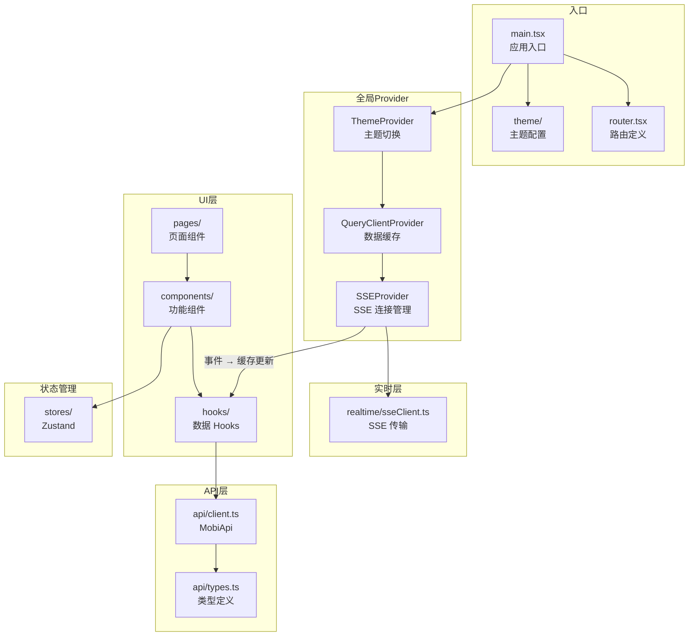
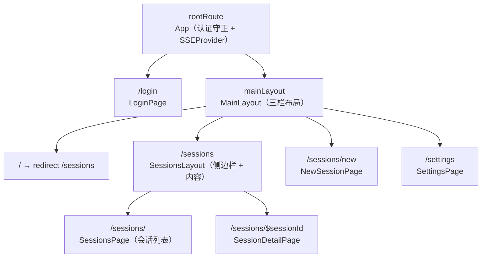
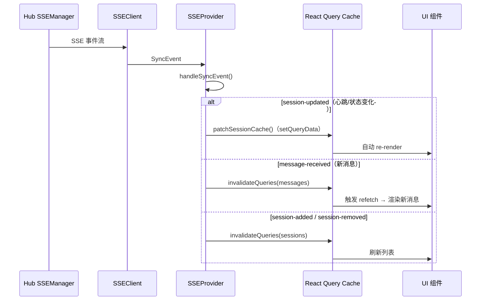
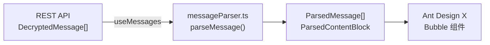
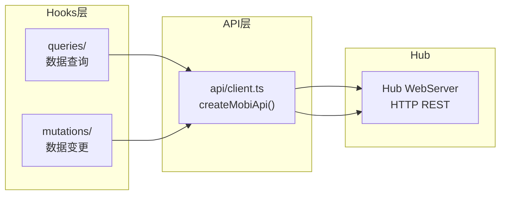

# Web 模块

Web 是 Mobi 的浏览器前端，提供 Claude Code 会话的远程交互界面。

## 新人指引

### 前置知识

阅读本文档前，建议了解以下概念：

- **React 19**：UI 框架，Web 端基于函数组件 + Hooks 构建
- **TanStack Router**：类型安全的文件路由，URL 驱动的页面状态
- **TanStack Query**：服务端状态管理，负责数据获取、缓存和自动刷新
- **Zustand**：轻量客户端状态管理，仅用于非服务端状态（认证、UI 偏好）
- **Ant Design 5.x**：UI 组件库，提供 Button、Select、Modal 等基础组件
- **Ant Design X**：AI 对话组件库，提供 Bubble（消息气泡）组件
- **SSE (Server-Sent Events)**：服务器单向推送，Web 端通过 SSE 接收实时事件

### 建议阅读顺序

1. **本文件** — 建立整体架构认知
2. `src/router.tsx` — 路由结构，理解页面组织
3. `src/api/` — API 层，理解与 Hub 的 HTTP 通信
4. `src/providers/SSEProvider.tsx` — SSE 实时事件处理
5. `src/components/chat/` — 聊天视图，理解消息渲染管线
6. `src/components/ToolCard/` — 工具卡片，理解工具结果展示
7. `src/hooks/queries/` — 数据查询层，理解缓存策略

### 术语表

| 术语 | 含义 |
|------|------|
| **SSEProvider** | 全局 SSE 连接管理器（单例），接收实时事件并更新 React Query 缓存 |
| **SSEClient** | SSE 传输层，封装 `@microsoft/fetch-event-source`，负责连接/重连/认证 |
| **ChatContainer** | 聊天容器组件，消费 `useMessages` 数据并渲染消息列表 |
| **ToolCard** | 工具调用展示组件，根据工具名称选择对应的视图（Edit、Diff、Write 等） |
| **ChatComposer** | 消息输入组件，支持文本输入、斜杠命令自动补全、文件附件 |
| **MessageParser** | 消息解析器，将 `DecryptedMessage` 转换为 `ParsedMessage` 供 Bubble 渲染 |
| **QueryKeys** | 集中定义的 React Query 缓存 key，确保缓存操作的一致性 |

## 整体架构



## 目录结构

```
packages/web/src/
├── main.tsx                    应用入口（~50 行），组装 Provider 链
├── App.tsx                     根组件，认证守卫 + SSEProvider 包裹
├── router.tsx                  TanStack Router 路由定义
│
├── api/                        HTTP API 层
│   ├── client.ts               createMobiApi() — 所有 REST 端点
│   └── types.ts                统一类型定义（Web 前端唯一类型源）
│
├── providers/                  React Context Providers
│   └── SSEProvider.tsx         SSE 全局连接管理（单例）
│
├── realtime/                   实时通信
│   └── sseClient.ts            SSE 传输层（fetch-event-source 封装）
│
├── theme/                      主题系统
│   ├── tokens.ts               浅色/深色主题 token（Shadcn 风格）
│   ├── components.ts           浅色/深色组件样式覆盖
│   └── ThemeProvider.tsx       主题切换 Provider
│
├── components/                 UI 组件（按功能域分组）
│   ├── chat/                   聊天视图
│   │   ├── ChatContainer.tsx   主聊天容器
│   │   ├── messageParser.ts    消息解析器
│   │   ├── PermissionRequest.tsx
│   │   └── ToolResultBlock.tsx
│   ├── composer/               消息输入
│   │   ├── ChatComposer.tsx    输入框 + 自动补全
│   │   ├── AutoComplete.tsx    斜杠命令补全
│   │   ├── StatusBar.tsx       状态栏（上下文预算等）
│   │   └── context.tsx         Composer 上下文
│   ├── ToolCard/               工具结果展示（21 文件）
│   │   ├── index.tsx           主组件，路由到对应视图
│   │   ├── knownTools.tsx      工具注册表
│   │   ├── PermissionFooter.tsx 权限审批按钮
│   │   ├── types.ts            工具类型定义
│   │   └── views/              工具专用视图（Edit/Diff/Write/Todo 等）
│   ├── session/                会话管理
│   │   ├── SessionList.tsx     会话列表
│   │   ├── SessionDetail.tsx   会话详情
│   │   ├── SessionCard.tsx     会话卡片
│   │   └── SessionModule.tsx   会话模块（含重命名/归档操作）
│   ├── NewSession/             新建会话向导（14 文件）
│   ├── layout/                 布局
│   │   ├── MainLayout.tsx      三栏布局（RailNav + Sidebar + Content）
│   │   ├── RailNav.tsx         左侧图标导航栏
│   │   └── ContentSidebar.tsx  内容侧边栏
│   ├── files/                  文件浏览
│   ├── git/                    Git 状态/Diff
│   ├── terminal/               终端视图
│   ├── settings/               设置页面
│   └── ui/                     共享 UI 原语
│
├── hooks/                      React Hooks
│   ├── queries/                TanStack Query 查询（11 个）
│   │   ├── useSessions.ts      会话列表
│   │   ├── useSession.ts       单个会话
│   │   ├── useMessages.ts      消息（无限滚动分页）
│   │   ├── useSessionGroups.ts 会话分组
│   │   ├── useMachines.ts      机器列表
│   │   ├── useFileTree.ts      文件树
│   │   ├── useGitStatus.ts     Git 状态
│   │   └── ...                 斜杠命令、技能等
│   ├── mutations/              TanStack Query 变更（3 个）
│   │   ├── useSendMessage.ts   发送消息
│   │   ├── useSessionActions.ts 会话操作（归档/中止/切换/恢复/重命名）
│   │   └── useSpawnSession.ts  启动新会话
│   ├── useMediaQuery.ts        响应式断点
│   └── useTerminalSocket.ts    终端 WebSocket 连接
│
├── stores/                     Zustand 状态
│   ├── authStore.ts            认证 token（localStorage 持久化）
│   └── uiStore.ts              UI 状态（主题、语言、侧边栏、视图模式）
│
├── lib/                        共享业务逻辑
│   ├── query-keys.ts           React Query key 集中定义
│   ├── messages.ts             消息合并/去重/排序（缓存操作工具）
│   ├── fileAttachments.ts      文件附件类型和辅助函数
│   ├── toolInputUtils.ts       工具输入解析
│   └── recent-skills.ts        最近技能 localStorage 持久化
│
├── utils/                      纯工具函数
│   ├── sessionUtils.ts         会话显示名称格式化
│   ├── path.ts                 路径显示处理
│   ├── timeFormat.ts           相对时间格式化
│   ├── applySuggestion.ts      自动补全建议应用
│   └── findActiveWord.ts       光标位置单词查找
│
├── chat/                       消息标准化管线（备用）
│   ├── index.ts                Barrel export
│   ├── modelConfig.ts          上下文预算配置（唯一活跃导出）
│   └── ...                     完整的 NormalizedMessage → ChatBlock 管线
│
├── pages/                      路由页面组件
│   ├── LoginPage.tsx
│   ├── SessionsPage.tsx
│   ├── SessionsLayout.tsx
│   ├── SessionDetailPage.tsx
│   ├── NewSessionPage.tsx
│   └── SettingsPage.tsx
│
└── i18n/                       国际化
    ├── index.ts                i18next 配置
    └── locales/                en.json, zh.json
```

## 路由结构



| 路径 | 页面 | 说明 |
|------|------|------|
| `/login` | LoginPage | 登录页（无 MainLayout） |
| `/sessions` | SessionsPage | 会话列表，左侧分组侧边栏 + 右侧列表 |
| `/sessions/$sessionId` | SessionDetailPage | 会话详情，支持聊天/文件/终端三个视图 |
| `/sessions/new` | NewSessionPage | 新建会话向导 |
| `/settings` | SettingsPage | 设置页面 |

## 数据流

### 实时事件流（SSE）



**关键设计决策**：

- `session-updated` 使用 `setQueryData` 直接修补缓存，避免心跳触发 API 请求
- `message-received` 使用 `invalidateQueries` 触发 refetch，因为消息有分页和去重逻辑
- 失效操作通过批处理（16ms 防抖）合并，避免高频事件导致多次 API 请求

### 消息渲染管线



消息类型映射：

| ParsedContentBlock.type | 渲染方式 |
|-------------------------|----------|
| `text` | Markdown 文本气泡 |
| `reasoning` | 可折叠思考过程 |
| `tool-call` | ToolCard 组件（根据工具名选择视图） |
| `tool-result` | 工具结果展示 |
| `summary` | 会话摘要 |
| `event` | 系统事件（API 错误、耗时统计） |

### 工具调用折叠

消息渲染管线中，工具调用经过两层过滤后再展示：

#### 隐藏层（reducer 阶段）

`reducerTools.ts` 的 `isHiddenTool()` 在消息归约时直接跳过以下工具，不生成 `tool-call` block：

- `ToolSearch`、`EnterPlanMode` / `exit_plan_mode`
- `TaskCreate` / `TaskUpdate` / `TaskList` / `TaskGet` / `TaskOutput` / `TaskStop`
- `mcp__mobi__change_title` / `mobi__change_title`

其中 `change_title` 转为 `title-changed` 事件，`EnterPlanMode` 转为 `plan-mode-entered` 事件，其余静默忽略。

#### 折叠层（渲染阶段）

`domain/chat/groupToolCalls.ts` 的 `groupCollapsibleToolCalls()` 对连续的可折叠工具调用进行合并收起：

**可折叠工具**：`Bash`、`shell_command`、`Read`、`Glob`、`Grep`，以及所有 `mcp__` 前缀的 MCP 工具

MCP 工具按 server 分组计数，标题格式为 `"Called {server} N times"`（server 名称中 `_` 替换为 `:`），如 `"Called plugin:chrome-devtools-mcp:chrome-devtools 4 times"`。

**核心概念 — Zone**：连续相邻的可折叠工具调用（不论状态）。Zone 边界由非可折叠工具或非 tool-call block 打断，边界稳定，不随工具状态变化而分裂或合并。

**分组规则**：

| 状态 | 处理 |
|------|------|
| `completed`（≥ 2 条） | 合并为 `ToolCallGroup`，默认收起 |
| `completed`（< 2 条） | 单独展示 |
| `running` / `pending` / `error` | 在折叠组之后单独展示 |

**渲染顺序**：`[Fold(completed)] + [non-completed 逐个展示]`，各自保持原始相对顺序。

**折叠组标题**：按类别统计 completed 工具，生成自然语言摘要（如 "Run 3 shell commands, read 2 files"），由 `formatGroupTitle()` 格式化。

**数据流**：

```
ChatBlock[]
  → groupCollapsibleToolCalls()    // 纯函数，O(n) 扫描
  → GroupedBlock[]                 // ChatBlock | ToolCallGroup
  → buildBubbleItems()             // 遍历 GroupedBlock[]
  → BubbleItemBase[]
```

| 文件 | 职责 |
|------|------|
| `domain/chat/groupToolCalls.ts` | Zone 检测 + 分组算法 + 标题格式化 |
| `domain/chat/reducerTools.ts` | `isHiddenTool()` 隐藏判断 |
| `components/chat/blocks/ToolCallGroupBlock.tsx` | 折叠组渲染（Think 组件，默认收起） |
| `components/chat/buildBubbleItems.tsx` | 调用分组函数，分发到渲染器 |

### API 交互



API client 是一个工厂函数 `createMobiApi()`，返回类型化的 API 方法对象。
所有请求自动附加 JWT token，401 响应触发登出跳转。

## 状态管理策略

Web 端区分三种状态，使用不同的管理方案：

| 状态类型 | 管理方式 | 示例 |
|----------|----------|------|
| **服务端状态** | TanStack Query | 会话列表、消息、机器列表 |
| **客户端 UI 状态** | Zustand store | 主题、语言、侧边栏开关、视图模式 |
| **认证状态** | Zustand + localStorage | JWT token |
| **URL 状态** | TanStack Router | 当前会话 ID（`$sessionId`） |

**注意**：服务端状态不存入 Zustand，统一由 TanStack Query 管理。SSE 事件直接更新 Query 缓存，UI 自动响应。

## 布局体系

```
┌─────────────────────────────────────────────────┐
│ MainLayout                                       │
│ ┌────┬────────────┬──────────────────────────┐  │
│ │    │            │                          │  │
│ │Rail│ Content    │    Content Area          │  │
│ │Nav │ Sidebar    │    (页面内容)             │  │
│ │    │ (会话列表) │                          │  │
│ │ 📋 │            │    ChatContainer          │  │
│ │ ⚙️ │            │    FileView               │  │
│ │    │            │    TerminalView           │  │
│ └────┴────────────┴──────────────────────────┘  │
└─────────────────────────────────────────────────┘
```

- **RailNav**：固定宽度图标导航栏，支持桌面/移动自适应
- **ContentSidebar**：可折叠的内容侧边栏，展示会话分组列表
- **Content Area**：主内容区域，根据视图模式切换聊天/文件/终端

移动端时 RailNav 替换为汉堡菜单，ContentSidebar 变为全屏覆盖。

## 关键文件速查

| 需求 | 文件 |
|------|------|
| 添加新页面 | `router.tsx` + `pages/` + `layout/navConfig.ts` |
| 添加新 API 端点 | `api/client.ts` + `api/types.ts` |
| 添加新数据查询 | `hooks/queries/` + `lib/query-keys.ts` |
| 添加新工具卡片视图 | `components/ToolCard/views/` + `components/ToolCard/knownTools.tsx` |
| 修改消息渲染 | `components/chat/messageParser.ts` + `components/chat/ChatContainer.tsx` |
| 修改 SSE 事件处理 | `providers/SSEProvider.tsx` |
| 修改主题 | `theme/tokens.ts` + `theme/components.ts` |
| 添加新 UI 组件 | `components/ui/` 或对应功能域子目录 |
