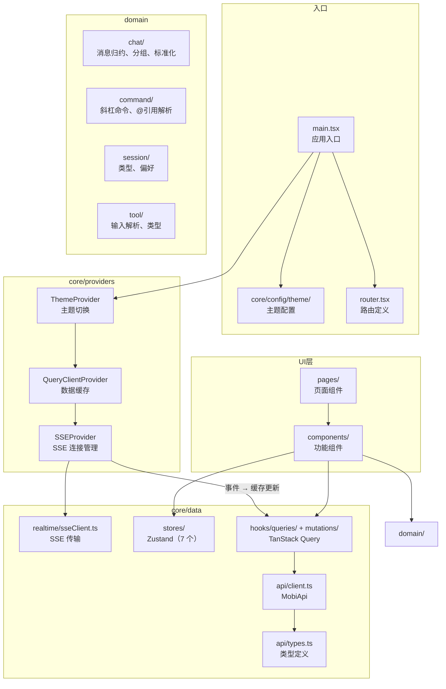
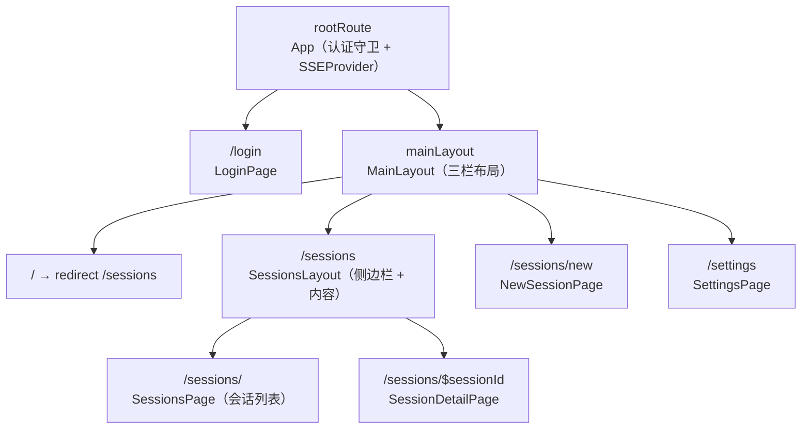
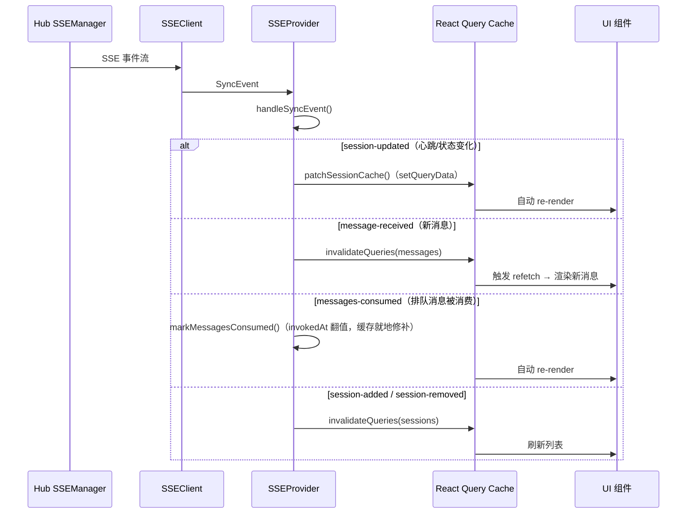
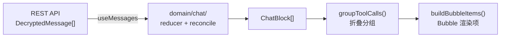
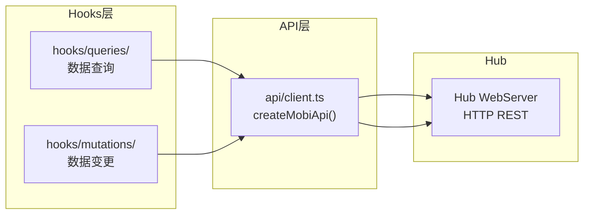

# Web 模块

Web 是 Mobi 的浏览器前端，提供 Claude Code 会话的远程交互界面。

## 新人指引

### 前置知识

阅读本文档前，建议了解以下概念：

- **React 19**：UI 框架，Web 端基于函数组件 + Hooks 构建
- **TanStack Router**：类型安全的文件路由，URL 驱动的页面状态
- **TanStack Query**：服务端状态管理，负责数据获取、缓存和自动刷新
- **Zustand**：轻量客户端状态管理，仅用于非服务端状态（认证、UI 偏好）
- **Ant Design 5.x**：UI 组件库，提供 Button、Select、Modal 等基础组件
- **Ant Design X**：AI 对话组件库，提供 Bubble（消息气泡）组件
- **SSE (Server-Sent Events)**：服务器单向推送，Web 端通过 SSE 接收实时事件

### 建议阅读顺序

1. **本文件** — 建立整体架构认知
2. `src/router.tsx` — 路由结构，理解页面组织
3. `src/core/data/api/` — API 层，理解与 Hub 的 HTTP 通信
4. `src/core/providers/SSEProvider.tsx` — SSE 实时事件处理
5. `src/core/notifications/` — toast 通知三分支决策（收到 toast 后前端本地判定展示方式）
6. `src/domain/chat/` — 消息解析管线，理解 reducer → normalize → 分组流程
7. `src/components/chat/` — 聊天视图，理解消息渲染管线
8. `src/components/tool-card/` — 工具卡片，理解工具结果展示
9. `src/core/data/hooks/` — 数据查询层，理解缓存策略

### 术语表

| 术语 | 含义 |
|------|------|
| **SSEProvider** | 全局 SSE 连接管理器（单例），接收实时事件并更新 React Query 缓存 |
| **SSEClient** | SSE 传输层，封装 `@microsoft/fetch-event-source`，负责连接/重连/认证 |
| **ChatContainer** | 聊天容器组件，消费 `useMessages` 数据并渲染消息列表 |
| **ToolCard** | 工具调用展示组件，根据工具名称选择对应的视图（Edit、Diff、Write 等） |
| **ChatComposer** | 消息输入组件，支持文本输入、斜杠命令自动补全、文件附件。运行中允许发送（消息进入排队悬浮条）。切换 session 时待发送的文本与已上传附件通过 `composerDrafts`（sessionStorage）持久化 |
| **Chat Reducer** | 消息归约器（`domain/chat/reducer.ts`），将原始消息事件归约为 ChatBlock 列表 |
| **QueryKeys** | 集中定义的 React Query 缓存 key，确保缓存操作的一致性 |

## 整体架构

代码按 `core / domain / components / pages` 四层组织：

```
src/
├── core/          ← 基础设施（数据、配置、工具函数、Provider）
├── domain/        ← 领域逻辑（纯数据处理，不依赖 React）
├── components/    ← UI 组件（按功能域分组）
└── pages/         ← 页面路由组件
```



## 目录结构

```
packages/web/src/
├── main.tsx                    应用入口（~50 行），组装 Provider 链
├── App.tsx                     根组件，认证守卫 + SSEProvider 包裹
├── router.tsx                  TanStack Router 路由定义
├── dev.ts                      开发模式标记
├── index.css                   全局样式入口
│
├── core/                       基础设施
│   ├── data/                   数据层
│   │   ├── api/                HTTP API
│   │   │   ├── client.ts       createMobiApi() — 所有 REST 端点
│   │   │   └── types.ts        统一类型定义（Web 前端唯一类型源）
│   │   ├── stores/             Zustand 全局状态（8 个）
│   │   │   ├── authStore.ts    认证 token（localStorage 持久化）
│   │   │   ├── uiStore.ts      UI 状态（主题、语言、侧边栏、视图模式）
│   │   │   ├── chatBlocksByIdStore.ts   会话级 ChatBlock 缓存
│   │   │   ├── backgroundTasksStore.ts  后台任务状态
│   │   │   ├── runningAgentsStore.ts    运行中 Agent 状态
│   │   │   ├── teamAgentsStore.ts       Team Agent 状态
│   │   │   ├── notificationBadgeStore.ts 通知角标未读状态
│   │   │   └── workspaceStore.ts  Inspector 面板状态（tabs + tab 视图状态）
│   │   ├── realtime/           实时通信
│   │   │   └── sseClient.ts    SSE 传输层（fetch-event-source 封装）
│   │   ├── cache/              缓存操作工具
│   │   │   ├── messageCache.ts 消息缓存修补（patch/去重/排序）
│   │   │   └── sessionCache.ts 会话缓存修补
│   │   └── hooks/              React Hooks
│   │       ├── queries/        TanStack Query 查询（12 个）
│   │       │   ├── useSessions.ts        会话列表
│   │       │   ├── useSession.ts         单个会话
│   │       │   ├── useMessages.ts        消息（无限滚动分页）
│   │       │   ├── useSessionGroups.ts   会话分组
│   │       │   ├── useGroupSessions.ts   分组内会话
│   │       │   ├── useMachines.ts        机器列表
│   │       │   ├── useFileTree.ts        文件树
│   │       │   ├── useGitStatus.ts       Git 状态
│   │       │   ├── useGitDiff.ts         Git Diff
│   │       │   ├── useCommands.ts        斜杠命令列表
│   │       │   ├── useSidechainMessages.ts Agent 子对话消息
│   │       │   └── useSDKMetadata.ts     SDK 元数据
│   │       ├── mutations/      TanStack Query 变更（4 个）
│   │       │   ├── useSendMessage.ts     发送消息（运行中发送→排队）
│   │       │   ├── useCancelQueuedMessage.ts 取消排队消息（乐观删除 + 两阶段）
│   │       │   ├── useSessionActions.ts  会话操作（归档/中止/切换/恢复/重命名）
│   │       │   └── useSpawnSession.ts    启动新会话
│   │       ├── useMediaQuery.ts          响应式断点
│   │       ├── useNotify.ts             通知 Hook
│   │       └── useNotificationSetup.ts   通知权限 + Web Push 订阅
│   ├── notifications/          通知决策（纯函数）
│   │   ├── toastDecision.ts    decideToastAction() — toast 三分支决策（忽略/页面 Toast+角标/系统通知）
│   │   └── parseActiveSessionId.ts 从 URL 解析当前活跃 sessionId
│   ├── config/                 应用配置
│   │   ├── i18n/               国际化
│   │   │   ├── index.ts        i18next 配置
│   │   │   └── locales/        en.json, zh.json
│   │   └── theme/              主题系统
│   │       ├── tokens.ts       浅色/深色主题 token（Shadcn 风格）
│   │       ├── components.ts   浅色/深色组件样式覆盖
│   │       └── ThemeProvider.tsx 主题切换 Provider
│   ├── providers/              React Context Providers
│   │   └── SSEProvider.tsx     SSE 全局连接管理（单例）
│   ├── lib/                    业务辅助逻辑
│   │   ├── query-keys.ts       React Query key 集中定义
│   │   ├── messages.ts         消息合并/去重/排序（缓存操作工具，isQueuedForInvocation）
│   │   ├── markMessagesConsumed.ts 排队消息消费标记（invokedAt first-write-wins）
│   │   ├── fileAttachments.ts  文件附件类型和辅助函数
│   │   ├── composerDrafts.ts  per-session 草稿持久化（sessionStorage + LRU，含附件子集）
│   │   ├── toolInputUtils.ts   工具输入解析
│   │   ├── recent-skills.ts    最近技能 localStorage 持久化
│   │   ├── ansiUtils.ts        ANSI 转义序列处理
│   │   ├── commandUsage.ts     命令使用统计
│   │   ├── metricsFormat.ts    性能指标格式化
│   │   └── styledUtils.ts      样式工具函数
│   ├── utils/                  纯工具函数
│   │   ├── sessionUtils.ts     会话显示名称格式化
│   │   ├── path.ts             路径显示处理
│   │   ├── timeFormat.ts       相对时间格式化
│   │   ├── applySuggestion.ts  自动补全建议应用
│   │   ├── findActiveWord.ts   光标位置单词查找
│   │   └── codeLanguageDetect.ts 代码语言检测
│   └── pwa/                    PWA 支持
│       ├── registerSW.ts       Service Worker 注册
│       ├── swReady.ts          SW ready 超时保护（awaitServiceWorkerReady）
│       └── sw.ts               自定义 Service Worker（处理 push / notificationclick）
│
├── domain/                     领域逻辑（纯数据，不依赖 React）
│   ├── chat/                   聊天领域
│   │   ├── index.ts            Barrel export
│   │   ├── types.ts            ChatBlock、AgentEvent 等核心类型
│   │   ├── reducer.ts          消息归约器（原始事件 → ChatBlock 列表）
│   │   ├── reducerTools.ts     工具调用隐藏/转换规则
│   │   ├── reducerEvents.ts    系统事件归约
│   │   ├── reducerCliOutput.ts CLI 输出归约
│   │   ├── reducerTimeline.ts  时间线归约
│   │   ├── normalize.ts        消息标准化入口
│   │   ├── normalizeAgent.ts   Agent 消息标准化
│   │   ├── normalizeUser.ts    用户消息标准化
│   │   ├── reconcile.ts        消息对账（去重/排序/合并）
│   │   ├── groupToolCalls.ts   工具调用折叠分组算法
│   │   ├── presentation.ts     展示层格式化（时间戳、时长等）
│   │   ├── extractRunningAgents.ts 提取运行中 Agent
│   │   ├── cliParser.ts        CLI 输出文本解析
│   │   ├── modelConfig.ts      上下文预算配置
│   │   ├── eventFormatter.tsx  事件格式化（含 JSX）
│   │   └── tracer.ts           追踪/调试工具
│   ├── command/                命令领域
│   │   ├── mentionParser.ts    @ 引用解析
│   │   └── slashCommandHelper.ts 斜杠命令辅助
│   ├── session/                会话领域
│   │   ├── types.ts            会话类型定义
│   │   └── preferences.ts      用户偏好
│   └── tool/                   工具领域
│       ├── types.ts            工具类型定义
│       ├── askUserQuestion.ts  AskUserQuestion 输入解析
│       └── requestUserInput.ts RequestUserInput 输入解析
│
├── components/                 UI 组件（按功能域分组）
│   ├── chat/                   聊天视图
│   │   ├── ChatContainer.tsx   主聊天容器
│   │   ├── QueuedMessagesBar.tsx 排队消息悬浮条（agent 运行中发送的消息，✕取消 / ✎编辑）
│   │   ├── buildBubbleItems.tsx Bubble 渲染项构建
│   │   ├── bubbleRoles.ts      气泡角色配置
│   │   ├── ChatWelcome.tsx     空态欢迎页
│   │   ├── AgentLoadingBubble.tsx Agent 加载气泡
│   │   ├── CompactProgressBubble.tsx 紧凑进度气泡
│   │   ├── CliOutputDetailDrawer.tsx CLI 输出详情抽屉
│   │   ├── CopyButton.tsx      复制按钮
│   │   ├── ScrambleText.tsx    打字机文字动画
│   │   ├── useElapsedSeconds.ts 已用时间 Hook
│   │   └── blocks/             各类型渲染器
│   │       ├── index.tsx       renderChatBlock 调度器
│   │       ├── TextBlock.tsx   文本块
│   │       ├── CliOutputBlock.tsx CLI 输出块
│   │       ├── ReasoningBlock.tsx 思考过程块
│   │       ├── AgentEventBlock.tsx Agent 事件块
│   │       ├── CompactSummaryBlock.tsx 紧凑摘要块
│   │       ├── ToolCallBlock.tsx     工具调用块
│   │       └── ToolCallGroupBlock.tsx 工具调用折叠组
│   ├── composer/               消息输入（27 文件）
│   │   ├── ChatComposer.tsx    输入框 + 自动补全 + 布局编排
│   │   ├── AutoComplete.tsx    自动补全容器
│   │   ├── MentionDropdown.tsx @ 文件引用下拉
│   │   ├── SlashCommandDropdown.tsx 斜杠命令下拉
│   │   ├── StatusBar.tsx       状态栏（上下文预算等）
│   │   ├── AgentCard.tsx       Agent 选择卡片
│   │   ├── AgentPanel.tsx      Agent 选择面板
│   │   ├── BackgroundTaskCard.tsx  后台任务卡片
│   │   ├── BackgroundTaskPanel.tsx 后台任务面板
│   │   ├── TeamAgentCard.tsx   Team Agent 卡片
│   │   ├── TeamAgentPanel.tsx  Team Agent 面板
│   │   ├── TaskPanel.tsx       任务面板
│   │   ├── TodoPanel.tsx       待办面板
│   │   └── ...
│   ├── tool-card/              工具结果展示
│   │   ├── index.tsx           主组件，路由到对应视图
│   │   ├── knownTools.tsx      工具注册表
│   │   ├── PermissionFooter.tsx 权限审批按钮
│   │   ├── AskUserQuestionFooter.tsx AskUserQuestion 底部操作
│   │   ├── RequestUserInputFooter.tsx RequestUserInput 底部操作
│   │   ├── ToolDetailDrawer.tsx 工具详情抽屉
│   │   ├── AgentDrawerContent.tsx Agent 子对话抽屉内容
│   │   ├── BashDrawerContent.tsx  Bash 输出抽屉内容
│   │   ├── OptionPreview.tsx   选项预览
│   │   ├── checklist.tsx       清单工具渲染
│   │   ├── icons.tsx           工具图标
│   │   ├── toolIcons.tsx       工具图标映射
│   │   ├── useAgentSidechain.ts Agent 子对话数据 Hook
│   │   └── views/              工具专用视图
│   │       ├── _all.tsx        全量注册
│   │       ├── _results.tsx    结果视图注册
│   │       ├── BashView.tsx
│   │       ├── DiffView.tsx
│   │       ├── EditView.tsx
│   │       ├── MultiEditView.tsx
│   │       ├── WriteView.tsx
│   │       ├── ReadDetailView.tsx
│   │       ├── GlobView.tsx
│   │       ├── SendMessageView.tsx
│   │       ├── ExitPlanModeView.tsx
│   │       ├── UpdatePlanView.tsx
│   │       ├── AskUserQuestionView.tsx
│   │       ├── RequestUserInputView.tsx
│   │       ├── TeamCreateView.tsx
│   │       ├── TeamDeleteView.tsx
│   │       ├── ToolViewPanel.tsx 通用工具面板
│   │       └── lineNumberUtils.ts 行号工具
│   ├── session/                会话管理
│   │   ├── SessionList.tsx     会话列表
│   │   ├── SessionDetail.tsx   会话详情
│   │   ├── NewSessionForm.tsx  新建会话表单
│   │   ├── SessionContextBar.tsx 会话上下文栏
│   │   ├── useMachineDirectoryListing.ts 机器目录列表 Hook
│   │   └── useRecentPaths.ts   最近路径 Hook
│   ├── layout/                 布局
│   │   ├── MainLayout.tsx      三栏布局（RailNav + Sidebar + Content）
│   │   ├── RailNav.tsx         左侧图标导航栏
│   │   ├── MobileMenu.tsx      移动端汉堡菜单
│   │   ├── PageHeader.tsx      页面头部
│   │   ├── SessionListDrawer.tsx 会话列表抽屉
│   │   ├── navConfig.ts        导航配置
│   │   ├── InstallButton.tsx   PWA 安装按钮
│   │   ├── UpdatePrompt.tsx    更新提示
│   │   ├── usePwaMode.ts       PWA 运行环境检测（独立窗口/嵌入）
│   │   └── useThemeLocaleToggle.ts 主题/语言切换 Hook
│   ├── login/                  登录页角色带
│   │   ├── CharacterBand.tsx   底部 4 角色带（眼球跟随/眨眼/对视/偷瞄）
│   │   ├── EyeBall.tsx         眼球组件（Pupil + EyeBall）
│   │   ├── useCharacterAnimation.ts 角色动画状态机（眨眼/对视/偷瞄定时器）
│   │   └── useMouseLook.ts     单一鼠标位置源（rAF 节流 + 共享几何）
│   ├── pixel-avatar/           像素头像动画
│   │   ├── PixelAvatar.tsx     主组件
│   │   ├── types.ts            类型定义
│   │   ├── vibingMessages.ts   状态文案
│   │   ├── hooks/useAnimationLoop.ts 动画循环 Hook
│   │   └── sprites/            精灵图
│   ├── files/                  文件浏览
│   │   ├── FileTree.tsx        文件树
│   │   └── FileView.tsx        文件查看器
│   ├── git/                    Git 状态/Diff
│   │   ├── GitStatus.tsx       Git 状态
│   │   └── DiffView.tsx        Diff 视图
│   ├── terminal/               终端视图
│   │   ├── TerminalView.tsx    终端视图（useCachedInstance 保活）
│   │   └── cachedTerminal.ts   终端实例工厂（xterm + socket 常驻缓存）
│   ├── settings/               设置页面
│   │   ├── SettingsModule.tsx
│   │   ├── NotificationSettings.tsx 通知设置区块（权限开关、订阅状态）
│   │   └── blocks/             通知设置子组件（GuideSection 权限引导 / PwaCard PWA 卡）
│   └── ui/                     共享 UI 原语
│       ├── Markdown.tsx        Markdown 渲染器
│       ├── AutoDetectCodeBlock.tsx 代码块语言检测
│       ├── ContentDrawer.tsx   内容抽屉
│       ├── ErrorBoundary.tsx   错误边界
│       ├── FilePathText.tsx    文件路径文本
│       ├── IconButton.tsx      图标按钮
│       ├── PixelCard.tsx       像素卡片
│       ├── BlinkText.tsx       闪烁文字
│       ├── OverflowContainer.tsx 溢出容器
│       ├── FootnoteComponents.tsx 脚注组件
│       ├── footnotePlugin.ts   Markdown 脚注插件
│       ├── latexPlugin.ts      Markdown LaTeX 插件
│       ├── slashCommandPlugin.ts Markdown 斜杠命令插件
│       ├── sourceIcon.tsx      来源图标
│       └── useStreamingContent.ts 流式内容 Hook
│
├── pages/                      路由页面组件
│   ├── LoginPage.tsx
│   ├── SessionsPage.tsx
│   ├── SessionsLayout.tsx
│   ├── SessionDetailPage.tsx
│   ├── NewSessionPage.tsx
│   └── SettingsPage.tsx
│
└── styles/                     全局样式
    ├── antd.css                Ant Design 覆盖
    ├── base.css                基础样式
    ├── fonts.css               字体
    ├── highlight.css           代码高亮
    ├── markdown.css            Markdown 渲染样式
    ├── modes.css               模式样式
    ├── scrollbar.css           滚动条样式
    └── variables.css           CSS 变量
```

## 路由结构



| 路径 | 页面 | 说明 |
|------|------|------|
| `/login` | LoginPage | 登录页（无 MainLayout） |
| `/sessions` | SessionsPage | 会话列表，左侧分组侧边栏 + 右侧列表 |
| `/sessions/$sessionId` | SessionDetailPage | 会话详情，支持聊天/文件/终端三个视图 |
| `/sessions/new` | NewSessionPage | 新建会话向导 |
| `/settings` | SettingsPage | 设置页面 |

## 数据流

### 实时事件流（SSE）



**关键设计决策**：

- `session-updated` 使用 `setQueryData` 直接修补缓存，避免心跳触发 API 请求
- `message-received` 使用 `invalidateQueries` 触发 refetch，因为消息有分页和去重逻辑
- `messages-consumed` 使用 `markMessagesConsumed` 就地修补缓存（把命中 localId 的消息 `invokedAt` 翻值），避免 refetch 抖动
- 失效操作通过批处理（16ms 防抖）合并，避免高频事件导致多次 API 请求

### 消息渲染管线

消息渲染分为两层：**领域层归约**（domain）和 **UI 层渲染**（components）。



**领域层**（`domain/chat/`）负责纯数据转换：

1. `reducer.ts` — 将原始消息事件归约为 ChatBlock 列表
2. `reducerTools.ts` — 隐藏/转换特定工具调用（如 change_title → title-changed 事件）
3. `reconcile.ts` — 消息去重、排序、合并
4. `normalize.ts` / `normalizeAgent.ts` / `normalizeUser.ts` — 消息标准化
5. `groupToolCalls.ts` — 连续可折叠工具调用分组

**UI 层**（`components/chat/`）负责渲染：

1. `ChatContainer.tsx` — 编排容器，消费 useMessages 数据
2. `buildBubbleItems.tsx` — 将 GroupedBlock[] 转为 Bubble 渲染项
3. `blocks/` — 各类型 ChatBlock 的渲染器

消息类型映射：

| ChatBlock 类型 | 渲染方式 |
|----------------|----------|
| `text` | Markdown 文本气泡 |
| `reasoning` | 可折叠思考过程 |
| `tool-call` | ToolCard 组件（根据工具名选择视图） |
| `tool-call-group` | 折叠的工具调用组（Think 组件，默认收起） |
| `cli-output` | CLI 输出块 |
| `summary` | 会话摘要 |
| `event` | 系统事件（API 错误、耗时统计） |

### Agent 消息渲染

Agent 工具（`Task` / `Agent`）是渲染复杂度最高的部分，有内联渲染和 Drawer 详情两条路径，sidechain 子对话通过双数据路径获取。

详细架构见 [→ Agent 消息渲染](agent-rendering.md)

### 流式逐字渲染

流式回复的"打字机"逐字效果横跨 CLI → Hub → Web 三层，有多个 dev-only 隐蔽坑（StrictMode 下 raf 被 cleanup 取消、snapshot/full 的 localId 不一致导致重 mount 等）。

详细架构、关键决策与调试方法见 [→ 流式逐字渲染](streaming.md)

### 工具调用折叠

消息渲染管线中，工具调用经过两层过滤后再展示：

#### 隐藏层（reducer 阶段）

`domain/chat/reducerTools.ts` 的 `isHiddenTool()` 在消息归约时直接跳过以下工具，不生成 `tool-call` block：

- `ToolSearch`、`EnterPlanMode` / `exit_plan_mode`
- `TaskCreate` / `TaskUpdate` / `TaskList` / `TaskGet` / `TaskOutput` / `TaskStop`
- `mcp__mobi__change_title` / `mobi__change_title`

其中 `change_title` 转为 `title-changed` 事件，`EnterPlanMode` 转为 `plan-mode-entered` 事件，其余静默忽略。

#### 折叠层（渲染阶段）

`domain/chat/groupToolCalls.ts` 的 `groupCollapsibleToolCalls()` 对连续的可折叠工具调用进行合并收起：

**可折叠工具**：`Bash`、`shell_command`、`Read`、`Glob`、`Grep`，以及所有 `mcp__` 前缀的 MCP 工具

MCP 工具按 server 分组计数，标题格式为 `"Called {server} N times"`（server 名称中 `_` 替换为 `:`），如 `"Called plugin:chrome-devtools-mcp:chrome-devtools 4 times"`。

**核心概念 — Zone**：连续相邻的可折叠工具调用（不论状态）。Zone 边界由非可折叠工具或非 tool-call block 打断，边界稳定，不随工具状态变化而分裂或合并。

**分组规则**：

| 状态 | 处理 |
|------|------|
| `completed`（≥ 2 条） | 合并为 `ToolCallGroup`，默认收起 |
| `completed`（< 2 条） | 单独展示 |
| `running` / `pending` / `error` | 在折叠组之后单独展示 |

**渲染顺序**：`[Fold(completed)] + [non-completed 逐个展示]`，各自保持原始相对顺序。

**折叠组标题**：按类别统计 completed 工具，生成自然语言摘要（如 "Run 3 shell commands, read 2 files"），由 `formatGroupTitle()` 格式化。

**数据流**：

```
ChatBlock[]
  → groupCollapsibleToolCalls()    // 纯函数，O(n) 扫描
  → GroupedBlock[]                 // ChatBlock | ToolCallGroup
  → buildBubbleItems()             // 遍历 GroupedBlock[]
  → BubbleItemBase[]
```

| 文件 | 职责 |
|------|------|
| `domain/chat/groupToolCalls.ts` | Zone 检测 + 分组算法 + 标题格式化 |
| `domain/chat/reducerTools.ts` | `isHiddenTool()` 隐藏判断 |
| `components/chat/blocks/ToolCallGroupBlock.tsx` | 折叠组渲染（Think 组件，默认收起） |
| `components/chat/buildBubbleItems.tsx` | 调用分组函数，分发到渲染器 |

### API 交互



API client 是一个工厂函数 `createMobiApi()`，返回类型化的 API 方法对象。
所有请求自动附加 JWT token，401 响应触发登出跳转。

## 状态管理策略

Web 端区分三种状态，使用不同的管理方案：

| 状态类型 | 管理方式 | 示例 |
|----------|----------|------|
| **服务端状态** | TanStack Query | 会话列表、消息、机器列表 |
| **客户端 UI 状态** | Zustand store | 主题、语言、侧边栏开关、视图模式 |
| **认证状态** | Zustand + localStorage | JWT token |
| **URL 状态** | TanStack Router | 当前会话 ID（`$sessionId`） |

**注意**：服务端状态不存入 Zustand，统一由 TanStack Query 管理。SSE 事件直接更新 Query 缓存，UI 自动响应。

### Zustand Store 列表

| Store | 职责 |
|-------|------|
| `useAuthStore` | JWT token（localStorage 持久化） |
| `useUiStore` | UI 状态（主题、语言、侧边栏、视图模式） |
| `useChatBlocksByIdStore` | 会话级 ChatBlock 缓存（按 sessionId 索引） |
| `useBackgroundTasksStore` | 后台任务状态 |
| `useRunningAgentsStore` | 运行中 Agent 状态 |
| `useTeamAgentsStore` | Team Agent 状态 |
| `useNotificationBadgeStore` | 通知角标未读状态 |
| `useWorkspaceStore` | Inspector 面板状态（按 sessionId 隔离：tabs、activeTabId、布局，及 tab 的视图状态 `viewState` 如 PDF 缩放/滚动比例） |

## 布局体系

```
┌─────────────────────────────────────────────────┐
│ MainLayout                                       │
│ ┌────┬────────────┬──────────────────────────┐  │
│ │    │            │                          │  │
│ │Rail│ Content    │    Content Area          │  │
│ │Nav │ Sidebar    │    (页面内容)             │  │
│ │    │ (会话列表) │                          │  │
│ │ 📋 │            │    ChatContainer          │  │
│ │ ⚙️ │            │    FileView               │  │
│ │    │            │    TerminalView           │  │
│ └────┴────────────┴──────────────────────────┘  │
└─────────────────────────────────────────────────┘
```

- **RailNav**：固定宽度图标导航栏，支持桌面/移动自适应
- **ContentSidebar**：可折叠的内容侧边栏，展示会话分组列表
- **Content Area**：主内容区域，根据视图模式切换聊天/文件/终端

移动端时 RailNav 替换为汉堡菜单（MobileMenu），ContentSidebar 变为全屏覆盖。

## 关键文件速查

| 需求 | 文件 |
|------|------|
| 添加新页面 | `router.tsx` + `pages/` + `components/layout/navConfig.ts` |
| 添加新 API 端点 | `core/data/api/client.ts` + `core/data/api/types.ts` |
| 添加新数据查询 | `core/data/hooks/queries/` + `core/lib/query-keys.ts` |
| 添加新工具卡片视图 | `components/tool-card/views/` + `components/tool-card/knownTools.tsx` |
| 修改消息归约 | `domain/chat/reducer.ts` + `domain/chat/reducerTools.ts` |
| 修改消息渲染 | `components/chat/ChatContainer.tsx` + `components/chat/blocks/` |
| 修改 SSE 事件处理 | `core/providers/SSEProvider.tsx` |
| 修改主题 | `core/config/theme/tokens.ts` + `core/config/theme/components.ts` |
| 添加新 UI 组件 | `components/ui/` 或对应功能域子目录 |
| 添加领域逻辑 | `domain/` 对应子目录（chat/command/session/tool） |
