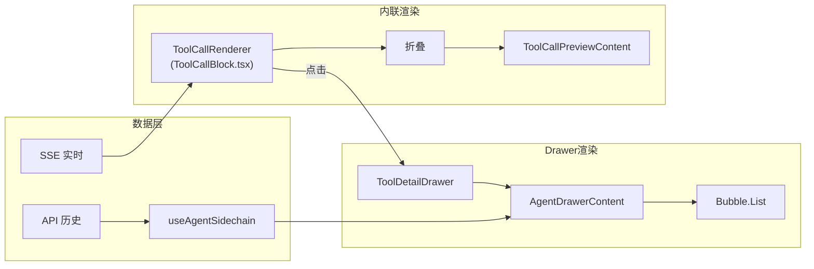
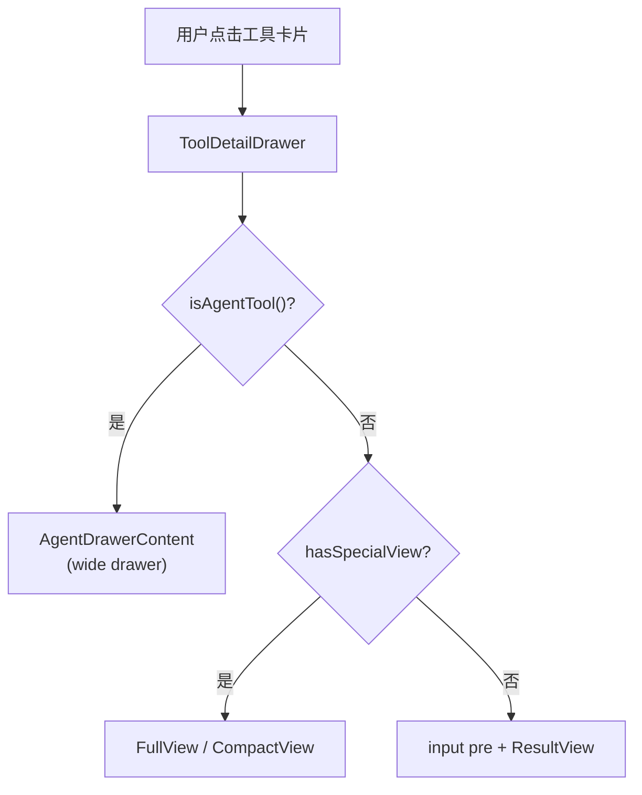

# Agent 消息渲染

本文档描述 Web 端 Agent 工具（`Task` / `Agent`）消息的内联渲染和 Drawer 详情渲染架构。Agent 工具的 sidechain 子对话是渲染复杂度最高的部分。

## 渲染架构总览

Agent 消息有两条渲染路径：**聊天内联**（主视图中折叠展示）和 **Drawer 详情**（点击后展开 sidechain 对话）。



## 数据流

### Sidechain 消息生命周期

```
SDK subagent 消息
  → CLI sdkToLogConverter (isSidechain=true)
  → Hub SQLite 存储
  → SSE / API 推送到 Web
  → normalizeAgent.ts (标记 isSidechain)
  → reducer.ts (traceMessages 将 sidechain 消息归为父 tool-call 的 children)
  → ToolCallBlock.children: ChatBlock[]
```

Reducer 阶段 `traceMessages()` 通过 `parent_tool_use_id` 将 sidechain 消息归组到父 `ToolCallBlock` 的 `children` 数组中，形成树形结构。

### Drawer 双数据路径

`useAgentSidechain` hook 封装了两条数据路径：

| 路径 | 触发条件 | 数据来源 |
|------|----------|----------|
| **SSE 实时** | `block.children.length > 0` | 直接使用 reducer 归约后的 children |
| **API 历史** | `block.children` 为空 | 调用 `/api/sessions/:id/sidechain-messages` 接口，本地 normalize + reduce |

API 历史路径中，`isSidechain` 标记被清除（`isSidechain: false`），使 sidechain 消息在 Drawer 内渲染为根消息。

| 文件 | 职责 |
|------|------|
| `components/tool-card/useAgentSidechain.ts` | 双路径数据获取 hook |
| `core/data/hooks/queries/useSidechainMessages.ts` | TanStack Query 封装 |
| `core/data/api/client.ts` → `messages.sidechain()` | API 客户端方法 |

## 内联渲染（聊天视图）

### ToolCallRenderer

**文件**：`components/chat/blocks/ToolCallBlock.tsx`

所有 tool-call block 的统一渲染入口，使用 Ant Design X 的 `<Think>` 组件实现折叠/展开。

```
┌─ Think (可折叠) ──────────────────────────────┐
│ [状态图标] [工具图标]  工具标题    description   │
├─ 展开区 ──────────────────────────────────────┤
│ ToolCallPreviewContent                         │
│   Agent 运行中 → Markdown 渲染 prompt           │
│   Agent 完成   → ResultToolView 渲染结果        │
│                                                │
│ PermissionFooter (权限待审批时)                  │
└────────────────────────────────────────────────┘
```

**Agent 工具特化逻辑**：

| 状态 | 内联预览内容 |
|------|-------------|
| `running` / `pending` | `getAgentPrompt(tool.input)` → Markdown 渲染 prompt，带 `OverflowContainer` 截断 |
| `completed` | `ResultToolView` 渲染结果 |
| 其他 | `getToolViewComponent` 或 `getToolResultViewComponent` |

点击展开区内容 → 打开 `ToolDetailDrawer`。

### 标题生成

`knownTools.tsx` 中 Agent 工具的标题规则：

| 工具 | 标题 | 副标题 |
|------|------|--------|
| `Task` | `Agent: {name}`（有 name + team_name）或 `getAgentTitle()` | 截断 prompt（120 字） |
| `Agent` | `getAgentTitle()` → `subagent_type · description` | 截断 prompt（120 字） |

## Drawer 详情渲染

### ToolDetailDrawer

**文件**：`components/tool-card/ToolDetailDrawer.tsx`

通用工具详情 Drawer 容器。通过 `isAgentTool(tool.name)` 判断，Agent 工具路由到 `AgentDrawerContent`，使用 wide 模式。



### AgentDrawerContent

**文件**：`components/tool-card/AgentDrawerContent.tsx`

Drawer 内的 sidechain 对话渲染，使用 `Bubble.List` 组件。

```
┌─ AgentDrawerContent ─────────────────────────┐
│ ┌─ Bubble.List ────────────────────────────┐ │
│ │ [sidechain 消息 1] (assistant)            │ │
│ │ [sidechain 消息 2] (user)                 │ │
│ │ [sidechain 消息 3] (assistant)            │ │
│ │ ...                                       │ │
│ │ [AgentLoadingBubble] (运行中)             │ │
│ │ ─── result ───                            │ │
│ │ [Markdown 结果]                           │ │
│ └──────────────────────────────────────────┘ │
│                       [↓ 滚动到底部按钮]      │
└──────────────────────────────────────────────┘
```

**渲染流程**：

1. `useAgentSidechain` 获取 sidechain blocks
2. `buildChatBubbleItems` 转换为 `BubbleItemBase[]`（`disableDrawer: true` 防止嵌套 Drawer）
3. 运行中追加 `AgentLoadingBubble`（PixelAvatar 动画 + 随机 "vibing" 文字 + 已用时间）
4. 完成后追加 result 分隔线 + Markdown 结果

**Bubble role 配置**：Drawer 场景使用自定义 `DRAWER_BUBBLE_ROLES`，通过 `<Global>` 注入 CSS 覆盖 Bubble 内边距。

## ToolCard（卡片式渲染）

**文件**：`components/tool-card/index.tsx`

旧版的卡片式渲染，使用 `<Card>` + `<Modal>` 组合。当前与 `ToolCallRenderer` 并行存在，用于特定场景。

**Agent 工具特化逻辑**：

- 运行中显示 prompt Markdown
- 完成后显示 ResultToolView
- `renderTaskSummary` 渲染最近 3 个子工具调用的状态摘要
- 点击打开 `<Modal>`（640px 宽），展示 prompt + result

## 关键组件索引

| 组件 | 文件 | 职责 |
|------|------|------|
| `ToolCallRenderer` | `components/chat/blocks/ToolCallBlock.tsx` | 聊天内联渲染入口，Think 折叠 |
| `ToolCallPreviewContent` | `components/chat/blocks/ToolCallBlock.tsx` | 内联预览内容（Agent prompt / 结果） |
| `ToolCard` | `components/tool-card/index.tsx` | 卡片式渲染（Card + Modal），含 Task 摘要 |
| `ToolDetailDrawer` | `components/tool-card/ToolDetailDrawer.tsx` | Drawer 容器，路由到 Agent / 普通视图 |
| `AgentDrawerContent` | `components/tool-card/AgentDrawerContent.tsx` | Drawer 内 sidechain Bubble.List |
| `AgentLoadingBubble` | `components/chat/AgentLoadingBubble.tsx` | 运行中加载动画（PixelAvatar + vibing 文字） |
| `useAgentSidechain` | `components/tool-card/useAgentSidechain.ts` | Agent sidechain 数据获取（双路径） |
| `knownTools` | `components/tool-card/knownTools.tsx` | 工具注册（`isAgentTool` / `getAgentTitle` / subtitle） |
| `getAgentPrompt` | `components/tool-card/index.tsx` | 提取 Agent 工具的 prompt 文本 |
| `buildChatBubbleItems` | `components/chat/buildBubbleItems.tsx` | ChatBlock[] → BubbleItemBase[] 转换 |
