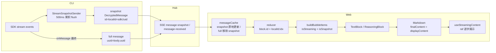

# 流式逐字渲染

流式回复的"打字机"逐字效果实现。看似简单（`slice` + `requestAnimationFrame`），实际链路横跨 CLI → Hub → Web 三层，隐藏多个dev-only 坑。本文档记录架构、关键决策与调试方法，避免重蹈覆辙。

## 渲染链路



**核心数据**：CLI 的 `StreamSnapshotSender` 把 SDK 流式事件累积，每 500ms 通过 `SDKToLogConverter` 转成 `DecryptedMessage`（`snapshot: true`）发给 Hub；SDK 最终 message 作为 full message 落库。Web 收到后走 reducer → bubble → TextBlock → Markdown → `useStreamingContent` 逐字揭示。

## 关键设计

### 1. snapshot 与 full message 必须共享 localId

snapshot 和 full message 是同一条消息的两个阶段（流式中 / 落库后），但 **`msg.id` 不同**：

- snapshot：`id = sdkUuid`（CLI `wrapAsDecryptedMessage`，SDK 流式 message 的 uuid）
- full：`id = body.uuid`（RawJSONLines 的 uuid，SDK 最终 message 的 uuid，与 sdkUuid 不同）

若 `block.id` 用 `msg.id`，snapshot/full 的 block.id 不同 → React 按 key 复用失败 → **TextBlock 卸载重 mount** → `useState` 重置 → 逐字被打断（短回复只一批 snapshot 就被 full 重 mount 覆盖，表现为一次性）。

**解决**：
- **CLI 侧**：`StreamSnapshotSender.currentSdkUuid` getter，`claudeRemote` 的 `onMessage` **仅对 `type === 'assistant'` 的 message** 复用 sdkUuid 作 uuid（即 localId），保证 snapshot/full 的 `localId` 一致。必须限定 assistant：sdkOutputLoop 的 `onMessage` 还承载 tool use/result/user 等消息，无差别改写会让这些消息错贴 assistant 的 localId，导致 reducer `block.id` 冲突。
- **Web 侧**：reducer 的 `block.id = ${msg.localId ?? msg.id}:${idx}`。`idx` 区分同消息的 reasoning（0）/ text（1），`localId` 让 snapshot/full 同 key。

### 2. isStreaming 不依赖 isRunning

`buildBubbleItems` 中 `isStreaming` 决定是否逐字。**不能依赖 `isRunning`**：snapshot 到达时 turn 的 `isRunning` 状态可能尚未就绪（SSE running 事件晚到），导致 `isStreaming=false` 全显。

```ts
// ✅ 正确：只要是未落库的 snapshot 就逐字
const isStreaming = isSnapshot
// ❌ 错误：依赖 isRunning，首批 snapshot 时常未就绪
const isStreaming = isLastRunningBlock && isSnapshot
```

### 3. 首批从 0 逐字（避免首批全显）

`useStreamingContent` 的 `useState` 初始值：流式时 `''`，非流式时 `target`。否则首批 snapshot 内容直接全显，短回复（一批 snapshot 就完整）无逐字观感。

```ts
const [display, setDisplay] = useState(streaming ? '' : target)
const revealedRef = useRef(streaming ? 0 : target.length)
```

### 4. wasStreaming：full message 后继续逐字

full message 到达时 `streaming` 变 false。用 `wasStreamingRef` 区分：
- **历史消息**（从未流式）→ 全显
- **流式结束后的 full message**（曾流式）→ 继续逐字到收敛，不被 snapToFull 打断

否则 full message 一到就 `snapToFull` 全显，覆盖 snapshot 阶段的逐字。

### 5. Markdown 始终用 hook 输出

`Markdown` 的 `finalContent = displayContent`（始终），不因 `streaming` 切换到 `content`。否则 full message（`streaming=false`）时 `finalContent=content` 全显，覆盖 display。

## 关键坑（dev-only，调试血泪）

### ⚠️ 坑 1：React StrictMode 导致 raf 永不执行（最隐蔽）

**现象**：`[START]` log 显示 raf 已启动，但 `[TICK]` log 全无——raf 调度了但回调从不执行。`display` 一直是 0。

**根因**：React StrictMode（dev）会**双调用 effect**（mount → effect → cleanup → effect）。第一跑 effect 启动 raf（`rafRef=rafId`），cleanup `cancelAnimationFrame(rafRef)` 取消了 raf，但 **`rafRef` 没 0**；第二跑 effect 见 `rafRef!==0`，认为动画在跑不重启 → tick 永不执行。

**解决**：cleanup 里 cancel 后必须 `rafRef.current = 0`：

```ts
useEffect(() => () => {
    cancelAnimationFrame(rafRef.current)
    rafRef.current = 0  // ← 必须！否则 StrictMode 第二跑不重启
}, [])
```

**这是 dev-only 坑**：生产无 StrictMode，effect 单次调用，不会触发。但 E2E（vite dev）必现。之前所有"修复"都无效，正是因为这层没破——raf 根本没跑。

### ⚠️ 坑 2：snapshot/full 的 localId 不一致

详见上文"关键设计 1"。CLI 的 `sdkUuid`（stream message.uuid）≠ `body.uuid`（RawJSONLines uuid），SDK 机制导致。必须 CLI 侧显式让 full 复用 sdkUuid。

### ⚠️ 坑 3：`isStreaming` 依赖未就绪的 isRunning

详见"关键设计 2"。

### ⚠️ 坑 4：messageCache 不能复用 snapshot 的 id

曾尝试在 `messageCache` 让 full message 复用 snapshot 的 id（保持 block key 稳定），但**违反设计**：测试明确期望 full message 用 full id（`msg-1`），且多 turn thinking 场景会错误合并不同消息。正确做法是 CLI 侧统一 localId，前端 `block.id=localId:idx`。

## 调试方法

### 采样 .x-markdown 长度序列（判断是否逐字）

挂高频采样器，记录所有 `.x-markdown` 容器的 `textContent.length`，看节点长度是否**渐增**（逐字）还是**跳变**（一次性）：

```js
window.__samples = []
window.__sampler = setInterval(() => {
    const nodes = Array.from(document.querySelectorAll('.x-markdown'))
    window.__samples.push({
        t: Date.now() - start,
        count: nodes.length,
        lens: nodes.map(n => n.textContent.length),
    })
}, 20)
```

读取后对每个节点位置做去重，`points.length > 2` 即有逐字增长。

### 关键 log（临时加，用完移除）

| log 位置 | 作用 |
|---------|------|
| `buildBubbleItems` 的 `[BB]` | `block.id` / `isSnapshot` / `isStreaming`，确认 snapshot/full 是否同 key、streaming 是否 true |
| `useStreamingContent` 的 `[SC]`（render 时）| `streaming` / `target.length` / `display.length` / `wasStreaming`，确认 hook 状态 |
| `useStreamingContent` 的 `[EFF]`（effect 时）| `revealed` / `rafRef`，确认 effect 是否到启动分支、raf 状态 |
| `useStreamingContent` 的 `[START]` / `[TICK]` | raf 是否启动 / tick 是否执行（排查坑 1） |
| `SSEProvider` 的 `[SSE-snap]` | snapshot 到达的 content 长度，确认分批情况 |

**排查顺序**：先确认 `[TICK]` 是否跑（坑 1）→ 再确认 `[BB]` snapshot/full 是否同 block.id（坑 2）→ 再确认 `[SC]` streaming 是否 true（坑 3）→ 最后看 display 是否驱动 DOM。

## 流式滚动跟随

逐字揭示解决「文字如何出现」，滚动跟随解决「视口如何跟着新内容走」。两者都由 `useStreamingContent` 的 ~20fps 揭示驱动——内容每揭示一批，气泡长高，触发 `ResizeObserver`，由 `ChatContainer` 的 observer effect 自行跟随到底部。

**为什么不用 `Bubble.List` 的 `autoScroll`**：`autoScroll` 启用 `column-reverse` + `useCompatibleScroll`，其 `enforceScrollLock` 与手动 `scrollTop` 恢复（加载历史时）存在时序冲突。故 `autoScroll={false}`，自实现跟随。

### 三段式跟随策略（按 `gap` = 可达底部 − 当前 scrollTop 分层）

| gap | 策略 | 理由 |
|----|------|------|
| ≤ `INSTANT_THRESHOLD`(80px) | **瞬时贴底**，不调度 rAF | 逐字 reveal 单次增量 ~10–40px 落在此区间，每次瞬时对齐保持 gap≈0；20fps × ~20px 步进视觉本就平滑 |
| (80, `SNAP_THRESHOLD`(300)] | **rAF 比例 glide**（每帧 `gap×0.25`） | 快速 burst / 代码块撑高的中等跳变，用平滑逼近替代硬切，消除跳动 |
| > 300px | **直接对齐** | 大块内容（图片/超长代码块）出现时不慢慢滑，立即贴底 |

`gap` 是关键观测量——E2E 采样 `scrollHeight - clientHeight - scrollTop` 序列，稳态恒为 0 即跟随正常；持续累积 → 滞后（见坑 3）。

### 关键设计

**1. 目标用可达底部，不是 `scrollHeight`**：`scrollTop` 物理上限是 `scrollHeight - clientHeight`，`scrollHeight` 不可达（超出被浏览器钳制）。`captureFollowTarget()` 统一算 `followMaxTop = scrollHeight - clientHeight`，由两个 `ResizeObserver`（内容尺寸 / 视口尺寸）在变化时刷新。

**2. tick 零 layout 读**：`tick` 内只读写闭包镜像 `currentPos`，不读 `scrollHeight`/`clientHeight`/`scrollTop`（rAF 内读会触发强制同步 layout）。layout 属性集中在 `captureFollowTarget` 里读，loop 运行时也由它更新目标——`smoothFollowToBottom` 入口的「已在跑则 return」不影响目标刷新。

**3. 跟随期隐藏「滚到底」按钮**：`shouldShow = !isNearBottom && distanceToBottom > 阈值`。glide 时 `distanceToBottom` 可能瞬时超阈值，不加 `!isNearBottom` 闸门按钮会闪烁。

**4. 四条终止路径**：用户向上滚（`handleScroll` 检测 `scrollTop < prevScrollTop - 2` 时 `cancelAnimationFrame`）/ scroll 恢复中（`isRestoringScrollRef`）/ 会话切换·卸载（`observerCleanupRef`）/ 收敛（gap ≤ 80 或 > 300 对齐退出）。

### 关键坑

**⚠️ 坑 1：目标用 `scrollHeight` → 正常视口不生效 + 小视口死循环**
`scrollTop = scrollHeight` 会被钳制到 `scrollHeight - clientHeight`。若用 `scrollHeight` 当目标算 `diff`，贴底时 `diff ≈ clientHeight`：桌面（clientHeight ~700）恒 > 300 走 snap → glide 从未生效；小视口（clientHeight ∈ (2, 300]）`diff` 落在 glide 区间但 `scrollTop` 被钳住不动 → `diff` 不收敛 → 死循环。**必须**用 `scrollHeight - clientHeight`。

**⚠️ 坑 2：逐字小增量走 glide → 底部 loading 气泡上下浮动**
glide 的 25%/帧追不上 20fps 的持续 reveal，滞后累积（实测可达 200px+），把底部 loading 气泡推下再追回 → 视觉上"跳动"。**解法**：`INSTANT_THRESHOLD` 让小增量瞬时贴底（gap≈0，气泡钉死），只对中等 burst 走 glide。这是「瞬时 vs 平滑」的边界——平滑只该用在大跳变上。

**⚠️ 坑 3：tick 读 layout 属性 → 每帧强制 reflow**
`tick` 内读 `scrollHeight` 在内容刚重渲的脏帧会强制一次同步 layout，叠加 scroll 事件 handler 的读，60fps 持续。用 `currentPos` 镜像 + `captureFollowTarget` 集中捕获消除。

### 调试采样

```js
// 采样跟随 gap + loading 气泡屏幕纵坐标，判断是否滞后浮动
const box = document.querySelector('.ant-bubble-list-scroll-box')
const loading = document.querySelector('div[role="status"][aria-label*="运行"]')
setInterval(() => {
  console.log({
    gap: Math.round(box.scrollHeight - box.clientHeight - box.scrollTop),
    rectTop: Math.round(loading.getBoundingClientRect().top),
  })
}, 30)
```

稳态 `gap` 恒 0、`rectTop` 不动 = 正常；`gap` 持续 > 0 = 滞后（见坑 2），`rectTop` 漂移大 = 浮动。

## E2E 验证局限

E2E 的 glm 模型 text 输出快（常一批 snapshot 就完整），snapshot 阶段极短，逐字效果不明显。**真实 Claude（text 流式慢、多批 snapshot）下逐字才稳定可见**。验证时优先观察 reasoning（思考块）——它通常更长、多批 snapshot，逐字效果最明显。

## 关键文件索引

| 文件 | 职责 |
|------|------|
| `cli/.../streamSnapshotSender.ts` | snapshot 累积 + flush + `currentSdkUuid` getter |
| `cli/.../claudeRemote.ts` | full message 复用 sdkUuid 作 localId |
| `web/.../domain/chat/reducerTimeline.ts` | `block.id = localId:idx` |
| `web/.../domain/chat/buildBubbleItems.tsx` | `isStreaming = isSnapshot` |
| `web/.../components/ui/useStreamingContent.ts` | 逐字揭示 hook（首批从 0 + wasStreaming + cleanup rafRef=0） |
| `web/.../components/ui/Markdown.tsx` | `finalContent = displayContent` |
| `web/.../components/chat/ChatContainer.tsx` | 流式滚动跟随（三段式 gap 策略 + 镜像零读 + captureFollowTarget） |
| `web/.../core/data/cache/messageCache.ts` | snapshot 原地更新 / full 按 parentUuid 清理 snapshot |
