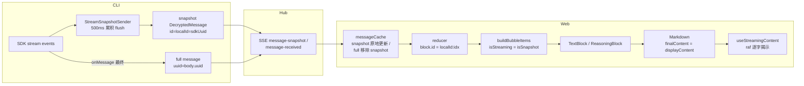

# 流式逐字渲染

流式回复的"打字机"逐字效果实现。看似简单（`slice` + `requestAnimationFrame`），实际链路横跨 CLI → Hub → Web 三层，隐藏多个dev-only 坑。本文档记录架构、关键决策与调试方法，避免重蹈覆辙。

## 渲染链路



**核心数据**：CLI 的 `StreamSnapshotSender` 把 SDK 流式事件累积，每 500ms 通过 `SDKToLogConverter` 转成 `DecryptedMessage`（`snapshot: true`）发给 Hub；SDK 最终 message 作为 full message 落库。Web 收到后走 reducer → bubble → TextBlock → Markdown → `useStreamingContent` 逐字揭示。

## 关键设计

### 1. snapshot↔full 对齐：CLI assembler 聚合 full（回到 message queue 之前稳定态）

snapshot 和 full 是同一条消息的两个阶段，id 各不同：

- snapshot `msg.id` = `sdkUuid`（CLI `wrapAsDecryptedMessage`，SDK 流式 message 的 uuid）
- full `msg.id` = DB 主键（Hub 分配）
- full `localId` = `body.uuid`（RawJSONLines 的 uuid，SDK 最终 assistant 的 uuid，与 `sdkUuid` 不同）

**粒度匹配是关键**：snapshot 是 message 级（一条累积所有 content block）；full 必须也是 message 级（一条），二者 1-vs-1 才能让前端 `resolveMessageCache` 按 parentUuid 清理可靠。

**问题根源**：SDK 开 `includePartialMessages`（为拿 stream_event 喂逐字）会**按 content block 拆开** emit 最终 assistant——一条 message（`[thinking, text]`）变成两条 full（thinking-full + text-full，共享 `message.id`、各自独立 uuid）。snapshot 一条 vs full 两条，粒度不匹配 → 对齐崩坏 → thinking 双气泡（snapshot 的 thinking block 与 thinking-full 重复）。

**解：CLI `AssistantPartialAssembler` 按 `message.id` 把拆分的 full 聚合回一条**（content 拼回 `[thinking, text]`，uuid 取最新 partial 的 `body.uuid`）。聚合后 full 一条、snapshot 一条，1-vs-1，parentUuid 不漂移，`resolveMessageCache` 按 parentUuid 清理可靠——**这就是 message queue 之前流式稳定的原因**。

**历史教训（为何反复出 bug）**：`d7260a2` 引入 assembler 时**同时**引入了 uuid 覆盖（让 full 用 `sdkUuid`，破坏 resume 去重——sdkUuid 不写 .jsonl，resume 时对不上）。`3d2433d` 修 uuid 覆盖的 resume bug 时，**把正确的 assembler（聚合）和错误的 uuid 覆盖一起删了**，full 从此拆分裸奔。之后 `parentUuid` 漂移 → `message.id` → `clearDeliveredBlocks` 等补丁，都是在"full 拆分"这个错误前提下打转。**恢复 assembler（不恢复 uuid 覆盖）= 修正前提**，回到稳定态。

**实现**（CLI `claudeRemote.ts` `sdkOutputLoop`）：
- `stream_event` → `StreamSnapshotSender` 累积 delta（snapshot 通道，display-only 不落库）
- assistant → `assembler.submit`（按 `message.id` 聚合；遇不同 `message.id` / 非 assistant 时 flush 输出一条完整 full）
- assembler emit full 时用 `template.uuid`（= `body.uuid`，写进 .jsonl，**resume 安全**）作 localId；**不**覆盖成 `sdkUuid`（保留 `3d2433d` 的 resume 修复）
- assembler emit full 时调 `snapshotSender.markFullDelivered()`（该 message 的 snapshot 已被 full 取代，abort 补全不再补它）

**前端双保险**：assembler 让 parentUuid 清理可靠（第一道，messageCache 层），但 parentUuid 有已知边界（null：会话首条 assistant、SSE 乱序）可能漏清。reducer 入口 `dedupeSnapshotBlocks` 按 `(messageId, type)` 兜底（第二道，渲染层）——snapshot 的 block 若已被同 `(messageId, type)` 的 full 覆盖则不渲染。两道在不同层，任一生效即无双气泡。`type`（reasoning/text）是内容自带的稳定标识，不依赖 block 序号或到达顺序。

**取舍（为何暂时保留 assembler）**：`dedupeSnapshotBlocks` 按 `(messageId, type)` 过滤**单独就能解决**双气泡 + text 不中断（snapshot 的 text block 渲染到 text-full）。assembler 的额外价值是双保险（parentUuid 清理可靠 + 聚合 full 含完整 text，避免 parentUuid 误删 snapshot 的 text 中断）。**代价**：assembler 累积到 flushAll 才输出，后台 complete message（无后续非 assistant 分隔）延迟到 turn 结束落库（后台 agent 多数有 stream_event 实时显示，complete 少数延迟）。**暂时保留 assembler**；若未来后台延迟成问题，可删 assembler + 删 parentUuid 清理，只留 type 过滤（见 `assistantPartialAssembler.ts` 类注释）。

### 2. isStreaming 不依赖 isRunning

`buildBubbleItems` 中 `isStreaming` 决定是否逐字。**不能依赖 `isRunning`**：snapshot 到达时 turn 的 `isRunning` 状态可能尚未就绪（SSE running 事件晚到），导致 `isStreaming=false` 全显。

```ts
// ✅ 正确：只要是未落库的 snapshot 就逐字
const isStreaming = isSnapshot
// ❌ 错误：依赖 isRunning，首批 snapshot 时常未就绪
const isStreaming = isLastRunningBlock && isSnapshot
```

### 3. 首批从 0 逐字（避免首批全显）

`useStreamingContent` 的 `useState` 初始值：流式时 `''`，非流式时 `target`。否则首批 snapshot 内容直接全显，短回复（一批 snapshot 就完整）无逐字观感。

```ts
const [display, setDisplay] = useState(streaming ? '' : target)
const revealedRef = useRef(streaming ? 0 : target.length)
```

### 4. wasStreaming：full message 后继续逐字

full message 到达时 `streaming` 变 false。用 `wasStreamingRef` 区分：
- **历史消息**（从未流式）→ 全显
- **流式结束后的 full message**（曾流式）→ 继续逐字到收敛，不被 snapToFull 打断

否则 full message 一到就 `snapToFull` 全显，覆盖 snapshot 阶段的逐字。

### 5. Markdown 始终用 hook 输出

`Markdown` 的 `finalContent = displayContent`（始终），不因 `streaming` 切换到 `content`。否则 full message（`streaming=false`）时 `finalContent=content` 全显，覆盖 display。

### 6. abort 补全：与 assembler 互斥，流式内容不丢失

snapshot 通道**不落库**（`snapshot:true` 仅 Hub 透传给前端即时显示）。只有完整 full（经 assembler 聚合）到达才落库。若 abort 时 SDK 没 emit 完整 assistant（assembler 未聚合输出），流式已显示的内容刷新后会丢失。

**机制**（CLI `sdkOutputLoop` 迭代结束）：
- `markFullDelivered` 在 **assembler 聚合输出完整 full 时**置位（**不**在每个 partial 到达时——一个 message 多 partial，任一 partial 就置 true 会让后续 partial 的 snapshot 补全失效）
- 迭代结束：`consumePendingFull()` 优先——有 pending（assembler 未输出完整 full，即 `markFullDelivered` 未置）→ 走 `onAbortFlush`，用 `snapshotSender` 累积（stream_event 实时累积，最完整）补全；assembler 的 pending 是不完整 partial，**丢弃**（不调 `assembler.flush`），避免与 snapshot 补全重复落库
- 无 pending（full 已 delivered）→ `assembler.flush()` 输出最后一条 message 的完整聚合 full

`onAbortFlush`（`claudeRemoteLauncher`）：`convertSnapshot(blocks)` → `messageQueue.enqueue`（经 messageQueue 统一仲裁顺序，由 `finally` 的 `messageQueue.flush()` 发送——保证 abort 时「delay 中的上一条 assistant → 当前补全」的正确 FIFO 时序，不绕过 messageQueue）。补全消息用 `convertSnapshot` 的独立 uuid + `messageId`（与 snapshot 共享 message.id，前端按双保险清理/去重）。

**兼容未来增量 snapshot**：`consumePendingFull()` 语义是"当前 message 的完整累积内容"，不暴露 buffers 内部。未来 snapshot 改增量发送（flush 只发 delta）时，只改 `flush` 实现，本接口仍返回完整内容，abort 补全逻辑不变；前端从补全 full（完整）重新渲染，不依赖 snapshot 累积状态。

## 关键坑（dev-only，调试血泪）

### ⚠️ 坑 1：React StrictMode 导致 raf 永不执行（最隐蔽）

**现象**：`[START]` log 显示 raf 已启动，但 `[TICK]` log 全无——raf 调度了但回调从不执行。`display` 一直是 0。

**根因**：React StrictMode（dev）会**双调用 effect**（mount → effect → cleanup → effect）。第一跑 effect 启动 raf（`rafRef=rafId`），cleanup `cancelAnimationFrame(rafRef)` 取消了 raf，但 **`rafRef` 没 0**；第二跑 effect 见 `rafRef!==0`，认为动画在跑不重启 → tick 永不执行。

**解决**：cleanup 里 cancel 后必须 `rafRef.current = 0`：

```ts
useEffect(() => () => {
    cancelAnimationFrame(rafRef.current)
    rafRef.current = 0  // ← 必须！否则 StrictMode 第二跑不重启
}, [])
```

**这是 dev-only 坑**：生产无 StrictMode，effect 单次调用，不会触发。但 E2E（vite dev）必现。之前所有"修复"都无效，正是因为这层没破——raf 根本没跑。

### ⚠️ 坑 2：删 assembler 误伤聚合（`3d2433d` 的过度删除）

详见上文"关键设计 1"。`d7260a2` 同时引入了 **assembler（聚合 full）** 和 **uuid 覆盖（破坏 resume）** 两个独立机制。`3d2433d` 修 uuid 覆盖的 resume bug 时，把两者**一起删了**——但 assembler 的聚合本与 uuid 覆盖无关（它用 `template.uuid` = `body.uuid`，写进 .jsonl，resume 安全），是被误伤的。

删 assembler 后 full 回到 SDK 拆分的原始形态（一条 message 的多 block 拆成多条 full），snapshot（一条累积）与 full（拆分）粒度不匹配，对齐崩坏。之后 `parentUuid` 漂移 → `message.id` → `clearDeliveredBlocks` 等补丁，全是在"full 拆分"这个错误前提下打转，越补越乱。

**正确做法**：恢复 assembler（聚合 full，用 `body.uuid`），**不**恢复 uuid 覆盖（保留 `3d2433d` 的 resume 修复）。parentUuid 清理在 assembler 聚合下重新可靠（full 一条，parentUuid 不漂移），reducer 的 `(messageId, type)` 过滤兜底其边界。

**拆分 vs 聚合的归属**：full 按 content block 拆开 emit 是 **SDK 在 `includePartialMessages` 下的行为**（不开则聚合一条，见 hapi——没开 `includePartialMessages`、无 assembler、流式稳定）；mobi 要字符级逐字必须开 `includePartialMessages`，必然遭遇拆分，**assembler 是 mobi 抵消拆分副作用的聚合层**，缺一不可。

### ⚠️ 坑 3：`isStreaming` 依赖未就绪的 isRunning

详见"关键设计 2"。

### ⚠️ 坑 4：snapshot/full 不复用 id——靠 assembler 让粒度匹配，而非让 id 相同

snapshot `msg.id`=`sdkUuid`、full `msg.id`=DB 主键，物理上不可能相同（`d7260a2` 曾用 uuid 覆盖强求相同，破坏 resume——见坑 2）。不要在 `messageCache` 复用 id（测试明确期望 full 用自己的 id，多 turn 场景会错误合并不同消息）。

**正确做法**：snapshot/full 各自 id 独立，靠 **CLI assembler 聚合 full**（让 full 从拆分的 N 条变回 1 条）使粒度与 snapshot（1 条）匹配，再靠 **parentUuid 清理**（主，messageCache 层）+ **`(messageId, type)` 过滤**（兜底，reducer 层）解决"snapshot/full 共存"的渲染去重——而非让 id/localId 相同。reducer 的 `block.id=localId:idx`。

## 调试方法

### 采样 .x-markdown 长度序列（判断是否逐字）

挂高频采样器，记录所有 `.x-markdown` 容器的 `textContent.length`，看节点长度是否**渐增**（逐字）还是**跳变**（一次性）：

```js
window.__samples = []
window.__sampler = setInterval(() => {
    const nodes = Array.from(document.querySelectorAll('.x-markdown'))
    window.__samples.push({
        t: Date.now() - start,
        count: nodes.length,
        lens: nodes.map(n => n.textContent.length),
    })
}, 20)
```

读取后对每个节点位置做去重，`points.length > 2` 即有逐字增长。

### 关键 log（临时加，用完移除）

| log 位置 | 作用 |
|---------|------|
| `buildBubbleItems` 的 `[BB]` | `block.id` / `isSnapshot` / `isStreaming`，确认 snapshot/full 是否同 key、streaming 是否 true |
| `useStreamingContent` 的 `[SC]`（render 时）| `streaming` / `target.length` / `display.length` / `wasStreaming`，确认 hook 状态 |
| `useStreamingContent` 的 `[EFF]`（effect 时）| `revealed` / `rafRef`，确认 effect 是否到启动分支、raf 状态 |
| `useStreamingContent` 的 `[START]` / `[TICK]` | raf 是否启动 / tick 是否执行（排查坑 1） |
| `SSEProvider` 的 `[SSE-snap]` | snapshot 到达的 content 长度，确认分批情况 |

**排查顺序**：先确认 `[TICK]` 是否跑（坑 1）→ 再确认 `[BB]` snapshot/full 是否同 block.id（坑 2）→ 再确认 `[SC]` streaming 是否 true（坑 3）→ 最后看 display 是否驱动 DOM。

## 流式滚动跟随

逐字揭示解决「文字如何出现」，滚动跟随解决「视口如何跟着新内容走」。两者都由 `useStreamingContent` 的 ~20fps 揭示驱动——内容每揭示一批，气泡长高，触发 `ResizeObserver`，由 `ChatContainer` 的 observer effect 自行跟随到底部。

**为什么不用 `Bubble.List` 的 `autoScroll`**：`autoScroll` 启用 `column-reverse` + `useCompatibleScroll`，其 `enforceScrollLock` 与手动 `scrollTop` 恢复（加载历史时）存在时序冲突。故 `autoScroll={false}`，自实现跟随。

### 三段式跟随策略（按 `gap` = 可达底部 − 当前 scrollTop 分层）

| gap | 策略 | 理由 |
|----|------|------|
| ≤ `INSTANT_THRESHOLD`(80px) | **瞬时贴底**，不调度 rAF | 逐字 reveal 单次增量 ~10–40px 落在此区间，每次瞬时对齐保持 gap≈0；20fps × ~20px 步进视觉本就平滑 |
| (80, `SNAP_THRESHOLD`(300)] | **rAF 比例 glide**（每帧 `gap×0.25`） | 快速 burst / 代码块撑高的中等跳变，用平滑逼近替代硬切，消除跳动 |
| > 300px | **直接对齐** | 大块内容（图片/超长代码块）出现时不慢慢滑，立即贴底 |

`gap` 是关键观测量——E2E 采样 `scrollHeight - clientHeight - scrollTop` 序列，稳态恒为 0 即跟随正常；持续累积 → 滞后（见坑 3）。

### 关键设计

**1. 目标用可达底部，不是 `scrollHeight`**：`scrollTop` 物理上限是 `scrollHeight - clientHeight`，`scrollHeight` 不可达（超出被浏览器钳制）。`captureFollowTarget()` 统一算 `followMaxTop = scrollHeight - clientHeight`，由两个 `ResizeObserver`（内容尺寸 / 视口尺寸）在变化时刷新。

**2. tick 零 layout 读**：`tick` 内只读写闭包镜像 `currentPos`，不读 `scrollHeight`/`clientHeight`/`scrollTop`（rAF 内读会触发强制同步 layout）。layout 属性集中在 `captureFollowTarget` 里读，loop 运行时也由它更新目标——`smoothFollowToBottom` 入口的「已在跑则 return」不影响目标刷新。

**3. 跟随期隐藏「滚到底」按钮**：`shouldShow = !isNearBottom && distanceToBottom > 阈值`。glide 时 `distanceToBottom` 可能瞬时超阈值，不加 `!isNearBottom` 闸门按钮会闪烁。

**4. 四条终止路径**：用户向上滚（`handleScroll` 检测 `scrollTop < prevScrollTop - 2` 时 `cancelAnimationFrame`）/ scroll 恢复中（`isRestoringScrollRef`）/ 会话切换·卸载（`observerCleanupRef`）/ 收敛（gap ≤ 80 或 > 300 对齐退出）。

### 关键坑

**⚠️ 坑 1：目标用 `scrollHeight` → 正常视口不生效 + 小视口死循环**
`scrollTop = scrollHeight` 会被钳制到 `scrollHeight - clientHeight`。若用 `scrollHeight` 当目标算 `diff`，贴底时 `diff ≈ clientHeight`：桌面（clientHeight ~700）恒 > 300 走 snap → glide 从未生效；小视口（clientHeight ∈ (2, 300]）`diff` 落在 glide 区间但 `scrollTop` 被钳住不动 → `diff` 不收敛 → 死循环。**必须**用 `scrollHeight - clientHeight`。

**⚠️ 坑 2：逐字小增量走 glide → 底部 loading 气泡上下浮动**
glide 的 25%/帧追不上 20fps 的持续 reveal，滞后累积（实测可达 200px+），把底部 loading 气泡推下再追回 → 视觉上"跳动"。**解法**：`INSTANT_THRESHOLD` 让小增量瞬时贴底（gap≈0，气泡钉死），只对中等 burst 走 glide。这是「瞬时 vs 平滑」的边界——平滑只该用在大跳变上。

**⚠️ 坑 3：tick 读 layout 属性 → 每帧强制 reflow**
`tick` 内读 `scrollHeight` 在内容刚重渲的脏帧会强制一次同步 layout，叠加 scroll 事件 handler 的读，60fps 持续。用 `currentPos` 镜像 + `captureFollowTarget` 集中捕获消除。

### 调试采样

```js
// 采样跟随 gap + loading 气泡屏幕纵坐标，判断是否滞后浮动
const box = document.querySelector('.ant-bubble-list-scroll-box')
const loading = document.querySelector('div[role="status"][aria-label*="运行"]')
setInterval(() => {
  console.log({
    gap: Math.round(box.scrollHeight - box.clientHeight - box.scrollTop),
    rectTop: Math.round(loading.getBoundingClientRect().top),
  })
}, 30)
```

稳态 `gap` 恒 0、`rectTop` 不动 = 正常；`gap` 持续 > 0 = 滞后（见坑 2），`rectTop` 漂移大 = 浮动。

## E2E 验证局限

E2E 的 glm 模型 text 输出快（常一批 snapshot 就完整），snapshot 阶段极短，逐字效果不明显。**真实 Claude（text 流式慢、多批 snapshot）下逐字才稳定可见**。验证时优先观察 reasoning（思考块）——它通常更长、多批 snapshot，逐字效果最明显。

## 关键文件索引

| 文件 | 职责 |
|------|------|
| `cli/.../assistantPartialAssembler.ts` | 按 `message.id` 聚合 SDK 拆分的 full 为一条（用 `body.uuid`，resume 安全）；坑 2 记录的误删与恢复 |
| `cli/.../streamSnapshotSender.ts` | snapshot 累积 + flush + 用 sdkUuid 作 snapshot id/localId + 携带 `message.id`（`message_start` 捕获，供前端 type 过滤兜底） |
| `cli/.../claudeRemote.ts` | `sdkOutputLoop` 接入 assembler（assistant 经聚合，assembler emit 时 `markFullDelivered`）；abort 分支（`consumePendingFull` 优先 / 否则 `assembler.flush`）；`handleStreamEvent` 捕获 `message.id` |
| `web/.../domain/chat/reducer.ts` | `reduceChatBlocks` 入口 `dedupeSnapshotBlocks` 按 `(messageId, type)` 兜底去重（双保险第二道） |
| `web/.../domain/chat/reducerTimeline.ts` | `block.id = localId:idx` |
| `web/.../domain/chat/buildBubbleItems.tsx` | `isStreaming = isSnapshot` |
| `web/.../components/ui/useStreamingContent.ts` | 逐字揭示 hook（首批从 0 + wasStreaming + cleanup rafRef=0） |
| `web/.../components/ui/Markdown.tsx` | `finalContent = displayContent` |
| `web/.../components/chat/ChatContainer.tsx` | 流式滚动跟随（三段式 gap 策略 + 镜像零读 + captureFollowTarget） |
| `web/.../core/data/cache/messageCache.ts` | snapshot 原地更新 / full 按 `parentUuid` 清理 snapshot（assembler 聚合 full 后 parentUuid 不漂移，双保险第一道） |
